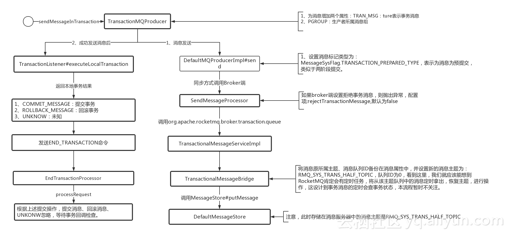
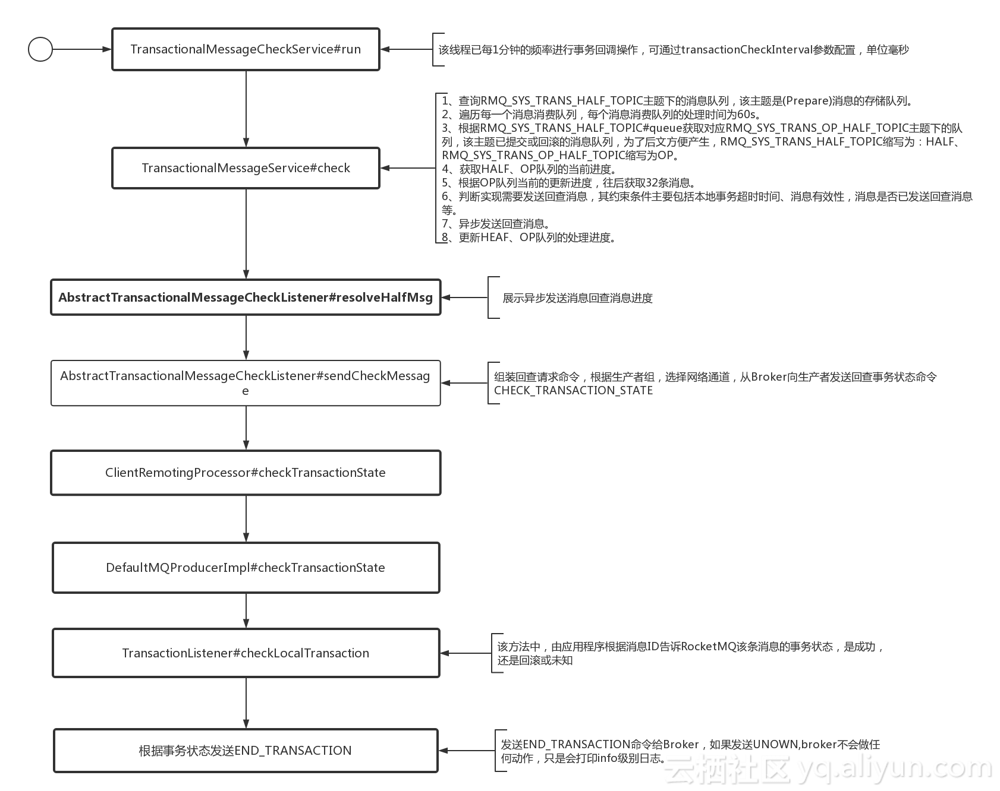
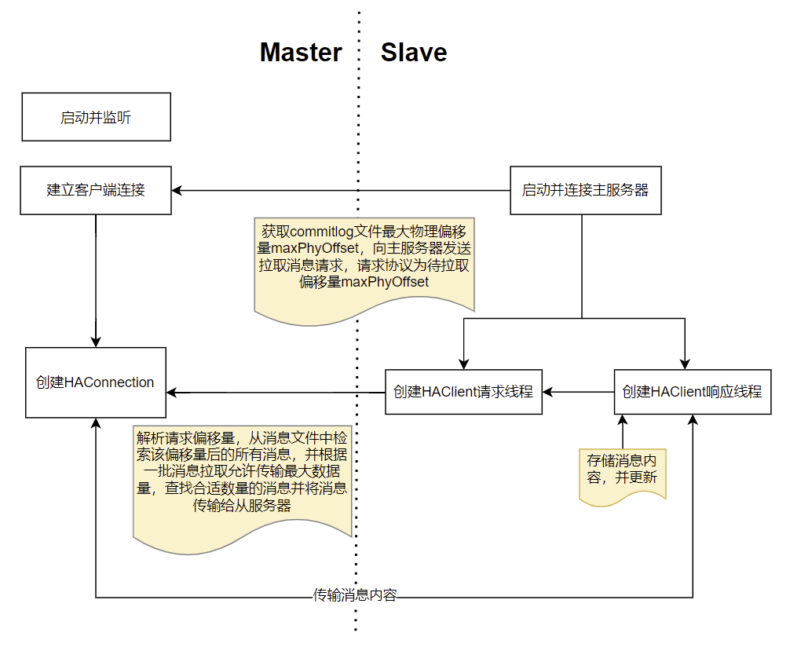
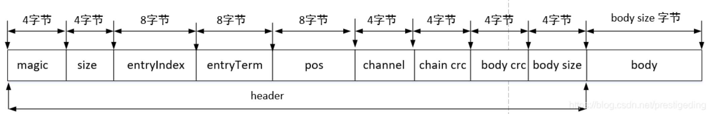
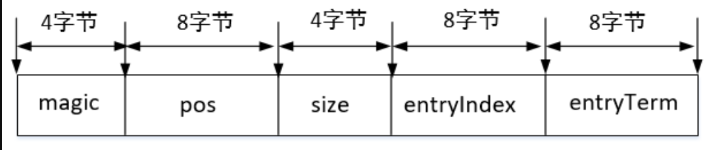
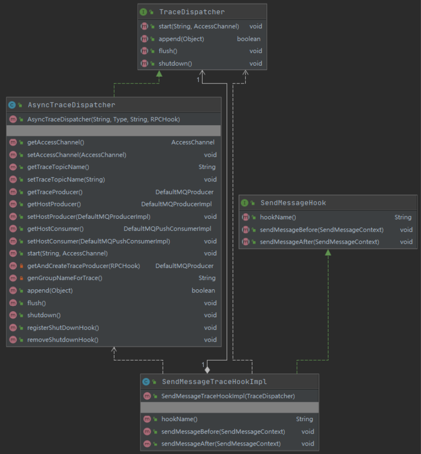
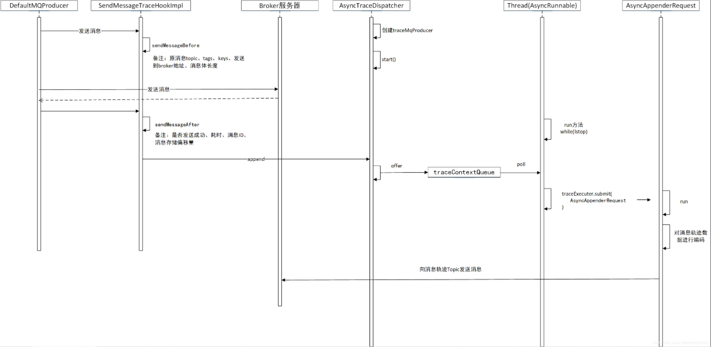

# 文档

Apache中文文档：https://www.itmuch.com/books/rocketmq/RocketMQ_Example.html

阿里云文档：https://help.aliyun.com/product/29530.html?spm=a2c4g.11186623.0.0.506c538aBXXtUy

控制台查询消息：https://help.aliyun.com/document_detail/29540.html

RocketMQ配置解释：https://www.cnblogs.com/jice/p/11981107.html

- 一些博客

Klutzoder'Blog：https://www.klutzoder.com/RocketMQ/middleware/rocketmq-03/


# 概念

### Topic

消息只能发送到同一个Topic中，同一个Topic可以分布到不同的Broker中，Broker中存储多个消费Queue。当进行消息发送时，消息客户端会拉取同一个Topic的所有Broker下所有的消费Queue进行负载均衡发送。

### Tag

可以理解为，Topic下的第二级消息类型。服务端进行消息过滤。

### Group Name

组：代表具有相同角色的生产者组合或消费者组合在一起，称为生产者组或消费者组，分类管理的作用。

### Key

消息的业务标识，由消息生产者（Producer）设置，唯一标识某个业务逻辑，根据这些key快速检索到消息。

 一般用于消息在业务层面的唯一标识。对发送的消息设置好 Key，以后可以根据这个 Key 来查找消息。比如消息异常，消息丢失，进行查找会很方便。

`RocketMQ` 会创建专门的索引文件，用来存储 Key 与消息的映射，由于是 Hash 索引，应==务必保证key尽可能唯一，避免潜在的哈希冲突。==

Tag 和 Key 的主要差别是使用场景不同，Tag 用在 Consumer 代码中，用于服务端消息过滤Key 主要用于通过命令进行查找消息。`RocketMQ` 并不能保证 message id 唯一，在这种情况下，生产者在 push 消息的时候可以给每条消息设定唯一的 key, 消费者可以通过 message key保证对消息幂等处理。

### Producer Group

生产者发送组主要用处是：若事务消息，如果某条发送某条消息的producer-A宕机，使得事务消息一直处于PREPARED状态并超时，则broker会回查同一个group的其他producer，确认这条消息应该commit还是rollback。

### Consumer Group

不同的消费组是从ConsumeQueue中拉取消息，消费消息后会记录消费的最大offset，表示之前的消息都已经消费过了，这个offset是保存再消费者组中，不是ConsumeQueue中。ConsumeQueue被消费消息后只是标记为已读状态，并不会删除消息，未删除的消息可供其他消费组消费。

这意味着，不同的group独自保存自己的消费offset，不同group的消费进度独立不相互影响。比如：a.  group 1发送积压，并不会影响到group 2的消费；b. group 1已经消费过了消息，group 2照样可以消费。

==注意：==

1. 广播模式：消息发送到所有的consumer group下的所有的consumer实例。
2. 集群模式：消息发送到所有consumer group下的其中某一个consumer实例。

Consume Queue

集群模式下同一个消费组内的消费者共同承担其订阅主题下消息队列的消费，==同一个消息消费队列在同一时刻只会被消费组内的一个消费者消费，一个消费者同一时刻可以分配多个消费队列。==

# Quick Start

### Producer(普通消息)

1. 同步消息：同步发送，可靠性高。应用如重要消息通知，短信通知；
2. 异步消息：通常应用在发送端不能容忍长时间地等待Broker响应，对响应时间敏感的业务。
3. 单向消息：主要用在不特别关心发送结果的场景，例如日志发送。

| 发送方式 | 发送TPS | 发送结果反馈 | 可靠性   |
| -------- | ------- | ------------ | -------- |
| 同步发送 | 快      | 有           | 不丢失   |
| 异步发送 | 快      | 有           | 不丢失   |
| 单向发送 | 最快    | 无           | 可能丢失 |

### Consumer

- 监听器：`MessageListenerConcurrently`, `MessageListenerOrderly` 继承 `MessageListener`；
- `MessageListenerConcurrently`：并发消费，`MessageListenerOrderly`：顺序消费

> 消费类型

- Push：消息由消息队列RocketMQ版推送至Consumer。Push方式下，消息队列RocketMQ版还支持批量消费功能，可以将批量消息统一推送至Consumer进行消费。更多信息，请参见[批量消费](https://help.aliyun.com/document_detail/191213.htm#concept-2000662)。
- Pull：消息由Consumer主动从消息队列RocketMQ版拉取。

### 顺序消息

消息有序指的是可以按照消息的发送顺序来消费(FIFO)。`RocketMQ`可以严格的保证消息有序，可以分为**分区有序**或者**全局有序**。

要保证顺序性，需单一生产者单线程地发送消息。

- **分区有序：消息发送到多Queue**
  - 用户注册需要发送验证码，以用户ID作为Sharding Key，那么同一个用户发送的消息都会按照发布的先后顺序来消费。
  - 电商的订单创建，以订单ID作为Sharding Key，那么同一个订单相关的创建订单消息、订单支付消息、订单退款消息、订单物流消息都会按照发布的先后顺序来消费。

- **全局有序：消息发送到单Queue**
  - 在证券处理中，以人民币兑换美元为Topic，在价格相同的情况下，先出价者优先处理，则可以按照FIFO的方式发布和消费全局顺序消息。


顺序消费的原理解析，在默认的情况下消息发送会采取Round Robin轮询方式把消息发送到不同的queue(分区队列)；而消费消息的时候从多个queue上拉取消息，这种情况发送和消费是不能保证顺序。但是如果控制发送的顺序消息只依次发送到同一个queue中，消费的时候只从这个queue上依次拉取，则就保证了顺序。当发送和消费参与的queue只有一个，则是全局有序；如果多个queue参与，则为分区有序，即相对每个queue，消息都是有序的。

> 常见问题

- 同一条消息是否可以既是顺序消息，又是定时消息和事务消息？

  不可以。顺序消息、定时消息、事务消息是不同的消息类型，三者是互斥关系，不能叠加在一起使用。

- 为什么全局顺序消息性能一般？

  全局顺序消息是严格按照FIFO的消息阻塞原则，即上一条消息没有被成功消费，那么下一条消息会一直被存储到Topic队列中。如果想提高全局顺序消息的TPS，可以升级实例配置，同时消息客户端应用尽量减少处理本地业务逻辑的耗时。

- 顺序消息支持哪种消息发送方式？

  顺序消息只支持可靠同步发送方式，不支持异步发送方式，否则将无法严格保证顺序。

- 顺序消息是否支持集群消费和广播消费？

  顺序消息暂时仅支持集群消费模式，不支持广播消费模式。

### 延时消息

1. 等级

delayTimeLevel：消息延迟级别，用于定时消息或消息重试。

```java
private String messageDelayLevel = "1s 5s 10s 30s 1m 2m 3m 4m 5m 6m 7m 8m 9m 10m 20m 30m 1h 2h";
```

| 延迟级别 | 时间 |
| -------- | ---- |
| 1        | 1s   |
| 2        | 5s   |
| 3        | 10s  |
| 4        | 30s  |
| 5        | 1m   |
| 6        | 2m   |
| 7        | 3m   |
| 8        | 4m   |
| 9        | 5m   |
| 10       | 6m   |
| 11       | 7m   |
| 12       | 8m   |
| 13       | 9m   |
| 14       | 10m  |
| 15       | 20m  |
| 16       | 30m  |
| 17       | 1h   |
| 18       | 2h   |

现在RocketMq并不支持任意时间的延时，需要设置几个固定的延时等级，从1s到2h分别对应着等级1到18 消息消费失败会进入延时消息队列，消息发送时间与设置的延时等级和重试次数有关。

2. 应用

电商里，提交了一个订单就可以发送一个延时消息，1h后去检查这个订单的状态，如果还是未付款就取消订单释放库存。

### 批量消息

批量发送消息能显著提高传递小消息的性能。限制是这些批量消息应该有相同的topic，相同的waitStoreMsgOK，而且不能是延时消息。此外，这一批消息的总大小不应超过4MB。

`waitStoreMsgOK`：消息发送时是否等消息存储完成后再返回。

批量消息不支持发送到Retry Group延时消息，而且这批消息的状态应该一样：`org.apache.rocketmq.common.message.MessageBatch#generateFromList`

```java
public static MessageBatch generateFromList(Collection<Message> messages) {
    assert messages != null;
    assert messages.size() > 0;
    List<Message> messageList = new ArrayList<Message>(messages.size());
    Message first = null;
    for (Message message : messages) {
        // 不支持延时消息
        if (message.getDelayTimeLevel() > 0) {
            throw new UnsupportedOperationException("TimeDelayLevel is not supported for batching");
        }
        
        // 不支持重试发到重试分组
        if (message.getTopic().startsWith(MixAll.RETRY_GROUP_TOPIC_PREFIX)) {
            throw new UnsupportedOperationException("Retry Group is not supported for batching");
        }
        if (first == null) {
            first = message;
        } else {
            // 每条消息的Topic应该一致
            if (!first.getTopic().equals(message.getTopic())) {
                throw new UnsupportedOperationException("The topic of the messages in one batch should be the same");
            }
            // 每条消息的isWaitStoreMsgOK应该一致
            if (first.isWaitStoreMsgOK() != message.isWaitStoreMsgOK()) {
                throw new UnsupportedOperationException("The waitStoreMsgOK of the messages in one batch should the same");
            }
        }
        messageList.add(message);
    }
    MessageBatch messageBatch = new MessageBatch(messageList);

    messageBatch.setTopic(first.getTopic());
    messageBatch.setWaitStoreMsgOK(first.isWaitStoreMsgOK());
    return messageBatch;
}
```


### 事务消息

分布式事务与传统事务:

消息队列RocketMQ版分布式事务消息不仅可以实现**应用之间的解耦**，又能保证数据的**最终一致性**。同时，传统的大事务可以被拆分为小事务，不仅能提升效率，还不会因为**某一个关联应用的不可用导致整体回滚**，从而最大限度保证核心系统的可用性。在极端情况下，如果关联的某一个应用始终无法处理成功，也只需对当前应用进行**补偿**或数据订正处理，而无需对整体业务进行回滚。


事务消息共有三种状态，提交状态、回滚状态、中间状态：

- TransactionStatus.CommitTransaction: 提交事务，它允许消费者消费此消息。
- TransactionStatus.RollbackTransaction: 回滚事务，它代表该消息将被删除，不允许被消费。
- TransactionStatus.Unknown: 中间状态，暂时无法判断状态，等待固定时间以后消息队列RocketMQ版服务端根据回查规则向生产者进行消息回查。

事务过程：


> 事务回查机制说明

- 发送事务消息为什么必须要实现回查Check机制？

  当步骤1中半事务消息发送完成，但本地事务返回状态为`TransactionStatus.Unknow`，或者应用退出导致本地事务未提交任何状态时，从Broker的角度看，这条半事务消息的状态是未知的。因此Broker会定期向消息发送方即消息生产者集群中的任意一生产者实例发起消息回查，要求发送方回查该Half状态消息，并上报其最终状态。

- Check被回调时，业务逻辑都需要做些什么？

  事务消息的Check方法里面，应该写一些检查事务一致性的逻辑。消息队列RocketMQ版发送事务消息时需要实现`LocalTransactionChecker`接口，用来处理Broker主动发起的本地事务状态回查请求，因此在事务消息的Check方法中，需要完成两件事情：

  1. 检查该半事务消息对应的本地事务的状态（committed or rollback）。
  2. 向Broker提交该半事务消息本地事务的状态。

- 回查间隔

  1. 时间：系统默认每隔30秒发起一次定时任务，对未提交的半事务消息进行回查，共持续12小时。

  2. 第一次消息回查最快时间：该参数支持自定义设置。若指定消息未达到设置的最快回查时间前，系统默认每隔30秒一次的回查任务不会检查该消息。

  ```java
  Message message = new Message();
  message.putUserProperties(PropertyKeyConst.CheckImmunityTimeInSeconds, "60");
  ```

> TransactionListener

- `executeLocalTransaction`

该方法实现具体的业务逻辑，包含记录本地事务状态。主要是设置本地事务状态，该方法与业务方代码在一个事务中，例如在OrderServer#createMap中，只要本地事务提交成功，该方法也会提交成功。故在这里，主要是向
t_message_transaction添加一条记录，在事务回查时，如果存在记录，就认为是该消息需要提交，其返回值建议返回
LocalTransactionState.UNKNOW。

- `checkLocalTransaction`

该方法主要告知RocketMQ消息是否需要提交或者回滚，如果本地事务表（t_message_transaction）存在记录，则认为提交；如果不存在，返回事务状态未知。如果在指定次数内还是未查到消息，RocketMQ将自动回滚该消息，默认为15次，可自定义。

```java
public interface TransactionListener {
    /**
     * When send transactional prepare(half) message succeed, this method will be invoked to execute local transaction.
     *
     * @param msg Half(prepare) message
     * @param arg Custom business parameter
     * @return Transaction state
     */
    LocalTransactionState executeLocalTransaction(final Message msg, final Object arg);

    /**
     * When no response to prepare(half) message. broker will send check message to check the transaction status, and this
     * method will be invoked to get local transaction status.
     *
     * @param msg Check message
     * @return Transaction state
     */
    LocalTransactionState checkLocalTransaction(final MessageExt msg);
}
```

### 延时/定时消息

原生的Apache RocketMQ并不支持任意事件的延时消息和定时消息，Aliyun RocketMQ可支持定时消息。

(如果要支持任意精度的定时消息消费，就必须在消息服务端对消息进行排序，这势必带来很大的性能损耗。那aliyun是怎么做的？)

> 概念

- 定时消息：Producer发送消息后，某一个**时间点**投递到Consumer进行消费，该消息即定时消息。
- 延时消息：Producer发送消息后，而是**延迟一定时间**后才投递到Consumer进行消费，该消息即延时消息。

> 使用场景

- 消息生产和消费有时间窗口要求，例如在电商交易中超时未支付关闭订单的场景，在订单创建时会发送一条延时消息。这条消息将会在30分钟以后投递给消费者，消费者收到此消息后需要判断对应的订单是否已完成支付。如支付未完成，则关闭订单。如已完成支付则忽略。
- 通过消息触发一些定时任务，例如在某一固定时间点向用户发送提醒消息。

> 注意事项

- 定时消息的精度会有1s~2s的延迟误差。

- 定时和延时消息的`msg.setStartDeliverTime`参数需要设置成当前时间戳之后的某个时刻（单位毫秒）。如果被设置成当前时间戳之前的某个时刻，消息将立刻投递给消费者。

- 定时和延时消息的`msg.setStartDeliverTime`参数可设置40天内的任何时刻（单位毫秒），超过40天消息发送将失败。

- `StartDeliverTime`是服务端开始向消费端投递的时间。如果消费者当前有消息堆积，那么定时和延时消息会排在堆积消息后面，将不能严格按照配置的时间进行投递。

- 由于客户端和服务端可能存在时间差，消息的实际投递时间与客户端设置的投递时间之间可能存在偏差。

- 设置定时和延时消息的投递时间后，依然受3天的消息保存时长限制。

  例如，设置定时消息5天后才能被消费，如果第5天后一直没被消费，那么这条消息将在第8天被删除。

### 消息重试(aliyun)

Consumer消费某条消息失败后，消息队列RocketMQ版会根据消息重试机制重新投递消息。若达到最大重试次数后消息还没有成功被消费，则消息将被投递至[死信队列](https://help.aliyun.com/document_detail/87277.htm#concept-2047154)。

==若自定义重试参数，请确保同一Group ID下的所有Consumer实例设置的最大重试次数和重试间隔相同，否则最后实例的配置将会覆盖前面启动的实例配置。（后面覆盖前面）==

```java
Properties properties = new Properties();
//配置对应Group ID的最大消息重试次数为20次，最大重试次数为字符串类型。
properties.put(PropertyKeyConst.MaxReconsumeTimes,"20");
//配置对应Group ID的消息重试间隔时间为3000毫秒，重试间隔时间为字符串类型。
properties.put(PropertyKeyConst.suspendTimeMillis,"3000");
Consumer consumer = ONSFactory.createConsumer(properties);
```

|   协议   | 消息类型 |                 重试间隔                  |                  最大重试次数                  |       配置方式       |
| :------: | :------: | :---------------------------------------: | :--------------------------------------------: | :------------------: |
| TCP协议  | 顺序消息 | 自定义参数：suspendTimeMillis，默认1000ms | 自定义参数：MaxReconsumeTimes，默认Integer.MAX |         代码         |
| TCP协议  | 无序消息 |        不支持自定义，间隔参看下表         |     自定义参数：MaxReconsumeTimes，默认16      |         代码         |
| HTTP协议 | 顺序消息 |                   1分钟                   |                     288次                      | 系统预设，不支持修改 |
| HTTP协议 | 无序消息 |                   5分钟                   |                     288次                      | 系统预设，不支持修改 |

| 第几次重试 | 与上次重试的间隔时间 | 第几次重试 | 与上次重试的间隔时间 |
| :--------: | :------------------: | :--------: | :------------------: |
|     1      |         10秒         |     9      |        7分钟         |
|     2      |         30秒         |     10     |        8分钟         |
|     3      |        1分钟         |     11     |        9分钟         |
|     4      |        2分钟         |     12     |        10分钟        |
|     5      |        3分钟         |     13     |        20分钟        |
|     6      |        4分钟         |     14     |        30分钟        |
|     7      |        5分钟         |     15     |        1小时         |
|     8      |        6分钟         |     16     |        2小时         |

重试次数 > 16，默认2小时。

> 注意事项

- 一条消息无论重试多少次，这些重试消息的==Message ID都不会改变==。
- 消息重试只针对集群消费模式生效；==广播消费模式不提供失败重试特性==，即消费失败后，失败消息不再重试，继续消费新的消息。

### 消息过滤

参看：https://help.aliyun.com/document_detail/29543.html

### 集群/广播消费

> 集群消费

- 集群消费模式下，每一条消息都只会被分发到一台机器上处理。如果需要被集群下的每一台机器都处理，请使用广播模式。
- 集群消费模式下，不保证每一次失败重投的消息路由到同一台机器上。

> 广播消费

- 广播消费模式下不支持顺序消息。
- 广播消费模式下不支持重置消费位点。
- 每条消息都需要被相同订阅逻辑的多台机器处理。
- 消费进度在客户端维护，出现重复消费的概率稍大于集群模式。
- 广播模式下，消息队列RocketMQ版保证每条消息至少被每台客户端消费一次，但是并不会重投消费失败的消息，因此业务方需要关注消费失败的情况。
- 广播模式下，客户端每一次重启都会从最新消息消费。客户端在被停止期间发送至服务端的消息将会被自动跳过，请谨慎选择。
- 广播模式下，每条消息都会被大量的客户端重复处理，因此推荐尽可能使用集群模式。
- 广播模式下服务端不维护消费进度，所以消息队列RocketMQ版控制台不支持消息堆积查询、消息堆积报警和订阅关系查询功能。

# 实践

### 可靠信息

消息发送成功或者失败要打印消息日志，务必要打印**SendResult**和**key**字段。

#### 消息丢失情景

此时消息已经发送成功，但是消息在服务器中丢失了。

1. 没有启动Master服务器或同步刷盘，消息还没有刷盘，Broker宕机了；
2. 设置了同步刷盘，消息进入了队列中但还没有刷盘，此时Broker宕机了；
3. 设置了异步主从同步消息（ASYNC_MASTER），Master消息未同步，Master宕机了；
4. salve已经收到Master同步消息，salve设置异步刷盘，消息未刷盘，salve宕机了

#### SendStatus

- **SEND_OK**

消息发送成功，但不一定是可靠的。要确保不会丢失任何消息，还应启用同步Master服务器或同步刷盘，即SYNC_MASTER或SYNC_FLUSH。

- **FLUSH_DISK_TIMEOUT**

消息发送成功但是服务器刷盘超时。此时消息已经进入服务器队列（内存），只有服务器宕机，消息才会丢失。消息存储配置参数中可以设置刷盘方式和同步刷盘时间长度。

如果Broker服务器设置了刷盘方式为同步刷盘，即==FlushDiskType = SYNC_FLUSH==（默认为异步刷盘方式），当Broker服务器未在同步刷盘时间内（==默认为5s==）完成刷盘，则将返回该状态——刷盘超时。

- **FLUSH_SLAVE_TIMEOUT**

消息发送成功，但是服务器同步到Slave时超时。此时消息已经进入服务器队列，只有服务器宕机，消息才会丢失。

如果Broker服务器的角色是同步Master，即SYNC_MASTER（默认是异步Master即ASYNC_MASTER），并且从Broker服务器未在同步刷盘时间（默认为5秒）内完成与主服务器的同步，则将返回该状态——数据同步到Slave服务器超时。

- **SLAVE_NOT_AVAILABLE**

消息发送成功，但是此时Slave不可用。

如果Broker服务器的角色是同步Master，即SYNC_MASTER（默认是异步Master服务器即ASYNC_MASTER），但没有配置slave Broker服务器，则将返回该状态——无Slave服务器可用。

#### 消息发送失败处理

1. 至多重试2次（同步发送为2次，异步发送为0次）；
2. 如果发送失败，则轮转到下一个Broker。这个方法的总耗时时间不超过sendMsgTimeout设置的值，默认10s；
3. 如果本身向broker发送消息产生超时异常，就不会再重试。

==以上策略也是在一定程度上保证了消息可以发送成功。如果业务对消息可靠性要求比较高，建议应用增加相应的重试逻辑：比如调用send同步方法发送失败时，则尝试将消息存储到db，然后由后台线程定时重试，确保消息一定到达Broker。==

### 消息幂等

RocketMQ无法避免消息重复（Exactly-Once），所以要在业务层做幂等处理。（幂等键：msgId，key）

msgId一定是全局唯一标识符，但是实际使用中，可能会存在相同的消息有两个不同msgId的情况（消费者**主动重发**、因客户端**重投机制**导致的重复等），这种情况就需要使业务字段进行重复消费。

因为不同的Message ID对应的消息内容可能相同，有可能出现冲突（重复）的情况，所以真正安全的幂等处理，不建议以Message ID作为处理依据。最好的方式是以业务唯一标识作为幂等处理的关键依据，而业务的唯一标识可以通过消息Key设置。

> 消息重复的场景

- **发送时消息重复**

  当一条消息已被成功发送到服务端并完成持久化，此时出现了网络闪断或者客户端宕机，导致服务端对客户端应答失败。 如果此时生产者意识到消息发送失败并尝试再次发送消息，消费者后续会收到两条内容相同并且Message ID也相同的消息。

- **投递时消息重复**

  消息消费的场景下，消息已投递到消费者并完成业务处理，当客户端给服务端反馈应答的时候网络闪断。为了保证消息至少被消费一次，消息队列RocketMQ版的服务端将在网络恢复后再次尝试投递之前已被处理过的消息，消费者后续会收到两条内容相同并且Message ID也相同的消息。

- **负载均衡时消息重复**（包括但不限于网络抖动、Broker重启以及消费者应用重启）

  当消息队列RocketMQ版的Broker或客户端重启、扩容或缩容时，会触发Rebalance，此时消费者可能会收到重复消息。

### 消息慢消费

> 消费耗时

- 读写外部数据库，例如MySQL数据库读写。
- 读写外部缓存等系统，例如Redis读写。
- 下游系统调用，例如Dubbo调用或者下游HTTP接口调用。

> 避免

- 梳理消息的消费耗时

  通过压测获取消息的消费耗时，并对耗时较高的操作的代码逻辑进行分析。查询消费耗时，请参见[获取消息消费耗时](https://help.aliyun.com/document_detail/193952.htm#step-zbp-czw-m7t)。梳理消息的消费耗时需要关注以下信息：

  - 消息消费逻辑的计算复杂度是否过高，代码是否存在无限循环和递归等缺陷。
  - 消息消费逻辑中的I/O操作（如：外部调用、读写存储等）是否是必须的，能否用本地缓存等方案规避。
  - 消费逻辑中的复杂耗时的操作是否可以做异步化处理，如果可以是否会造成逻辑错乱（消费完成但异步操作未完成）。

- 设置消息的消费并发度

  1. 逐步调大线程的单个节点的线程数，并观测节点的系统指标，得到单个节点最优的消费线程数和消息吞吐量。
  2. 得到单个节点的最优线程数和消息吞吐量后，根据上下游链路的流量峰值计算出需要设置的节点数，节点数=流量峰值/单线程消息吞吐量。

> 解决

- 提供消费并行度

  1. 增加Consumer 实例数量，可以通过加机器或启动多进程方式。（注意：==Consumer 实例超过订阅队列数，多余的Consumer将不能消费消息==。）
  2. 提高单个 Consumer 的消费并行线程，通过修改参数 `consumeThreadMin`、`consumeThreadMax`实现。

- 批量消费

  通过设置 consumer的`consumeMessageBatchMaxSize` 返个参数，默认是 1，即一次只消费一条消息，例如设置为 N，那么每次消费的消息数小于等于 N。

- 优化消费业务，提高消费速度

- 跳过非重要消息

​	发生消息堆积时，如果消费速度一直追不上发送速度，可选择丢不重要的消息。

```java
// 当某个队列的消息数堆积到100000条以上, 丢弃消息，直接返回success
public ConsumeConcurrentlyStatus consumeMessage(List<MessageExt> msgs, ConsumeConcurrentlyContext context) {
    long offset = msgs.get(0).getQueueOffset();
    String maxOffset =
        msgs.get(0).getProperty(Message.PROPERTY_MAX_OFFSET);
    long diff = Long.parseLong(maxOffset) - offset;
    if (diff > 100000) {
        // TODO 消息堆积情况的特殊处理
        return ConsumeConcurrentlyStatus.CONSUME_SUCCESS;
    }
    // TODO 正常消费过程
    return ConsumeConcurrentlyStatus.CONSUME_SUCCESS;
}
```

### Topic与Tag

- **消息类型是否一致**：如普通消息、事务消息、定时（延时）消息、顺序消息，不同的消息类型使用不同的Topic，无法通过Tag进行区分。
- **业务是否相关联**：没有直接关联的消息，如淘宝交易消息，京东物流消息使用不同的Topic进行区分；而同样是天猫交易消息，电器类订单、女装类订单、化妆品类订单的消息可以用Tag进行区分。
- **消息优先级是否一致**：如同样是物流消息，盒马必须小时内送达，天猫超市24小时内送达，淘宝物流则相对会慢一些，不同优先级的消息用不同的Topic进行区分。
- **消息量级是否相当**：有些业务消息虽然量小但是实时性要求高，如果跟某些万亿量级的消息使用同一个Topic，则有可能会因为过长的等待时间而“饿死”，此时需要将不同量级的消息进行拆分，使用不同的Topic。

总的来说，针对消息分类，您可以选择创建多个Topic，或者在同一个Topic下创建多个Tag。但通常情况下，不同的Topic之间的消息没有必然的联系，而Tag则用来区分同一个Topic下相互关联的消息，例如全集和子集的关系、流程先后的关系。

### 订阅关系一致

同一个消费者Group ID下所有Consumer实例所订阅的Topic、Tag必须完全一致。如果订阅关系不一致，消息消费的逻辑就会混乱，甚至导致消息丢失。

参看：https://help.aliyun.com/document_detail/43523.htm?spm=a2c4g.11186623.0.0.5c4a180a4yjrSG

# 源码

## 问题点（待解决）

1. 消息发送时的负载均衡，多个broker，每个broker都要建Topic？

## NameServer

> 关注点

1. 服务发现与注册机制
2. 路由管理
3. 路由存储数据类型和结构
4. 单点故障与高可用

#### 注册与发现

1. Broker启动时注册，与NameServer保持长连接（长连接断了怎么处理 -> 立即删除）。NameServer每10s检测Broker是否存活；
2. 若Broker宕机，NameServer会将其在路由表中移除（并不会主动通知客户端）；
3. 消息生产者在发送消息之前先从NameServer获取Broker服务器的地址列表。

实现细节：

- Broker每隔30s向NameServer集群的每一台机器发送心跳包，包含自身创建的topic路由等信息。
- 消息客户端每隔30s向NameServer更新对应topic的路由信息。
- NameServer收到Broker发送的心跳包时会记录时间戳。
- NameServer每隔10s会扫描一次brokerLiveTable（存放心跳包的时间戳信息），如果在120s内没有收到心跳包，则认为Broker失效，更新topic的路由信息，将失效的Broker信息移除。

#### 高可用

NameServer之间互不通信，高可用是通过部署多台NameServer来实现。因此某一刻，NameServer之间的路由信息不会完全一致。但是对消息发送不会造成重大影响，只是短暂造成消息发送不均衡。

#### 源码

> 初始化

org.apache.rocketmq.namesrv.NamesrvController#initialize

```java
public boolean initialize() {
		// 加载kv
        this.kvConfigManager.load();
		// 初始化通信模块Netty
        this.remotingServer = new NettyRemotingServer(this.nettyServerConfig, this.brokerHousekeepingService);

        this.remotingExecutor =
            Executors.newFixedThreadPool(nettyServerConfig.getServerWorkerThreads(), new ThreadFactoryImpl("RemotingExecutorThread_"));

        this.registerProcessor();

    	// 每10s扫描一次Broker，移除no active broker
        this.scheduledExecutorService.scheduleAtFixedRate(new Runnable() {
            @Override
            public void run() {
                NamesrvController.this.routeInfoManager.scanNotActiveBroker();
            }
        }, 5, 10, TimeUnit.SECONDS);

    	// 每10min打印一次kv配置
        this.scheduledExecutorService.scheduleAtFixedRate(new Runnable() {
            @Override
            public void run() {
                NamesrvController.this.kvConfigManager.printAllPeriodically();
            }
        }, 1, 10, TimeUnit.MINUTES);

        if (TlsSystemConfig.tlsMode != TlsMode.DISABLED) {
         	// ....
        }

        return true;
    }
```

> 路由信息

org.apache.rocketmq.namesrv.routeinfo.RouteInfoManager

```java
private final static long BROKER_CHANNEL_EXPIRED_TIME = 1000 * 60 * 2;
private final ReadWriteLock lock = new ReentrantReadWriteLock();
private final HashMap<String/* topic */, List<QueueData>> topicQueueTable;
private final HashMap<String/* brokerName */, BrokerData> brokerAddrTable;
private final HashMap<String/* clusterName */, Set<String/* brokerName */>> clusterAddrTable;
private final HashMap<String/* brokerAddr */, BrokerLiveInfo> brokerLiveTable;
private final HashMap<String/* brokerAddr */, List<String>/* Filter Server */> filterServerTable;
```

topicQueueTable：Topic下Queue的信息，消息发送时根据它进行负载均衡。

brokerAddrTable：Broker的基础信息，包括所属集群名称、主备Broker地址。

clusterAddrTable：Broker集群信息，存储集群中所有broker名称。

brokerLiveTable：broker状态信息，NameServer每次收到心跳包都会替换该信息。

filterServerTable：Broker上的FilterServer列表，用于类模式消息过滤。类模式过滤机制在4.4及以后版本被废弃。

> 路由注册

- broker启动向NameServer发送心跳包（循环所有的NameServer）：

org.apache.rocketmq.broker.BrokerController#start

org.apache.rocketmq.broker.out.BrokerOuterAPI#registerBrokerAll

```java
this.scheduledExecutorService.scheduleAtFixedRate(new Runnable() {
    @Override
    public void run() {
        try {
            BrokerController.this.registerBrokerAll(true, false, brokerConfig.isForceRegister());
        } catch (Throwable e) {
            log.error("registerBrokerAll Exception", e);
        }
    }
}, 1000 * 10, Math.max(10000, Math.min(brokerConfig.getRegisterNameServerPeriod(), 60000)), TimeUnit.MILLISECONDS);
```

- NameServer处理心跳包

1. 收到Netty请求：

​	`org.apache.rocketmq.namesrv.processor.DefaultRequestProcessor#processRequest`

​	标识：request.getCode() = `RequestCode.REGISTER_BROKER`

2. 更新broker信息

​	org.apache.rocketmq.namesrv.routeinfo.RouteInfoManager#registerBroker

> 路由删除

1. 定时删除（定时线程池10s）

遍历 -> 时间戳比较 -> 先移除路由表信息 -> 再移除路由相关信息 -> 断开连接

org.apache.rocketmq.namesrv.routeinfo.RouteInfoManager#scanNotActiveBroker

org.apache.rocketmq.namesrv.routeinfo.RouteInfoManager#onChannelDestroy

2. 正常关闭Broker

删除该broker的路由信息

org.apache.rocketmq.namesrv.routeinfo.RouteInfoManager#unregisterBroker

3. 关闭Netty连接

org.apache.rocketmq.namesrv.routeinfo.RouteInfoManager#onChannelDestroy

- 关于路由注册删除之间的线程问题

```markdown
> 引用：https://lists.apache.org/thread/hqclk5v2zmdq5vo6tfxtdtgw439xt8ns
这里是存在线程安全的问题。 scanNotActiveBroker 只与 unregisterBroker和 registerBroker的之间是线程不安全的。 
scanNotActiveBroker每10秒执行一次，而unregisterBroker 与 registerBroker 可能很久才会触发。甚至不会触发。 出现线程安全
的几率很低， scanNotActiveBroker 锁持有时间很长，频率高 scanNotActiveBroker 报错，可以等下下次执行, 每10秒执行一次，
那么会哟加锁，解锁的操作，比较耗时，在上面的原有下，不加锁是一种好的方式。
```

> 路由发现

路由信息的变更，NameServer不会推送到客户端，而是客户端定时拉取最新的路由信息。

标识：request.getCode() = `RequestCode.GET_ROUTEINFO_BY_TOPIC`

org.apache.rocketmq.namesrv.processor.DefaultRequestProcessor#getRouteInfoByTopic

## MQClientInstance

`JVM`中的所有消费者、生产者持有同一个`MQClientInstance`，`MQClientInstance`只会启动一次。

- 启动：`org.apache.rocketmq.client.impl.factory.MQClientInstance#start`

```java
// MQClientInstance启动方法
public void start() throws MQClientException {
  synchronized (this) {
    switch (this.serviceState) {
      case CREATE_JUST:
        this.serviceState = ServiceState.START_FAILED;
        // If not specified,looking address from name server
        if (null == this.clientConfig.getNamesrvAddr()) {
          this.mQClientAPIImpl.fetchNameServerAddr();
        }
        // Start request-response channel
        this.mQClientAPIImpl.start();
        // Start various schedule tasks
        this.startScheduledTask();
        // Start pull service (启动拉起消息线程)
        this.pullMessageService.start();
        // Start rebalance service
        this.rebalanceService.start();
        // Start push service
        this.defaultMQProducer.getDefaultMQProducerImpl().start(false);
        log.info("the client factory [{}] start OK", this.clientId);
        this.serviceState = ServiceState.RUNNING;
        break;
      case START_FAILED:
        throw new MQClientException("The Factory object[" + this.getClientId() + "] has been created before, and failed.", null);
      default:
        break;
    }
  }
}
```

## Producer

图解RocketMQ消息发送和存储流程：https://cloud.tencent.com/developer/article/1717385

> 关注点

1. 消息队列的负载均衡；
2. 消息发送的高可用；
3. 批量消息发送的一致性。

#### Topic

1. 生产者每30s向NameServer同步一次路由信息；
2. NameServer中不存在Topic时，自动创建Topic

==注：Broker的路由信息是持久化的，NameServer的路由信息是在内存中。==


#### Send

##### 流程

> 发送高可用

1. 重试机制：默认2次；
2. 故障规避：消息发送失败后接下来的5min会将消息发送到另外的Broker。

> 消息发送流程

- commitlog

  存储消息的地方，单个文件默认1GB，文件名长度为20位，左边补零，剩余为起始偏移量。

- comsumequeue

  consumequeue作为消费消息的索引，保存指定topic下队列消息在commitlog中的其实偏移量（offset），消息大小（size）和消息Tag的哈希码。Tag过滤会用到。


- ReputMessageService ThreadLoop

  每休眠1ms，处理一次doReput方法。循环转发commitlog中内容到consumequeue和index文件中。

  执行方法：`org.apache.rocketmq.store.DefaultMessageStore.ReputMessageService#doReput`

  文件分发方法：`org.apache.rocketmq.store.DefaultMessageStore#doDispatch`

- MQClientInstance

  消息客户端实例，与RocketMQ服务器（Broker，NameServer）交互，从RebalanceImpl实例的本地缓存变量topicSubscribeInfoTable中，获取该Topic主题下的消息消费队列集合（mqSet）。

  `org.apache.rocketmq.client.impl.factory.MQClientInstance#doRebalance`

- 消费组

  根据topic和ConsumerGroup参数获取该消费组下消费者id列表

  1. 广播模式所有消费端都会收到消息
  1. 集群模式消费端根据负载均衡策略获取消息（负载均衡策略：默认为平均分配算法，计算出当前Consumer端应该分配到的消息队列）


- PullMessageService ThreadLoop
  1. 获取PullRequest的处理队列ProcessQueue，然后更新该消息队列最后一次拉取的时间；`org.apache.rocketmq.client.impl.consumer.DefaultMQPushConsumerImpl#pullMessage`
  2. 如果消费者服务状态不为`ServiceState.RUNNING`，或者当前处于暂停状态，默认延迟3s再执行`org.apache.rocketmq.client.impl.consumer.PullMessageService#executePullRequestLater`
  3. 流量控制，两个维度，消息数量达到阈值（默认1000个），或者消息体大小（默认100MB）

- ConsumeMessageService.submitConsumeRequest()

  将拉取的消息放入ProcessQueue的msgTreeMap容器中（`org.apache.rocketmq.client.impl.consumer.ConsumeMessageService#submitConsumeRequest`

- ComsumeRequest ConsumeMessageThread Pool
  1. 消费线程执行(将消息放到ProcessQueue中)`org.apache.rocketmq.client.impl.consumer.ConsumeMessageConcurrentlyService.ConsumeRequest#run`
  1. 客户端消费消息`org.apache.rocketmq.client.impl.consumer.ConsumeMessageConcurrentlyService#consumeMessageDirectly`，`org.apache.rocketmq.client.consumer.listener.MessageListenerConcurrently#consumeMessage`
  1. 处理消费结果`org.apache.rocketmq.client.impl.consumer.ConsumeMessageConcurrentlyService#processConsumeResult`

- RemoteBrokerOffsetStore

  更新消费速度，发送给Broker


##### 发送同步消息SYNC

1. DefaultMQProducerImpl构造消息

​	构造RequestHeader，消息发送前后的钩子函数处理。

​	`org.apache.rocketmq.client.impl.producer.DefaultMQProducerImpl#sendKernelImpl`

​	`org.apache.rocketmq.client.hook.SendMessageHook`

2. 委托客户端MQClientAPIImpl处理并发送消息

​	设置请求code：`RequestCode.SEND_MESSAGE` 

​	`org.apache.rocketmq.client.impl.MQClientAPIImpl#sendMessage(java.lang.String, java.lang.String, org.apache.rocketmq.common.message.Message, org.apache.rocketmq.common.protocol.header.SendMessageRequestHeader, long, org.apache.rocketmq.client.impl.CommunicationMode, org.apache.rocketmq.client.producer.SendCallback, org.apache.rocketmq.client.impl.producer.TopicPublishInfo, org.apache.rocketmq.client.impl.factory.MQClientInstance, int, org.apache.rocketmq.client.hook.SendMessageContext, org.apache.rocketmq.client.impl.producer.DefaultMQProducerImpl)`

3. Broker处理消息并返回

   - Broker接受消息请求：`org.apache.rocketmq.broker.processor.SendMessageProcessor#processRequest`

   - 校验并返回消息结果：`org.apache.rocketmq.broker.processor.SendMessageProcessor#asyncSendMessage`

```java
private CompletableFuture<RemotingCommand> asyncSendMessage(ChannelHandlerContext ctx, RemotingCommand request,
                                                                SendMessageContext mqtraceContext,
                                                                SendMessageRequestHeader requestHeader) {
    // 1. 检查消息的核心方法
    // a. 检查Broker是否有写权限（没有创建的Topic，继承至TBW102）
    // b. 检查Topic和队列，包括权限、是否存在、是否合法等
    final RemotingCommand response = preSend(ctx, request, requestHeader);
    final SendMessageResponseHeader responseHeader = (SendMessageResponseHeader)response.readCustomHeader();

    if (response.getCode() != -1) {
        return CompletableFuture.completedFuture(response);
    }

    final byte[] body = request.getBody();

    int queueIdInt = requestHeader.getQueueId();
    TopicConfig topicConfig = this.brokerController.getTopicConfigManager().selectTopicConfig(requestHeader.getTopic());

    if (queueIdInt < 0) {
        queueIdInt = randomQueueId(topicConfig.getWriteQueueNums());
    }

    MessageExtBrokerInner msgInner = new MessageExtBrokerInner();
    msgInner.setTopic(requestHeader.getTopic());
    msgInner.setQueueId(queueIdInt);

    // 如果消息重试次数超过允许的最大重试次数，消息将进入DLQ死信队列。死信队列主题为%DLQ%+消费组名。
    if (!handleRetryAndDLQ(requestHeader, response, request, msgInner, topicConfig)) {
        return CompletableFuture.completedFuture(response);
    }

    // 省略 ...
    
    CompletableFuture<PutMessageResult> putMessageResult = null;
    String transFlag = origProps.get(MessageConst.PROPERTY_TRANSACTION_PREPARED);
    // 事务消息处理，保存为half消息
    if (transFlag != null && Boolean.parseBoolean(transFlag)) {
        if (this.brokerController.getBrokerConfig().isRejectTransactionMessage()) {
            response.setCode(ResponseCode.NO_PERMISSION);
            response.setRemark(
                "the broker[" + this.brokerController.getBrokerConfig().getBrokerIP1()
                + "] sending transaction message is forbidden");
            return CompletableFuture.completedFuture(response);
        }
        putMessageResult = this.brokerController.getTransactionalMessageService().asyncPrepareMessage(msgInner);
    } else {
        // 非事务消息的保存，调用org.apache.rocketmq.store.MessageStore#putMessage
        putMessageResult = this.brokerController.getMessageStore().asyncPutMessage(msgInner);
    }
    // 保存消息后，返回结果的处理
    return handlePutMessageResultFuture(putMessageResult, response, request, msgInner, responseHeader, mqtraceContext, ctx, queueIdInt);
}
```

##### 发送异步消息ASYNC

- 异步消息发送与同步发送逻辑大致相同，异步发送无须等待消息服务器返回本次消息发送的结果，只需要提供一个回调函数，供消息发送客户端在收到响应结果后回调。

- 异步的并发控制，通过参数clientAsyncSemaphoreValue实现，默认为65535。

- retryTimesWhenSendAsyncFailed属性来控制消息的发送重试次数，但是重试的调用入口是在收到服务端响
  应包时进行的，如果出现网络异常、网络超时等情况将不会重试。

##### 单向发送消息ONEWAY

单向消息发送客户端在收到响应结果后什么都不做了，并且没有重试机制。

##### 关于重试

- oneway没有重试，通过控制setRetryTimesWhenSendFailed和retryTimesWhenSendAsyncFailed参数来控制sync和async的重试次数。

- oneway没有重试的原因是，没有解析broker返回response，而sync和async都有解析并抛出相关异常来进行重试。包括`RemotingException`、`MQClientException`、`MQBrokerException`、`InterruptedException`

- sync和async重试处理地方不同
  - sync：`org.apache.rocketmq.client.impl.producer.DefaultMQProducerImpl#sendDefaultImpl`

  ```java
  // 除了sync指定重试次数，aync和oneway都是1
  int timesTotal = communicationMode == CommunicationMode.SYNC ? 1 + this.defaultMQProducer.getRetryTimesWhenSendFailed() : 1;
  ```

  - async：`org.apache.rocketmq.client.impl.MQClientAPIImpl#sendMessageAsync`


#### DefaultMQProducer

消息生产者实现类，实现了MQAdmin接口。

```java
public class DefaultMQProducer extends ClientConfig implements MQProducer {}

public interface MQProducer extends MQAdmin {}
```

##### 启动

`org.apache.rocketmq.client.impl.producer.DefaultMQProducerImpl#start(boolean)`

主要是启动MQClientInstance实例，MQClientInstance封装与Broker和NameServer交互的信息。

每个ClientId只有一个MQClientInstance实例（单例）。

##### send

流程

执行方法：

`org.apache.rocketmq.client.impl.producer.DefaultMQProducerImpl#send(org.apache.rocketmq.common.message.Message)`

执行步骤：

1. 消息长度验证：`Validators.checkMessage(msg, this.defaultMQProducer);`
2. 查找主题路由信息：`org.apache.rocketmq.client.impl.producer.DefaultMQProducerImpl#tryToFindTopicPublishInfo`
3. 选择消息队列：`org.apache.rocketmq.client.impl.producer.DefaultMQProducerImpl#selectOneMessageQueue`
4. 发送消息：`org.apache.rocketmq.client.impl.producer.DefaultMQProducerImpl#sendKernelImpl`

注：

> 生产者查找主题路由信息：
>
> 1. 先用topic为key从本地缓存中获取，没有则向NameServer中拉取到本地路由表，再从路由表中获取。
> 2. 如果NameServer没有该Topic信息，则抛出异常MQClientException`ResponseCode.TOPIC_NOT_EXIST`
> 3. 生产者捕获异常，使用默认Topic获取路由信息（TBW102，topic信息保存在defaultMQProducer），NameServer返回路由信息（默认路由信息一定会有，主要是broker地址，队列信息）
> 4. 生产者发送消息，如果topic不存在，配置了autoCreateTopicEnable=true则发送成功，反之抛出异常：topic[" + requestHeader.getTopic() + "] not exist, apply first please!

> 选择消息队列：
>
> - 故障延迟 sendLatencyFaultEnable = false
>   1. 默认队列轮询算法（消息队列数取模），返回lastBrokerName，记录异常Broker，下次选择时可跳过，提高消息发送成功率。
> - 故障延迟 sendLatencyFaultEnable = true
>   1. 根据对消息队列进行轮询获取一个消息队列
>   2. 验证该消息队列是否可用
>   3. 如果返回MessageQueue可用，移除latencyFaultTolerance中关于该topic的条目，表明该Broker故障已经恢复
>   

Producer从NameServer中拉取到的路由信息如下图：

从图中messageQueueList可以看出，其保存的是所有的broker的队列信息，然后轮询选择队列。因此sendMessage的负载均衡是队列的轮询而不是broker下的队列轮询。`org.apache.rocketmq.client.latency.MQFaultStrategy#selectOneMessageQueue`

##### Broker故障规避机制

1. 消息发送方法

`org.apache.rocketmq.client.impl.producer.DefaultMQProducerImpl#sendDefaultImpl`

```java
// 消息发送失败重试
for (; times < timesTotal; times++) {
    // 注意这个是重试逻辑
    // 第一次循环：mq = null， 即lastBrokerName = null
    // 2次以上循环：此时mq已经被赋值了（mq = mqSelected），mq等于上一次发送失败的队列MessageQueue，此时lastBrokerName等于上次发送失败的brokerName
    // 相当于这里记录了发送失败的brokerName了
    String lastBrokerName = null == mq ? null : mq.getBrokerName();
    // 选择队列, 故障规避核心方法
    MessageQueue mqSelected = this.selectOneMessageQueue(topicPublishInfo, lastBrokerName);
    if (mqSelected != null) {
        // mq等于选择出的队列
        mq = mqSelected;
        brokersSent[times] = mq.getBrokerName();
        try {
            beginTimestampPrev = System.currentTimeMillis();
		   // 消息发送
            sendResult = this.sendKernelImpl(msg, mq, communicationMode, sendCallback, topicPublishInfo, timeout - costTime);
            endTimestamp = System.currentTimeMillis();
            // 发送完毕之后, 更新Broker的信息
            // 消息发送消耗时间: endTimestamp - beginTimestampPrev
            this.updateFaultItem(mq.getBrokerName(), endTimestamp - beginTimestampPrev, false);
        }
    }
}
```

2. 记录不可用Broker的核心方法

sendLatencyFaultEnable = true时，才会调用该方法记录

`org.apache.rocketmq.client.impl.producer.DefaultMQProducerImpl#updateFaultItem`

```java
// 更新Broker的信息
// sendLatencyFaultEnable = true开启故障规避机制, 默认时false
// isolation = true : currentLatency = 30s
// isolation = false : currentLatency = 消息发送消耗时间 = endTimestamp - beginTimestampPrev
public void updateFaultItem(final String brokerName, final long currentLatency, boolean isolation) {
    if (this.sendLatencyFaultEnable) {
        long duration = computeNotAvailableDuration(isolation ? 30000 : currentLatency);
        this.latencyFaultTolerance.updateFaultItem(brokerName, currentLatency, duration);
    }
}

// 规避时间计算
// 算法: 从latencyMax数组尾部开始寻找，找到第一个比currentLatency小的下标，
// 然后从notAvailableDuration数组中获取需要规避的时长
private long computeNotAvailableDuration(final long currentLatency) {
    for (int i = latencyMax.length - 1; i >= 0; i--) {
        if (currentLatency >= latencyMax[i])
            return this.notAvailableDuration[i];
    }

    return 0;
}

// 规避策略
private long[] latencyMax = {50L, 100L, 550L, 1000L, 2000L, 3000L, 15000L};
private long[] notAvailableDuration = {0L, 0L, 30000L, 60000L, 120000L, 180000L, 600000L};
```

3. 选择队列方法，Broker故障规避核心方法

`org.apache.rocketmq.client.latency.MQFaultStrategy#selectOneMessageQueue`

```java
// 选择队列
public MessageQueue selectOneMessageQueue(final TopicPublishInfo tpInfo, final String lastBrokerName) {
    // 是否开启Broker故障规避
    if (this.sendLatencyFaultEnable) {
        try {
            int index = tpInfo.getSendWhichQueue().getAndIncrement();
            for (int i = 0; i < tpInfo.getMessageQueueList().size(); i++) {
                int pos = Math.abs(index++) % tpInfo.getMessageQueueList().size();
                if (pos < 0)
                    pos = 0;
                // 所有的Broker队列中，轮询选择一个队列
                MessageQueue mq = tpInfo.getMessageQueueList().get(pos);
                // 检查这个brokerName是否可用，如果broker不可用每次消息发送都会记录下来
                if (latencyFaultTolerance.isAvailable(mq.getBrokerName())) {
                    // 如果是第一次发送，或者broker是可用的并与上次发送失败的broker一样，则返回此broker
                    if (null == lastBrokerName || mq.getBrokerName().equals(lastBrokerName))
                        return mq;
                }
            }

            // 上面没找到broker，则尝试从规避的Broker中选择一个可用的Broker，如果没有找到，则返回null。
            final String notBestBroker = latencyFaultTolerance.pickOneAtLeast();
            // 根据notBestBroker获取该队列信息，如果broker已经断开则没有路由信息，writeQueueNums返回-1
            int writeQueueNums = tpInfo.getQueueIdByBroker(notBestBroker);
            if (writeQueueNums > 0) {
                final MessageQueue mq = tpInfo.selectOneMessageQueue();
                if (notBestBroker != null) {
                    mq.setBrokerName(notBestBroker);
                    mq.setQueueId(tpInfo.getSendWhichQueue().getAndIncrement() % writeQueueNums);
                }
                return mq;
            } else {
                latencyFaultTolerance.remove(notBestBroker);
            }
        } catch (Exception e) {
            log.error("Error occurred when selecting message queue", e);
        }

        return tpInfo.selectOneMessageQueue();
    }
	// 没开启故障规避，直接根据BrokerName选择队列
    return tpInfo.selectOneMessageQueue(lastBrokerName);
}
```

4. 执行队列选择

`org.apache.rocketmq.client.impl.producer.TopicPublishInfo#selectOneMessageQueue(java.lang.String)`

```java
public MessageQueue selectOneMessageQueue(final String lastBrokerName) {
    // 第一次发送消息，lastBrokerName = null, 直接进行队列选择
    if (lastBrokerName == null) {
        return selectOneMessageQueue();
    } else {
        int index = this.sendWhichQueue.getAndIncrement();
        for (int i = 0; i < this.messageQueueList.size(); i++) {
            int pos = Math.abs(index++) % this.messageQueueList.size();
            if (pos < 0)
                pos = 0;
            // 所有的Broker队列中，轮询选择一个队列
            MessageQueue mq = this.messageQueueList.get(pos);
            // 判断是否是上一次发送失败的broker
            // lastBrokerName != null, lastBrokerName就代表上次发送失败的brokerName
            if (!mq.getBrokerName().equals(lastBrokerName)) {
                // 返回一个非上次失败的broker
                return mq;
            }
        }
        return selectOneMessageQueue();
    }
}

// 所有的Broker队列中，轮询选择一个队列
public MessageQueue selectOneMessageQueue() {
    int index = this.sendWhichQueue.getAndIncrement();
    int pos = Math.abs(index) % this.messageQueueList.size();
    if (pos < 0)
        pos = 0;
    return this.messageQueueList.get(pos);
}
```

5. Broker故障延迟机制核心类

`org.apache.rocketmq.client.latency.LatencyFaultTolerance`

```java
public interface LatencyFaultTolerance<T> {
    // 记录失败的Broker
    void updateFaultItem(final T name, final long currentLatency, final long notAvailableDuration);
	// 该Broker是否可用
    // 可用判断：没有记录Broker信息或该Broker已过规避时间
    boolean isAvailable(final T name);
	// 移除失败的Broker
    void remove(final T name);
	// 尝试从规避的Broker中选择一个可用的Broker，如果没有找到，则返回null。
    T pickOneAtLeast();
}
```

> 从上述源码剖析可以看出：
>
> - 无论开启与不开启sendLatencyFaultEnable机制在消息发送时都能规避故障的Broker，见步骤4队列选择。
>
> - sendLatencyFaultEnable = true：一种较为悲观的做法。当消息发送者遇到一次消息发送失败后，就会悲观地认为Broker不可用，在接下来的一段时间内就不再向其发送消息，直接避开该Broker。
>
> - sendLatencyFaultEnable = false：只会在本次消息发送的重试过程中规避该Broker，下一次消息发送还是会继续尝试。

#### 事务消息

> 相关blog

1. 阿里云事务消息文档：https://help.aliyun.com/document_detail/43348.html
2. RocketMQ事务消息实现原理-01（二阶段提交）：https://developer.aliyun.com/article/684232
3. RocketMQ事务消息实现原理-02（事务消息状态回查）：https://developer.aliyun.com/article/684256
4. RocketMQ事务消息实现原理-03（事务提交或回滚）：https://developer.aliyun.com/article/684258
5. RocketMQ事务消息实战：https://developer.aliyun.com/article/684259

> 核心方法

```java
public interface TransactionListener {
    /**
     * When send transactional prepare(half) message succeed, this method will be invoked to execute local transaction.
     *
     * @param msg Half(prepare) message
     * @param arg Custom business parameter
     * @return Transaction state
     */
    LocalTransactionState executeLocalTransaction(final Message msg, final Object arg);

    /**
     * When no response to prepare(half) message. broker will send check message to check the transaction status, and this
     * method will be invoked to get local transaction status.
     *
     * @param msg Check message
     * @return Transaction state
     */
    LocalTransactionState checkLocalTransaction(final MessageExt msg);
}
```

##### 流程图

- 事务消息发送流程



- 事务回查机制



##### Producer

> 事务消息发送入口

可以看到事务消息在`transactionListener != null`情况下，调用 `this.defaultMQProducerImpl.sendMessageInTransaction(msg, null, arg);`来处理事务消息。

`org.apache.rocketmq.client.producer.TransactionMQProducer#sendMessageInTransaction(org.apache.rocketmq.common.message.Message, java.lang.Object)`

```java
public TransactionSendResult sendMessageInTransaction(final Message msg,
    final Object arg) throws MQClientException {
    if (null == this.transactionListener) {
        throw new MQClientException("TransactionListener is null", null);
    }

    msg.setTopic(NamespaceUtil.wrapNamespace(this.getNamespace(), msg.getTopic()));
    return this.defaultMQProducerImpl.sendMessageInTransaction(msg, null, arg);
}
```

###### sendMessageInTransaction

1. 事务消息不支持定时发送
2. 发送同步half消息到broker存储
3. 消息`PREPARED`发送成功，producer执行本地事务`transactionListener.executeLocalTransaction(msg, arg)`
4. `PREPARED`消息发送失败，则不会调用`TransactionListener#executeLocalTransaction`，并且本地事务消息，设置为`LocalTransactionState.ROLLBACK_MESSAGE`，表示消息需要被回滚。

```java
public TransactionSendResult sendMessageInTransaction(final Message msg, final LocalTransactionExecuter localTransactionExecuter, final Object arg) throws MQClientException {
    //=============================== 分割线 ===============================//

    TransactionListener transactionListener = getCheckListener();
    if (null == localTransactionExecuter && null == transactionListener) {
        throw new MQClientException("tranExecutor is null", null);
    }

    //=============================== 分割线 ===============================//
    
    // ignore DelayTimeLevel parameter
    // 忽略定时消息级别，换言之事务消息不支持定时发送
    if (msg.getDelayTimeLevel() != 0) {
        MessageAccessor.clearProperty(msg, MessageConst.PROPERTY_DELAY_TIME_LEVEL);
    }

    //=============================== 分割线 ===============================//
    
    Validators.checkMessage(msg, this.defaultMQProducer);
    SendResult sendResult = null;
    // 设置消息属性：TRAN_MSG，其值为true，表示为事务half消息
    MessageAccessor.putProperty(msg, MessageConst.PROPERTY_TRANSACTION_PREPARED, "true");
    // 设置消息属性：PGROUP，表示为消息所属发送者组
    MessageAccessor.putProperty(msg, MessageConst.PROPERTY_PRODUCER_GROUP, this.defaultMQProducer.getProducerGroup());
    try {
        // 同步发送消息（主要是把half消息存储到broker）
        // 在消息发送之前，会先检查消息的属性TRAN_MSG,如果存在并且值为true，则通过设置消息系统标记的方式，设置消息为MessageSysFlag.TRANSACTION_PREPARED_TYPE。
        sendResult = this.send(msg);
    } catch (Exception e) {
        throw new MQClientException("send message Exception", e);
    }

    //=============================== 分割线 ===============================//
    
    LocalTransactionState localTransactionState = LocalTransactionState.UNKNOW;
    Throwable localException = null;
    switch (sendResult.getSendStatus()) {
        case SEND_OK: {
            try {
                if (sendResult.getTransactionId() != null) {
                    msg.putUserProperty("__transactionId__", sendResult.getTransactionId());
                }
                String transactionId = msg.getProperty(MessageConst.PROPERTY_UNIQ_CLIENT_MESSAGE_ID_KEYIDX);
                if (null != transactionId && !"".equals(transactionId)) {
                    msg.setTransactionId(transactionId);
                }
                if (null != localTransactionExecuter) {
                    localTransactionState = localTransactionExecuter.executeLocalTransactionBranch(msg, arg);
                } else if (transactionListener != null) {
                    log.debug("Used new transaction API");
                    // 消息发送成功，执行本地事务
                    localTransactionState = transactionListener.executeLocalTransaction(msg, arg);
                }
                if (null == localTransactionState) {
                    localTransactionState = LocalTransactionState.UNKNOW;
                }

                if (localTransactionState != LocalTransactionState.COMMIT_MESSAGE) {
                    log.info("executeLocalTransactionBranch return {}", localTransactionState);
                    log.info(msg.toString());
                }
            } catch (Throwable e) {
                log.info("executeLocalTransactionBranch exception", e);
                log.info(msg.toString());
                localException = e;
            }
        }
        break;
        case FLUSH_DISK_TIMEOUT:
        case FLUSH_SLAVE_TIMEOUT:
        case SLAVE_NOT_AVAILABLE:
            localTransactionState = LocalTransactionState.ROLLBACK_MESSAGE;
            break;
        default:
            break;
    }

    //=============================== 分割线 ===============================//

    try {
        this.endTransaction(msg, sendResult, localTransactionState, localException);
    } catch (Exception e) {
        log.warn("local transaction execute " + localTransactionState + ", but end broker transaction failed", e);
    }
    
    //=============================== 分割线 ===============================//

    TransactionSendResult transactionSendResult = new TransactionSendResult();
    transactionSendResult.setSendStatus(sendResult.getSendStatus());
    transactionSendResult.setMessageQueue(sendResult.getMessageQueue());
    transactionSendResult.setMsgId(sendResult.getMsgId());
    transactionSendResult.setQueueOffset(sendResult.getQueueOffset());
    transactionSendResult.setTransactionId(sendResult.getTransactionId());
    transactionSendResult.setLocalTransactionState(localTransactionState);
    return transactionSendResult;
}
```

2. 关于消息发送时，属性`MessageConst.PROPERTY_TRANSACTION_PREPARED`的流转
   - producer发送事务消息前，设置属性和sysFlag；
   - broker检查sysFlag，事务消息则调用asyncPrepareMessage；
   - 此时消息是预提交状态。

```java
// org.apache.rocketmq.client.impl.producer.DefaultMQProducerImpl#sendKernelImpl
final String tranMsg = msg.getProperty(MessageConst.PROPERTY_TRANSACTION_PREPARED);
if (tranMsg != null && Boolean.parseBoolean(tranMsg)) {
       sysFlag |= MessageSysFlag.TRANSACTION_PREPARED_TYPE;
}

// org.apache.rocketmq.broker.processor.SendMessageProcessor#asyncSendMessage
String transFlag = origProps.get(MessageConst.PROPERTY_TRANSACTION_PREPARED);
if (transFlag != null && Boolean.parseBoolean(transFlag)) {
    if (this.brokerController.getBrokerConfig().isRejectTransactionMessage()) {
        response.setCode(ResponseCode.NO_PERMISSION);
        response.setRemark(
            "the broker[" + this.brokerController.getBrokerConfig().getBrokerIP1()
            + "] sending transaction message is forbidden");
        return CompletableFuture.completedFuture(response);
    }
    putMessageResult = this.brokerController.getTransactionalMessageService().asyncPrepareMessage(msgInner);
} else {
    putMessageResult = this.brokerController.getMessageStore().asyncPutMessage(msgInner);
}
```

###### endTransaction

producer执行完本地事务之后，会根据事务状态`LocalTransactionState`，调用该方法结束事务（提交或回滚）。

`org.apache.rocketmq.client.impl.producer.DefaultMQProducerImpl#endTransaction`

```java
public void endTransaction(
    final Message msg,
    final SendResult sendResult,
    final LocalTransactionState localTransactionState,
    final Throwable localException) throws RemotingException, MQBrokerException, InterruptedException, UnknownHostException {
    final MessageId id;
    if (sendResult.getOffsetMsgId() != null) {
        id = MessageDecoder.decodeMessageId(sendResult.getOffsetMsgId());
    } else {
        id = MessageDecoder.decodeMessageId(sendResult.getMsgId());
    }
    String transactionId = sendResult.getTransactionId();
    final String brokerAddr = this.mQClientFactory.findBrokerAddressInPublish(sendResult.getMessageQueue().getBrokerName());
    EndTransactionRequestHeader requestHeader = new EndTransactionRequestHeader();
    // 事务ID（prepare消息时为null）
    requestHeader.setTransactionId(transactionId);
    requestHeader.setCommitLogOffset(id.getOffset());
    // 事务操作（commitOrRollback)
    switch (localTransactionState) {
        case COMMIT_MESSAGE:
            // 提交事务
            requestHeader.setCommitOrRollback(MessageSysFlag.TRANSACTION_COMMIT_TYPE);
            break;
        case ROLLBACK_MESSAGE:
            // 回滚事务
            requestHeader.setCommitOrRollback(MessageSysFlag.TRANSACTION_ROLLBACK_TYPE);
            break;
        case UNKNOW:
            // 忽略该请求
            requestHeader.setCommitOrRollback(MessageSysFlag.TRANSACTION_NOT_TYPE);
            break;
        default:
            break;
    }

    doExecuteEndTransactionHook(msg, sendResult.getMsgId(), brokerAddr, localTransactionState, false);
    // 消费组 
    requestHeader.setProducerGroup(this.defaultMQProducer.getProducerGroup());
    // 消息队列偏移量
    requestHeader.setTranStateTableOffset(sendResult.getQueueOffset());
    // 消息ID
    requestHeader.setMsgId(sendResult.getMsgId());
    // 异常信息
    String remark = localException != null ? ("executeLocalTransactionBranch exception: " + localException.toString()) : null;
    // 发送broker处理事务
    this.mQClientFactory.getMQClientAPIImpl().endTransactionOneway(brokerAddr, requestHeader, remark, this.defaultMQProducer.getSendMsgTimeout());
}
```

###### checkTransactionState

Broker时会消息回查会调用此方法：`org.apache.rocketmq.client.impl.ClientRemotingProcessor#checkTransactionState`

```java
// 接收broker请求
public RemotingCommand processRequest(ChannelHandlerContext ctx, RemotingCommand request) throws RemotingCommandException {
        switch (request.getCode()) {
            case RequestCode.CHECK_TRANSACTION_STATE:
                return this.checkTransactionState(ctx, request);
            // ....
    }
}

public RemotingCommand checkTransactionState(ChannelHandlerContext ctx,
    RemotingCommand request) throws RemotingCommandException {
  final CheckTransactionStateRequestHeader requestHeader =
    (CheckTransactionStateRequestHeader) request.decodeCommandCustomHeader(CheckTransactionStateRequestHeader.class);
  final ByteBuffer byteBuffer = ByteBuffer.wrap(request.getBody());
  final MessageExt messageExt = MessageDecoder.decode(byteBuffer);
  if (messageExt != null) {
    if (StringUtils.isNotEmpty(this.mqClientFactory.getClientConfig().getNamespace())) {
      messageExt.setTopic(NamespaceUtil
                          .withoutNamespace(messageExt.getTopic(), this.mqClientFactory.getClientConfig().getNamespace()));
    }
    String transactionId = messageExt.getProperty(MessageConst.PROPERTY_UNIQ_CLIENT_MESSAGE_ID_KEYIDX);
    if (null != transactionId && !"".equals(transactionId)) {
      messageExt.setTransactionId(transactionId);
    }
    final String group = messageExt.getProperty(MessageConst.PROPERTY_PRODUCER_GROUP);
    if (group != null) {
      MQProducerInner producer = this.mqClientFactory.selectProducer(group);
      if (producer != null) {
        final String addr = RemotingHelper.parseChannelRemoteAddr(ctx.channel());
				// 最终调用生产者的checkTransactionState方法
        producer.checkTransactionState(addr, messageExt, requestHeader);
      } else {
        log.debug("checkTransactionState, pick producer by group[{}] failed", group);
      }
    } else {
      log.warn("checkTransactionState, pick producer group failed");
    }
  } else {
    log.warn("checkTransactionState, decode message failed");
  }

  return null;
}

// org.apache.rocketmq.client.impl.producer.DefaultMQProducerImpl#checkTransactionState
// 该方法目的：创建一个Runnable，线程池提交Runnable，异步执行事务检查
public void checkTransactionState(final String addr, final MessageExt msg, final CheckTransactionStateRequestHeader header) {
  Runnable request = new Runnable() {
    private final String brokerAddr = addr;
    private final MessageExt message = msg;
    private final CheckTransactionStateRequestHeader checkRequestHeader = header;
    private final String group = DefaultMQProducerImpl.this.defaultMQProducer.getProducerGroup();

    @Override
    public void run() {
      // 获取消息发送者的TransactionListener
      TransactionCheckListener transactionCheckListener = DefaultMQProducerImpl.this.checkListener();
      TransactionListener transactionListener = getCheckListener();
      if (transactionCheckListener != null || transactionListener != null) {
        LocalTransactionState localTransactionState = LocalTransactionState.UNKNOW;
        Throwable exception = null;
        try {
          if (transactionCheckListener != null) {
            localTransactionState = transactionCheckListener.checkLocalTransactionState(message);
          } else if (transactionListener != null) {
            log.debug("Used new check API in transaction message");
            // 检测本地事务状态，返回事务状态
            localTransactionState = transactionListener.checkLocalTransaction(message);
          } else {
            log.warn("CheckTransactionState, pick transactionListener by group[{}] failed", group);
          }
        } catch (Throwable e) {
          log.error("Broker call checkTransactionState, but checkLocalTransactionState exception", e);
          exception = e;
        }
			 // 向broker提交事务状态
        this.processTransactionState(
          localTransactionState,
          group,
          exception);
      } else {
        log.warn("CheckTransactionState, pick transactionCheckListener by group[{}] failed", group);
      }
    }

    private void processTransactionState(
      final LocalTransactionState localTransactionState,
      final String producerGroup,
      final Throwable exception) {
      final EndTransactionRequestHeader thisHeader = new EndTransactionRequestHeader();
      thisHeader.setCommitLogOffset(checkRequestHeader.getCommitLogOffset());
      thisHeader.setProducerGroup(producerGroup);
      thisHeader.setTranStateTableOffset(checkRequestHeader.getTranStateTableOffset());
      thisHeader.setFromTransactionCheck(true);

      String uniqueKey = message.getProperties().get(MessageConst.PROPERTY_UNIQ_CLIENT_MESSAGE_ID_KEYIDX);
      if (uniqueKey == null) {
        uniqueKey = message.getMsgId();
      }
      thisHeader.setMsgId(uniqueKey);
      thisHeader.setTransactionId(checkRequestHeader.getTransactionId());
      switch (localTransactionState) {
        case COMMIT_MESSAGE:
          thisHeader.setCommitOrRollback(MessageSysFlag.TRANSACTION_COMMIT_TYPE);
          break;
        case ROLLBACK_MESSAGE:
          thisHeader.setCommitOrRollback(MessageSysFlag.TRANSACTION_ROLLBACK_TYPE);
          log.warn("when broker check, client rollback this transaction, {}", thisHeader);
          break;
        case UNKNOW:
          thisHeader.setCommitOrRollback(MessageSysFlag.TRANSACTION_NOT_TYPE);
          log.warn("when broker check, client does not know this transaction state, {}", thisHeader);
          break;
        default:
          break;
      }

      String remark = null;
      if (exception != null) {
        remark = "checkLocalTransactionState Exception: " + RemotingHelper.exceptionSimpleDesc(exception);
      }
      doExecuteEndTransactionHook(msg, uniqueKey, brokerAddr, localTransactionState, true);

      try {
        // 然后向Broker发送RequestCode.END_TRANSACTION命令即可，处理事务状态
        DefaultMQProducerImpl.this.mQClientFactory.getMQClientAPIImpl().endTransactionOneway(brokerAddr, thisHeader, remark,
                                                                                             3000);
      } catch (Exception e) {
        log.error("endTransactionOneway exception", e);
      }
    }
  };

  this.checkExecutor.submit(request);
}
```

##### Broker

broker检查producer发送的消息，检查transFlag标志来决定调用`asyncPrepareMessage`（事务的预提交）和`asyncPutMessage`。

```java
CompletableFuture<PutMessageResult> putMessageResult = null;
String transFlag = origProps.get(MessageConst.PROPERTY_TRANSACTION_PREPARED);
if (transFlag != null && Boolean.parseBoolean(transFlag)) {
    if (this.brokerController.getBrokerConfig().isRejectTransactionMessage()) {
        response.setCode(ResponseCode.NO_PERMISSION);
        response.setRemark(
                "the broker[" + this.brokerController.getBrokerConfig().getBrokerIP1()
                        + "] sending transaction message is forbidden");
        return CompletableFuture.completedFuture(response);
    }
    // 第一次发送half消息
    putMessageResult = this.brokerController.getTransactionalMessageService().asyncPrepareMessage(msgInner);
} else {
    // 之后发送的消息
    putMessageResult = this.brokerController.getMessageStore().asyncPutMessage(msgInner);
}
return handlePutMessageResultFuture(putMessageResult, response, request, msgInner, responseHeader, mqtraceContext, ctx, queueIdInt);
```

###### asyncSendMessage

`org.apache.rocketmq.broker.transaction.TransactionalMessageService#asyncPrepareMessage`

这是Boker对事务消息Prepare状态的处理逻辑，将haft消息存储在Broker，但存储的并不是原主题，而是`RMQ_SYS_TRANS_HALF_TOPIC`，故此时**消费端是无法消费生产者发送的消息的**。

```java
// 1
public CompletableFuture<PutMessageResult> asyncPrepareMessage(MessageExtBrokerInner messageInner) {
    return transactionalMessageBridge.asyncPutHalfMessage(messageInner);
}

// 2
public CompletableFuture<PutMessageResult> asyncPutHalfMessage(MessageExtBrokerInner messageInner) {
    // 设置消息属性后，将该消息储存起来
    return store.asyncPutMessage(parseHalfMessageInner(messageInner));
}

// 3 
private MessageExtBrokerInner parseHalfMessageInner(MessageExtBrokerInner msgInner) {
    // 备份消息的原主题名称与原队列ID
    MessageAccessor.putProperty(msgInner, MessageConst.PROPERTY_REAL_TOPIC, msgInner.getTopic());
    MessageAccessor.putProperty(msgInner, MessageConst.PROPERTY_REAL_QUEUE_ID,String.valueOf(msgInner.getQueueId()));
    // 取消消息的事务消息标签
    msgInner.setSysFlag(MessageSysFlag.resetTransactionValue(msgInner.getSysFlag(), MessageSysFlag.TRANSACTION_NOT_TYPE));
    // 重新设置Topic为TopicValidator.RMQ_SYS_TRANS_HALF_TOPIC
    msgInner.setTopic(TransactionalMessageUtil.buildHalfTopic());
    // 固定queueId为0
    msgInner.setQueueId(0);
    // 设置原有属性
    msgInner.setPropertiesString(MessageDecoder.messageProperties2String(msgInner.getProperties()));
    return msgInner;
}
```

###### processRequest

该方法是Broker处理不同的事务消息的请求。

```txt
1、COMMIT_MESSAGE ：提交事务。
2、ROLLBACK_MESSAGE：回滚事务。
3、UNKNOW：未知事务状态
```

```java
public RemotingCommand processRequest(ChannelHandlerContext ctx, RemotingCommand request) throws RemotingCommandException {
    final RemotingCommand response = RemotingCommand.createResponseCommand(null);
    final EndTransactionRequestHeader requestHeader =
        (EndTransactionRequestHeader)request.decodeCommandCustomHeader(EndTransactionRequestHeader.class);
    LOGGER.debug("Transaction request:{}", requestHeader);
    // slave不处理消息
    if (BrokerRole.SLAVE == brokerController.getMessageStoreConfig().getBrokerRole()) {
        response.setCode(ResponseCode.SLAVE_NOT_AVAILABLE);
        LOGGER.warn("Message store is slave mode, so end transaction is forbidden. ");
        return response;
    }
    
    //=============================== 分割线 ===============================//

    // request来源 -> 事务检查消息的请求
    if (requestHeader.getFromTransactionCheck()) {
        switch (requestHeader.getCommitOrRollback()) {
            case MessageSysFlag.TRANSACTION_NOT_TYPE: {
                LOGGER.warn("Check producer[{}] transaction state, but it's pending status."
                        + "RequestHeader: {} Remark: {}",
                    RemotingHelper.parseChannelRemoteAddr(ctx.channel()),
                    requestHeader.toString(),
                    request.getRemark());
                return null;
            }

            case MessageSysFlag.TRANSACTION_COMMIT_TYPE: {
                LOGGER.warn("Check producer[{}] transaction state, the producer commit the message."
                        + "RequestHeader: {} Remark: {}",
                    RemotingHelper.parseChannelRemoteAddr(ctx.channel()),
                    requestHeader.toString(),
                    request.getRemark());

                break;
            }

            case MessageSysFlag.TRANSACTION_ROLLBACK_TYPE: {
                LOGGER.warn("Check producer[{}] transaction state, the producer rollback the message."
                        + "RequestHeader: {} Remark: {}",
                    RemotingHelper.parseChannelRemoteAddr(ctx.channel()),
                    requestHeader.toString(),
                    request.getRemark());
                break;
            }
            default:
                return null;
        }
    } else {
        
        //=============================== 分割线 ===============================//
        
        // request来源 -> 执行完本地事务消息的请求
        switch (requestHeader.getCommitOrRollback()) {
            // UNKNOW：return null不做处理
            case MessageSysFlag.TRANSACTION_NOT_TYPE: {
                LOGGER.warn("The producer[{}] end transaction in sending message,  and it's pending status."
                        + "RequestHeader: {} Remark: {}",
                    RemotingHelper.parseChannelRemoteAddr(ctx.channel()),
                    requestHeader.toString(),
                    request.getRemark());
                return null;
            }

            // ROLLBACK_MESSAGE：break，往下执行逻辑rollback回滚事务
            case MessageSysFlag.TRANSACTION_COMMIT_TYPE: {
                break;
            }

            // COMMIT_MESSAGE：break，往下执行逻辑commit提交事务
            case MessageSysFlag.TRANSACTION_ROLLBACK_TYPE: {
                LOGGER.warn("The producer[{}] end transaction in sending message, rollback the message."
                        + "RequestHeader: {} Remark: {}",
                    RemotingHelper.parseChannelRemoteAddr(ctx.channel()),
                    requestHeader.toString(),
                    request.getRemark());
                break;
            }
            default:
                return null;
        }
    }
    
    //=============================== 分割线 ===============================//

    OperationResult result = new OperationResult();
    // 提交事务
    if (MessageSysFlag.TRANSACTION_COMMIT_TYPE == requestHeader.getCommitOrRollback()) {
        // 提交消息，别被这名字误导了，该方法主要是根据commitLogOffset从commitlog文件中查找消息返回OperationResult实例
        result = this.brokerController.getTransactionalMessageService().commitMessage(requestHeader);
        // 如果成功查找到消息，则继续处理，否则返回给客户端，消息未找到错误信息(SYSTEM_ERROR)
        if (result.getResponseCode() == ResponseCode.SUCCESS) {
            // 验证消息必要字段, 验证通过: SUCCESS, 验证不通过: SYSTEM_ERROR, 主要验证项:
            // 1. 验证消息的生产组与请求信息中的生产者组是否一致
            // 2. 验证消息的队列偏移量（queueOffset）与请求信息中的偏移量是否一致
            // 3. 验证消息的commitLogOffset与请求信息中的CommitLogOffset是否一致
            RemotingCommand res = checkPrepareMessage(result.getPrepareMessage(), requestHeader);
            if (res.getCode() == ResponseCode.SUCCESS) {
                // 恢复事务消息的真实的主题、队列，并设置事务ID
                MessageExtBrokerInner msgInner = endMessageTransaction(result.getPrepareMessage());
                // 设置消息的相关属性, 取消了事务相关的系统标记
                msgInner.setSysFlag(MessageSysFlag.resetTransactionValue(msgInner.getSysFlag(), requestHeader.getCommitOrRollback()));
                msgInner.setQueueOffset(requestHeader.getTranStateTableOffset());
                msgInner.setPreparedTransactionOffset(requestHeader.getCommitLogOffset());
                msgInner.setStoreTimestamp(result.getPrepareMessage().getStoreTimestamp());
                MessageAccessor.clearProperty(msgInner, MessageConst.PROPERTY_TRANSACTION_PREPARED);
                // 发送最终消息，其实现原理非常简单，调用MessageStore将消息存储在commitlog文件中，此时的消息，会被转发到原消息主题对应的消费队列，被消费者消费
                RemotingCommand sendResult = sendFinalMessage(msgInner);
                if (sendResult.getCode() == ResponseCode.SUCCESS) {
                    // 删除预处理消息(prepare)
                    // 其实是将消息存储在主题为：RMQ_SYS_TRANS_OP_HALF_TOPIC的主题中, 设置消息属性为TransactionalMessageUtil.REMOVETAG
                    // 代表这些消息已经被处理（提交或回滚）
                    this.brokerController.getTransactionalMessageService().deletePrepareMessage(result.getPrepareMessage());
                }
                return sendResult;
            }
            return res;
        }
    // 回滚事务
    } else if (MessageSysFlag.TRANSACTION_ROLLBACK_TYPE == requestHeader.getCommitOrRollback()) {
        // 回滚消息，其实内部就是根据commitlogOffset查找消
        result = this.brokerController.getTransactionalMessageService().rollbackMessage(requestHeader);
        if (result.getResponseCode() == ResponseCode.SUCCESS) {
            RemotingCommand res = checkPrepareMessage(result.getPrepareMessage(), requestHeader);
            if (res.getCode() == ResponseCode.SUCCESS) {
                // 删除预处理消息(prepare)
                // 将消息存储在RMQ_SYS_TRANS_OP_HALF_TOPIC中，代表该消息已被处理, 设置消息属性为TransactionalMessageUtil.REMOVETAG
                // 代表这些消息已经被处理（提交或回滚）
                // 对比提交事务消息：提交事务消息会队列一步，将消息恢复原主题与队列，再次存储在commitlog文件中供consumer消费
                this.brokerController.getTransactionalMessageService().deletePrepareMessage(result.getPrepareMessage());
            }
            return res;
        }
    }
    response.setCode(result.getResponseCode());
    response.setRemark(result.getResponseRemark());
    return response;
}
```

###### TransactionalMessageCheckService

Broker启动时，会init后台线程`TransactionalMessageCheckService`，定时去检测`RMQ_SYS_TRANS_HALF_TOPIC`主题中的消息，回查消息的事务状态。TransactionalMessageCheckService的检测频率默认1分钟，可通过在broker.conf文件中设置`transactionCheckInterval`的值来改变默认值，单位为毫秒。

- onWaitEnd

定时调用`onWaitEnd`，执行事务回查。

```java
protected void onWaitEnd() {
    long timeout = brokerController.getBrokerConfig().getTransactionTimeOut();
    // 事务的最大检测次数，如果超过检测次数，消息会默认为丢弃，即回滚消息
    int checkMax = brokerController.getBrokerConfig().getTransactionCheckMax();
    long begin = System.currentTimeMillis();
    log.info("Begin to check prepare message, begin time:{}", begin);
    this.brokerController.getTransactionalMessageService().check(timeout, checkMax, this.brokerController.getTransactionalMessageCheckListener());
    log.info("End to check prepare message, consumed time:{}", System.currentTimeMillis() - begin);
}
```

- check

```java
public void check(long transactionTimeout, int transactionCheckMax, AbstractTransactionalMessageCheckListener listener) {
    try {
        String topic = TopicValidator.RMQ_SYS_TRANS_HALF_TOPIC;
        Set<MessageQueue> msgQueues = transactionalMessageBridge.fetchMessageQueues(topic);
        if (msgQueues == null || msgQueues.size() == 0) {
            log.warn("The queue of topic is empty :" + topic);
            return;
        }
        log.debug("Check topic={}, queues={}", topic, msgQueues);
        
		//=============================== 分割线 ===============================//

        for (MessageQueue messageQueue : msgQueues) {
            long startTime = System.currentTimeMillis();
            MessageQueue opQueue = getOpQueue(messageQueue);
            // 操作队列的消费进度
            long halfOffset = transactionalMessageBridge.fetchConsumeOffset(messageQueue);
            // 待操作的消费队列的消费进度
            long opOffset = transactionalMessageBridge.fetchConsumeOffset(opQueue);
            log.info("Before check, the queue={} msgOffset={} opOffset={}", messageQueue, halfOffset, opOffset);
            if (halfOffset < 0 || opOffset < 0) {
                log.error("MessageQueue: {} illegal offset read: {}, op offset: {},skip this queue", messageQueue,
                    halfOffset, opOffset);
                continue;
            }
    	
            //=============================== 分割线 ===============================//

            List<Long> doneOpOffset = new ArrayList<>();
            HashMap<Long, Long> removeMap = new HashMap<>();
            // 填充removeMap、doneOpOffset数据结构，这里主要的目的是避免重复调用事务回查接口
            PullResult pullResult = fillOpRemoveMap(removeMap, opQueue, opOffset, halfOffset, doneOpOffset);
            if (null == pullResult) {
                log.error("The queue={} check msgOffset={} with opOffset={} failed, pullResult is null",
                    messageQueue, halfOffset, opOffset);
                continue;
            }
            
        	//=============================== 分割线 ===============================//
            
            // single thread
            // 获取空消息的次数
            int getMessageNullCount = 1;
            // 当前处理RMQ_SYS_TRANS_HALF_TOPIC#queueId的最新进度
            long newOffset = halfOffset;
            // 当前处理消息的队列偏移量，其主题依然为RMQ_SYS_TRANS_HALF_TOPIC
            long i = halfOffset;
            while (true) {
                // 限制每次最多处理的时间, 60s
                if (System.currentTimeMillis() - startTime > MAX_PROCESS_TIME_LIMIT) {
                    log.info("Queue={} process time reach max={}", messageQueue, MAX_PROCESS_TIME_LIMIT);
                    break;
                }
                // 如果removeMap中包含当前处理的消息，则继续下一条
                // removeMap中的值是通过fillOpRemoveMap中填充的, 具体实现逻辑是: 
                // 1. 从RMQ_SYS_TRANS_OP_HALF_TOPIC主题中拉取32条
                // 2. 如果拉取的消息队列偏移量大于等于RMQ_SYS_TRANS_HALF_TOPIC#queueId当前的处理进度时，会添加到removeMap中，表示已处理过。
                if (removeMap.containsKey(i)) {
                    log.debug("Half offset {} has been committed/rolled back", i);
                    Long removedOpOffset = removeMap.remove(i);
                    doneOpOffset.add(removedOpOffset);
                } else {
                    // 根据消息队列偏移量i从消费队列中获取消息
                    GetResult getResult = getHalfMsg(messageQueue, i);
                    MessageExt msgExt = getResult.getMsg();
                    // 如果消息为空，则根据允许重复次数进行操作，默认重试一次，目前不可配置。
                    if (msgExt == null) {
                        // 如果超过重试次数，直接跳出，结束该消息队列的事务状态回查
                        if (getMessageNullCount++ > MAX_RETRY_COUNT_WHEN_HALF_NULL) {
                            break;
                        }
                        // 如果是由于没有新的消息而返回为空（拉取状态为：PullStatus.NO_NEW_MSG），则结束该消息队列的事务状态回查
                        if (getResult.getPullResult().getPullStatus() == PullStatus.NO_NEW_MSG) {
                            log.debug("No new msg, the miss offset={} in={}, continue check={}, pull result={}", i,
                                messageQueue, getMessageNullCount, getResult.getPullResult());
                            break;
                        // 其他原因，则将偏移量i设置为： getResult.getPullResult().getNextBeginOffset()，重新拉取
                        } else {
                            log.info("Illegal offset, the miss offset={} in={}, continue check={}, pull result={}",
                                i, messageQueue, getMessageNullCount, getResult.getPullResult());
                            i = getResult.getPullResult().getNextBeginOffset();
                            newOffset = i;
                            continue;
                        }
                    }
                    
                    //=============================== 分割线 ===============================//

                    // 判断该消息是否需要discard(吞没，丢弃，不处理)、或skip(跳过)
                    // needDiscard依据：如果该消息回查的次数超过允许的最大回查次数，则该消息将被丢弃，即事务消息提交失败，不能被消费者消费，其做法，主要是每回查一次，在消息属性TRANSACTION_CHECK_TIMES中增1，默认最大回查次数为5次
                    // needSkip依据：如果事务消息超过文件的过期时间，默认72小时（具体请查看RocketMQ过期文件相关内容），则跳过该消息。
                    if (needDiscard(msgExt, transactionCheckMax) || needSkip(msgExt)) {
                        listener.resolveDiscardMsg(msgExt);
                        newOffset = i + 1;
                        i++;
                        continue;
                    }
                    if (msgExt.getStoreTimestamp() >= startTime) {
                        log.debug("Fresh stored. the miss offset={}, check it later, store={}", i,
                            new Date(msgExt.getStoreTimestamp()));
                        break;
                    }
                    
                    //=============================== 分割线 ===============================//

                    // valueOfCurrentMinusBorn：该消息已存储的时间，等于系统当前时间减去消息存储的时间戳
                    long valueOfCurrentMinusBorn = System.currentTimeMillis() - msgExt.getBornTimestamp();
                    // checkImmunityTime: 立即检测事务消息的时间
                    long checkImmunityTime = transactionTimeout;
                    String checkImmunityTimeStr = msgExt.getUserProperty(MessageConst.PROPERTY_CHECK_IMMUNITY_TIME_IN_SECONDS);
                    if (null != checkImmunityTimeStr) {
                        // 设置了免疫时间（应用程序事务结束时间），检查跳过执行下一条检查，broker.conf设置
                        checkImmunityTime = getImmunityTime(checkImmunityTimeStr, transactionTimeout);
                        if (valueOfCurrentMinusBorn < checkImmunityTime) {
                            if (checkPrepareQueueOffset(removeMap, doneOpOffset, msgExt)) {
                                newOffset = i + 1;
                                i++;
                                continue;
                            }
                        }
                    } else {
                        // 如果当前时间还未过（应用程序事务结束时间），则跳出本次回查处理的，等下一次再试。
                        if ((0 <= valueOfCurrentMinusBorn) && (valueOfCurrentMinusBorn < checkImmunityTime)) {
                            log.debug("New arrived, the miss offset={}, check it later checkImmunity={}, born={}", i,
                                checkImmunityTime, new Date(msgExt.getBornTimestamp()));
                            break;
                        }
                    }
                    
                    //=============================== 分割线 ===============================//

                    List<MessageExt> opMsg = pullResult.getMsgFoundList();
                    // 判断是否需要发送事务回查消息，判断依据：
                    // 1. 如果从操作队列(RMQ_SYS_TRANS_OP_HALF_TOPIC)中没有已处理消息。并且已经超过免疫时间（应用程序事务结束时间），参数transactionTimeOut值
                    // 2. 如果操作队列不为空，并且最后一天条消息的存储时间已经超过transactionTimeOut值
                    boolean isNeedCheck = (opMsg == null && valueOfCurrentMinusBorn > checkImmunityTime)
                        || (opMsg != null && (opMsg.get(opMsg.size() - 1).getBornTimestamp() - startTime > transactionTimeout))
                        || (valueOfCurrentMinusBorn <= -1);

                  
                  // 如果需要发送事务状态回查消息，则先将消息再次存储到RMQ_SYS_TRANS_HALF_TOPIC主题中，存储成功则返回true，否则返回false
                  // 如果发送成功，会将该消息的queueOffset、commitLogOffset设置为重新存入的偏移量  
                  if (isNeedCheck) {
                    if (!putBackHalfMsgQueue(msgExt, i)) {
                      continue;
                    }
                    // 事务回查
                    listener.resolveHalfMsg(msgExt);
                  } else {
                    // 如果无法判断是否发送回查消息，则加载更多的已处理消息进行刷选, fillOpRemoveMap会拉取32条opMessage
                    pullResult = fillOpRemoveMap(removeMap, opQueue, pullResult.getNextBeginOffset(), halfOffset, doneOpOffset);
                    log.debug("The miss offset:{} in messageQueue:{} need to get more opMsg, result is:{}", i,
                              messageQueue, pullResult);
                    continue;
                  }
                  
                  //=============================== 分割线 ===============================//

                }
                newOffset = i + 1;
                i++;
            }
          	// 保存(Prepare)消息队列的回查进度
            if (newOffset != halfOffset) {
                transactionalMessageBridge.updateConsumeOffset(messageQueue, newOffset);
            }
            long newOpOffset = calculateOpOffset(doneOpOffset, opOffset);
          	// 保存处理队列（op）的进度
            if (newOpOffset != opOffset) {
                transactionalMessageBridge.updateConsumeOffset(opQueue, newOpOffset);
            }
        }
    } catch (Throwable e) {
        log.error("Check error", e);
    }

}
```

> 关于操作队列和待操作队列

- RMQ_SYS_TRANS_HALF_TOPIC

  prepare消息的主题，事务消息首先先进入到该主题。

- RMQ_SYS_TRANS_OP_HALF_TOPIC

  当消息服务器收到事务消息的提交或回滚请求后，会将消息存储在该主题下

> transactionTimeout

事务消息的超时时间，其设计的意义是，应用程序在发送事务消息后，事务不会马上提交，该时间就是假设事务消息发送成功后，应用程序事务提交的时间，在这段时间内，RocketMQ任务事务未提交，故不应该在这个时间段向应用程序发送回查请求。

###### resolveHalfMsg

`org.apache.rocketmq.broker.transaction.AbstractTransactionalMessageCheckListener#resolveHalfMsg`

`TransactionalMessageCheckService`半消息检查线程在需要事务回查时会调用`resolveHalfMsg()`方法，发起具体的事务回查。

这里用一个线程池来异步发送回查消息，为了回查进度保存的简化，这里只要发送了回查消息，当前回查进度会向前推动，如果回查失败，上一步骤新增的消息将可以再次发送回查消息，那如果回查消息发送成功，那会不会下一次又重复发送回查消息呢？这个可以根据OP队列中的消息来判断是否重复，如果回查消息发送成功并且消息服务器完成提交或回滚操作，这条消息会发送到OP队列中，然后fillOpRemoveMap根据处理进度获取一批已处理的消息，来与消息判断是否重复，由于fillopRemoveMap一次只拉32条消息，那又如何保证一定能拉取到与当前消息的处理记录呢？其实就是通过代码@10来实现的，如果此批消息最后一条未超过事务延迟消息，则继续拉取更多消息进行判断（@12）和(@14),op队列也会随着回查进度的推进而推进。

```java
public void resolveHalfMsg(final MessageExt msgExt) {
    executorService.execute(new Runnable() {
        @Override
        public void run() {
            try {
                sendCheckMessage(msgExt);
            } catch (Exception e) {
                LOGGER.error("Send check message error!", e);
            }
        }
    });
}
```

###### sendCheckMessage

构建回查事务状态请求消息，执行事务消息回查，`org.apache.rocketmq.broker.transaction.AbstractTransactionalMessageCheckListener#sendCheckMessage`

```java
public void sendCheckMessage(MessageExt msgExt) throws Exception {
  CheckTransactionStateRequestHeader checkTransactionStateRequestHeader = new CheckTransactionStateRequestHeader();
	// 消息offsetId
  checkTransactionStateRequestHeader.setCommitLogOffset(msgExt.getCommitLogOffset());
  // 消息ID(索引)
  checkTransactionStateRequestHeader.setOffsetMsgId(msgExt.getMsgId());
  // 消息事务ID
  checkTransactionStateRequestHeader.setMsgId(msgExt.getUserProperty(MessageConst.PROPERTY_UNIQ_CLIENT_MESSAGE_ID_KEYIDX));
  checkTransactionStateRequestHeader.setTransactionId(checkTransactionStateRequestHeader.getMsgId());
  // 事务消息队列中的偏移量（RMQ_SYS_TRANS_HALF_TOPIC）
  checkTransactionStateRequestHeader.setTranStateTableOffset(msgExt.getQueueOffset());
  // 恢复原消息的主题、队列，并设置storeSize为0
  msgExt.setTopic(msgExt.getUserProperty(MessageConst.PROPERTY_REAL_TOPIC));
  msgExt.setQueueId(Integer.parseInt(msgExt.getUserProperty(MessageConst.PROPERTY_REAL_QUEUE_ID)));
  msgExt.setStoreSize(0);
  // 获取生产者组名称
  String groupId = msgExt.getProperty(MessageConst.PROPERTY_PRODUCER_GROUP);
  // 根据生产者组获取任意一个生产者，通过与其连接发送事务回查消息，回查消息的请求者为【Broker服务器】，接收者为(client，具体为消息生产者)
  Channel channel = brokerController.getProducerManager().getAvailableChannel(groupId);
  if (channel != null) {
    brokerController.getBroker2Client().checkProducerTransactionState(groupId, channel, checkTransactionStateRequestHeader, msgExt);
  } else {
    LOGGER.warn("Check transaction failed, channel is null. groupId={}", groupId);
  }
}
```

## Message


| 字段           | 用途                                 |
| -------------- | ------------------------------------ |
| flag           | RocketMQ不做处理                     |
| properties     | 用于扩展属性                         |
| tags           | 消息tag，用于消息过滤                |
| keys           | 消息索引键，用空格隔开               |
| waitStoreMsgOK | 消息发送时是否等消息储存完成后再返回 |

批量消息发送前会把消息列表压缩一遍，编码和解码的工作都是MessageDecoder来完成。


## Broker

处理发送信息请求：`org.apache.rocketmq.broker.processor.SendMessageProcessor#preSend`

消息处理，包括是否自动创建Topic：`org.apache.rocketmq.broker.processor.AbstractSendMessageProcessor#msgCheck`

- 启动

​	如果配置了autoCreateTopicEnable=true，在Broker启动流程中，会构建TopicConfigManager对象，其构造方法中首先会判断是否开启了允许自动创建主题，如果启用了自动创建主题，则向topicConfigTable中添加默认主题的路由信息。

`org.apache.rocketmq.broker.topic.TopicConfigManager#TopicConfigManager(org.apache.rocketmq.broker.BrokerController)`

## 消息存储

- 优秀博客

RocketMQ消息存储：https://baiyp.ren/RocketMQ%E6%B6%88%E6%81%AF%E5%AD%98%E5%82%A8.html

- 流程图


#### 存储流程

1. 检查是否能够写入(broker slave 消息合法性)

`org.apache.rocketmq.store.DefaultMessageStore#checkStoreStatus`

`org.apache.rocketmq.store.DefaultMessageStore#checkMessage`

2. 消息的延迟级别大于0，设置延迟队列的Topic和queueId
3. 获取当前可以写入的CommitLog文件

```java
putMessageLock.lock(); //spin or ReentrantLock ,depending on store config
try {
    MappedFile mappedFile = this.mappedFileQueue.getLastMappedFile();
    long beginLockTimestamp = this.defaultMessageStore.getSystemClock().now();
    this.beginTimeInLock = beginLockTimestamp;

    // Here settings are stored timestamp, in order to ensure an orderly
    // global
    msg.setStoreTimestamp(beginLockTimestamp);

    if (null == mappedFile || mappedFile.isFull()) {
        mappedFile = this.mappedFileQueue.getLastMappedFile(0); // Mark: NewFile may be cause noise
    }
    if (null == mappedFile) {
        log.error("create mapped file1 error, topic: " + msg.getTopic() + " clientAddr: " + msg.getBornHostString());
        return CompletableFuture.completedFuture(new PutMessageResult(PutMessageStatus.CREATE_MAPEDFILE_FAILED, null));
    }
}
```

4. 将消息追加到文件中

`org.apache.rocketmq.store.MappedFile#appendMessagesInner`

5. 创建MsgId

```java
Supplier<String> msgIdSupplier = () -> {
    int sysflag = msgInner.getSysFlag();
    int msgIdLen = (sysflag & MessageSysFlag.STOREHOSTADDRESS_V6_FLAG) == 0 ? 4 + 4 + 8 : 16 + 4 + 8;
    ByteBuffer msgIdBuffer = ByteBuffer.allocate(msgIdLen);
    MessageExt.socketAddress2ByteBuffer(msgInner.getStoreHost(), msgIdBuffer);
    msgIdBuffer.clear();//because socketAddress2ByteBuffer flip the buffer
    msgIdBuffer.putLong(msgIdLen - 8, wroteOffset);
    return UtilAll.bytes2string(msgIdBuffer.array());
};
```


#### 储存文件

1. `commitlog`：消息存储，所有消息主题的消息都存储再commitlog文件中；
2. `consumequeue`：消息消费队列，消息到达commitlog文件后，将异步转发到consumequeue文件中，供消息消费者消费；
3. `index`：消息索引，主要存储消息key与offset的对应关系。

三者关系图：


==简单来说：commitlog储存消息，consumequeue绑定Topic关联的producer和consumer分发的消息，index用来查找消息。==

#### commitlog


commitlog的消息写入是顺序写入，一旦写入不允许修改（极致利用磁盘顺序写特性），命名是以偏移量来命名，如第一个CommitLog文件为0000000000000000000，第二个CommitLog文件为00000000001073741824，依次类推。

1个commitlog文件大小是1G，第二个文件的开始偏移是1G = 1024 * 1024 * 1024B = 1073741824

##### Message ID


全局唯一消息ID，共16字节。

生成：`org.apache.rocketmq.store.CommitLog.DefaultAppendMessageCallback#doAppend(long, java.nio.ByteBuffer, int, org.apache.rocketmq.store.MessageExtBrokerInner, org.apache.rocketmq.store.CommitLog.PutMessageContext)`

```java
Supplier<String> msgIdSupplier = () -> {
    int sysflag = msgInner.getSysFlag();
    int msgIdLen = (sysflag & MessageSysFlag.STOREHOSTADDRESS_V6_FLAG) == 0 ? 4 + 4 + 8 : 16 + 4 + 8;
    ByteBuffer msgIdBuffer = ByteBuffer.allocate(msgIdLen);
    MessageExt.socketAddress2ByteBuffer(msgInner.getStoreHost(), msgIdBuffer);
    msgIdBuffer.clear();//because socketAddress2ByteBuffer flip the buffer
    msgIdBuffer.putLong(msgIdLen - 8, wroteOffset);
    return UtilAll.bytes2string(msgIdBuffer.array());
};
```

#### consumequeue


consumequeue消息条目固定20字节，并提供index来快速定位消息条目，提高读性能。同时，由于每个消息固定20字节，就可以利用逻辑偏移计算来定位条目，无需再遍历整个consumequeue文件。

#### index


> Header

- beginTimeStamp：Index文件中消息的最小存储时间

- endTimeStamp：Index文件中消息的最大存储时间
- beginPhyOffset：Index文件中存储的消息的最小物理偏移量
- endPhyOffset：Index文件中存储的消息的最大物理偏移量
- HashSlot Count：最大可存储的 hash 槽个数
- Index Count：当前已经使用的索引条目个数。注意这个值是从 1 开始

> Slot Table

该数值可通过broker.conf中`maxIndexNum`配置，储存index条目的索引。

> Index Linked List

- HashCode

  消息的 Topic 和 Message Key 经过哈希得到的整数（Topic+Message Key模糊查询，因为存在Hash冲突）。

- PhyOffset

  消息在 CommitLog 中的物理偏移量，用于到 CommitLog 中查询消息。

- timedif

  Message的落盘时间与header里的beginTimestamp的差值（精确到秒），用于根据时间范围查询消息

- pre index no

​	 hash冲突处理的关键之处，相同hash值上一个消息索引的index（如果当前消息索引是该hash值的第一个索引，则prevIndex=0, 也是消息索引查找时的停止条件）

#### checkpoint

checkpoint用来记录commitlog，consumeQueue，Index文件刷盘时间点。


- PhysicMsgTimestamp：commitlog文件刷盘时间点
- LogicsMsgTimestamp：consumequeue文件刷盘时间点
- IndexTimestamp：index文件刷盘时间点

#### 页缓存

`RocketMQ`引用内存映射，将磁盘文件加载到内存中，极大提升文件的读写性能。

因为`RocketMQ`操作`CommitLog`、`ConsumeQueue`文件是基于内存映射机制并在启动的时候会加载`commitlog`、`consumequeue`目录下的所有文件，所以为了避免内存与磁盘的浪费，不可能将消息永久存储在消息服务器上，这就需要引入一种机制来删除已过期的文件。(删除任务：`org.apache.rocketmq.store.DefaultMessageStore#addScheduleTask`)

```java
// 指定删除文件时间点到了
boolean timeup = this.isTimeToDelete();
// 磁盘空间满了
boolean spacefull = this.isSpaceToDelete();
// 预留手工触发机制（暂未实现）
boolean manualDelete = this.manualDeleteFileSeveralTimes > 0;
```


#### 刷盘


## Consumer

- 消费者拉取消息模式


- 消费进度反馈机制


> 关于消费进度提交机制的思考?

线程`t1`，`t2`，`t3`同时消费消息`msg1`，`msg2`，`msg3`。假设线程`t3`先于`t1`、`t2`完成处理，那么`t3`在提交消费偏移量时是提交`msg3`的偏移量吗？

如果提交`msg3`的偏移量是作为消费进度被提交，如果此时**消费端重启**，消息消费`msg1`、`msg2`就不会再被消费，这样就会造成“消息丢失”。因此`t3`线程并不会提交`msg3`的偏移量，而是**提交线程池中偏移量最小的消息的偏移量**，即`t3`线程在消费完`msg3`后，提交的消息消费进度依然是`msg1`的偏移量，这样能避免消息丢失，但同样有**消息重复消费的风险。**

#### 1. 启动流程

`org.apache.rocketmq.client.impl.consumer.DefaultMQPushConsumerImpl#start`

第一步：构建主题订阅信息`SubscriptionData`并加入`RebalanceImpl`的订阅消息中，订阅信息的来源主要是以下两个方面。（`org.apache.rocketmq.client.impl.consumer.DefaultMQPushConsumerImpl#copySubscription`）

- 通过调用`DefaultMQPushConsumerImpl#subscribe（Stringtopic, String subExpression）`方法获取(此方法在构建Consumer时调用)

```java
// 实例化消费者
DefaultMQPushConsumer consumer = new DefaultMQPushConsumer("consumer_group_demo_01");
// 订阅一个或者多个Topic, 以及Tag来过滤需要消费的消息
consumer.subscribe("TopicTest", "*");
```

- 订阅重试主题消息(此方法只会在集群模式下调用)

org.apache.rocketmq.client.impl.consumer.DefaultMQPushConsumerImpl#copySubscription

```java
case CLUSTERING:
    final String retryTopic = MixAll.getRetryTopic(this.defaultMQPushConsumer.getConsumerGroup());
    SubscriptionData subscriptionData = FilterAPI.buildSubscriptionData(this.defaultMQPushConsumer.getConsumerGroup(),                                                                        retryTopic, SubscriptionData.SUB_ALL);
    this.rebalanceImpl.getSubscriptionInner().put(retryTopic, subscriptionData);
    break;
```

第二步：初始化`MQClientInstance`、`RebalanceImple`（消息重新负载实现类）等

```java
this.mQClientFactory = MQClientManager.getInstance().getAndCreateMQClientInstance(this.defaultMQPushConsumer, this.rpcHook);
this.rebalanceImpl.setConsumerGroup(this.defaultMQPushConsumer.getConsumerGroup());
this.rebalanceImpl.setMessageModel(this.defaultMQPushConsumer.getMessageModel());
this.rebalanceImpl.setAllocateMessageQueueStrategy(this.defaultMQPushConsumer.getAllocateMessageQueueStrategy());
this.rebalanceImpl.setmQClientFactory(this.mQClientFactory);
```

第三步：初始化消息进度。如果消息消费采用集群模式，那么消息进度存储在Broker上，如果采用广播模式，那么消息消费进度存储在消费端。

```java
 if (this.defaultMQPushConsumer.getOffsetStore() != null) {
     this.offsetStore = this.defaultMQPushConsumer.getOffsetStore();
 } else {
     switch (this.defaultMQPushConsumer.getMessageModel()) {
         case BROADCASTING:
             // 广播模式， 消息进度放在本地，即consumer端
             this.offsetStore = new LocalFileOffsetStore(this.mQClientFactory, this.defaultMQPushConsumer.getConsumerGroup());
             break;
         case CLUSTERING:
         		 // 集群模式，消息进度放在Broker
             this.offsetStore = new RemoteBrokerOffsetStore(this.mQClientFactory, this.defaultMQPushConsumer.getConsumerGroup());
             break;
         default:
             break;
     }
     this.defaultMQPushConsumer.setOffsetStore(this.offsetStore);
 }
this.offsetStore.load();
```

第四步：创建消费端消费线程服务。`ConsumeMessageService`主要负责消息消费，在内部维护一个线程池

```java
if (this.getMessageListenerInner() instanceof MessageListenerOrderly) {
    // 顺序消费
    this.consumeOrderly = true;
    this.consumeMessageService =
        new ConsumeMessageOrderlyService(this, (MessageListenerOrderly) this.getMessageListenerInner());
} else if (this.getMessageListenerInner() instanceof MessageListenerConcurrently) {
    // 非顺序消费，并发消费
    this.consumeOrderly = false;
    this.consumeMessageService =
        new ConsumeMessageConcurrentlyService(this, (MessageListenerConcurrently) this.getMessageListenerInner());
}
// 启动消费线程池
this.consumeMessageService.start();
```

第五步：向`MQClientInstance`注册消费者并启动`MQClientInstance`，`JVM`中的所有消费者、生产者持有同一个`MQClientInstance`，`MQClientInstance`只会启动一次。

```java
// mQClientFactory即MQClientInstance，只启动一次，并只有一个
boolean registerOK = mQClientFactory.registerConsumer(this.defaultMQPushConsumer.getConsumerGroup(), this);
if (!registerOK) {
  this.serviceState = ServiceState.CREATE_JUST;
  this.consumeMessageService.shutdown(defaultMQPushConsumer.getAwaitTerminationMillisWhenShutdown());
  throw new MQClientException("The consumer group[" + this.defaultMQPushConsumer.getConsumerGroup()
                              + "] has been created before, specify another name please." + FAQUrl.suggestTodo(FAQUrl.GROUP_NAME_DUPLICATE_URL),
                              null);
}
```

#### 2. 消息拉取

拉取offset关系：https://segmentfault.com/a/1190000041764749

`MQClientInstance#start`启动过程中，会使用一个单独的线程`pullMessageService`进行消息的拉取。

```java
// MQClientInstance启动方法
public void start() throws MQClientException {
  synchronized (this) {
    switch (this.serviceState) {
      case CREATE_JUST:
        this.serviceState = ServiceState.START_FAILED;
        // If not specified,looking address from name server
        if (null == this.clientConfig.getNamesrvAddr()) {
          this.mQClientAPIImpl.fetchNameServerAddr();
        }
        // Start request-response channel
        this.mQClientAPIImpl.start();
        // Start various schedule tasks
        this.startScheduledTask();
        // Start pull service (启动拉起消息线程)
        this.pullMessageService.start();
        // Start rebalance service
        this.rebalanceService.start();
        // Start push service
        this.defaultMQProducer.getDefaultMQProducerImpl().start(false);
        log.info("the client factory [{}] start OK", this.clientId);
        this.serviceState = ServiceState.RUNNING;
        break;
      case START_FAILED:
        throw new MQClientException("The Factory object[" + this.getClientId() + "] has been created before, and failed.", null);
      default:
        break;
    }
  }
}
```

`PullMessageService`只有在得到`PullRequest`对象时才会执行拉取任务，`PullRequest`的生成地方共有2处：

1. 一个是在`RocketMQ`根据`PullRequest`拉取任务执行完一次消息拉取任务后，又将`PullRequest`对象放入`pullRequestQueue`；
2. 另一个是在`RebalanceImpl`中创建的。

```java
public void run() {
    log.info(this.getServiceName() + " service started");
		// Stopped声明为volatile，停止正在运行线程的设计技巧
    while (!this.isStopped()) {
        try {
            // pullRequest为空，则获取阻塞
            PullRequest pullRequest = this.pullRequestQueue.take();
            // 这里会将pullRequest重新放入pullRequestQueue中，重新执行消息拉取任务
            this.pullMessage(pullRequest);
        } catch (InterruptedException ignored) {
        } catch (Exception e) {
            log.error("Pull Message Service Run Method exception", e);
        }
    }

    log.info(this.getServiceName() + " service end");
}
```

- `PullRequest`组成

```java
public class PullRequest {
  // 消费者组
  private String consumerGroup;
  // 待拉取消费队列（负载均衡）
  private MessageQueue messageQueue;
  // 消息处理队列，从Broker中拉取到的消息会先存入ProccessQueue，然后再提交到消费者消费线程池进行消费。
  private ProcessQueue processQueue;
  // 待拉取的MessageQueue偏移量
  private long nextOffset;
  // 是否被锁定
  private boolean previouslyLocked = false;
}
```

> 消息拉取基本流程

1. **客户端封装消息拉取请求**

`org.apache.rocketmq.client.impl.consumer.DefaultMQPushConsumerImpl#pullMessage`

这里会触发流控：主要的考量是担心因为一条消息堵塞，使消息进度无法向前推进，可能会造成大量消息重复消费。当触发流控时，会将`pullRequest`放到延迟队列中，延迟执行。

真正执行拉取消息的操作：`org.apache.rocketmq.client.impl.consumer.PullAPIWrapper#pullKernelImpl`

2. **消息服务器查找消息并返回**

`org.apache.rocketmq.broker.processor.PullMessageProcessor#processRequest(io.netty.channel.ChannelHandlerContext, org.apache.rocketmq.remoting.protocol.RemotingCommand)`

```java
// 执行查找消息
// 查找条件: consumerGroup、topic、queueId
// offset(待拉取偏移量)、maMsgNums(最大拉取消息数)、messageFilter(消息过滤器)
final GetMessageResult getMessageResult =
            this.brokerController.getMessageStore().getMessage(requestHeader.getConsumerGroup(), requestHeader.getTopic(),
                requestHeader.getQueueId(), requestHeader.getQueueOffset(), requestHeader.getMaxMsgNums(), messageFilter);
```

因为主从同步会存在延迟，这一步会设置下一次建议拉取的`brokerId`。如果从节点数据包含下一次拉取的偏移量，则设置下一次拉取任务建议从slave中拉取。

```java
// 是否包含下次偏移量, 是否建议从slave中拉取
long diff = maxOffsetPy - maxPhyOffsetPulling;
                        long memory = (long) (StoreUtil.TOTAL_PHYSICAL_MEMORY_SIZE
                            * (this.messageStoreConfig.getAccessMessageInMemoryMaxRatio() / 100.0));
                        getResult.setSuggestPullingFromSlave(diff > memory);
```


建议拉取Broker的判断条件：

1. salve是否可读  ：否 -> 从master中拉取
2. `isSuggestPullingFromSlave == true` ：当前消费较慢了，`brokerId`从配置项`whichBrokerWhenConsumeSlowly`中获取。
3. `isSuggestPullingFromSlave == false`：当前消费速度正常，使用订阅组建议的`brokerId`拉取消息进行消费，默认为master。

```java
if (this.brokerController.getBrokerConfig().isSlaveReadEnable()) {
  // consume too slow ,redirect to another machine
  if (getMessageResult.isSuggestPullingFromSlave()) {
    responseHeader.setSuggestWhichBrokerId(subscriptionGroupConfig.getWhichBrokerWhenConsumeSlowly());
  }
  // consume ok
  else {
    responseHeader.setSuggestWhichBrokerId(subscriptionGroupConfig.getBrokerId());
  }
} else {
  responseHeader.setSuggestWhichBrokerId(MixAll.MASTER_ID);
}
```

3. **消息拉取客户端处理返回的消息**

`org.apache.rocketmq.client.impl.MQClientAPIImpl#pullMessageAsync`

`DefaultMQPushConsumerImpl$PullCallBack#onSuccess`


#### 3. 消息消费

拉取消息并提交到消费者线程池，消费消息接口：

`org.apache.rocketmq.client.impl.consumer.ConsumeMessageService#submitConsumeRequest`

##### 3.1 并发消费

###### 消息消费

1. 提交给消费线程池

```java
 public void submitConsumeRequest(final List<MessageExt> msgs, final ProcessQueue processQueue, final MessageQueue messageQueue, final boolean dispatchToConsume) {
     final int consumeBatchSize = this.defaultMQPushConsumer.getConsumeMessageBatchMaxSize();
     // consumeBatchSize默认值1， msgs.size()最大值是32，受DefaultMQPushConsumer.pullBatchSize属性控制
     if (msgs.size() <= consumeBatchSize) {
         ConsumeRequest consumeRequest = new ConsumeRequest(msgs, processQueue, messageQueue);
         try {
             // 将consumeRequest提交到消息消费者线程池处理
             this.consumeExecutor.submit(consumeRequest);
         } catch (RejectedExecutionException e) {
             // 拒绝任务的标准处理方式: 延时重新提交
             this.submitConsumeRequestLater(consumeRequest);
         }
     } else {
         // 分批提交消费者线程池
         for (int total = 0; total < msgs.size(); ) {
             // 如果consumeBatchSize > total，则提交消费数量total = msgs.size()
             // 如果consumeBatchSize < total，则提交消费数量total = consumeBatchSize
             List<MessageExt> msgThis = new ArrayList<MessageExt>(consumeBatchSize);
             for (int i = 0; i < consumeBatchSize; i++, total++) {
                 if (total < msgs.size()) {
                     msgThis.add(msgs.get(total));
                 } else {
                     break;
                 }
             }

             ConsumeRequest consumeRequest = new ConsumeRequest(msgThis, processQueue, messageQueue);
             try {
                 // 执行消费逻辑
                 this.consumeExecutor.submit(consumeRequest);
             } catch (RejectedExecutionException e) {
                 for (; total < msgs.size(); total++) {
                     msgThis.add(msgs.get(total));
                 }
                 // 消费异常，5秒后重新执行，注意这里catch的异常是RejectedExecutionException，消费线程池满了
                 this.submitConsumeRequestLater(consumeRequest);
             }
         }
     }
 }
```

2. 消费者线程池处理消息

`org.apache.rocketmq.client.impl.consumer.ConsumeMessageConcurrentlyService.ConsumeRequest#run`

```java
@Override
public void run() {
  // 队列已drop, 停止消费
  if (this.processQueue.isDropped()) {
    return;
  }

  MessageListenerConcurrently listener = ConsumeMessageConcurrentlyService.this.messageListener;
  ConsumeConcurrentlyContext context = new ConsumeConcurrentlyContext(messageQueue);
  ConsumeConcurrentlyStatus status = null;
  // 如果消息来自延迟队列则设置其主题为%RETRY_TOPIC%+consumerGroup
  defaultMQPushConsumerImpl.resetRetryAndNamespace(msgs, defaultMQPushConsumer.getConsumerGroup());

  ConsumeMessageContext consumeMessageContext = null;
  // 执行钩子函数
  if (ConsumeMessageConcurrentlyService.this.defaultMQPushConsumerImpl.hasHook()) {
    consumeMessageContext = new ConsumeMessageContext();
    consumeMessageContext.setNamespace(defaultMQPushConsumer.getNamespace());
    consumeMessageContext.setConsumerGroup(defaultMQPushConsumer.getConsumerGroup());
    consumeMessageContext.setProps(new HashMap<String, String>());
    consumeMessageContext.setMq(messageQueue);
    consumeMessageContext.setMsgList(msgs);
    consumeMessageContext.setSuccess(false);
    ConsumeMessageConcurrentlyService.this.defaultMQPushConsumerImpl.executeHookBefore(consumeMessageContext);
  }

  long beginTimestamp = System.currentTimeMillis();
  boolean hasException = false;
  ConsumeReturnType returnType = ConsumeReturnType.SUCCESS;
  try {
    if (msgs != null && !msgs.isEmpty()) {
      for (MessageExt msg : msgs) {
        MessageAccessor.setConsumeStartTimeStamp(msg, String.valueOf(System.currentTimeMillis()));
      }
    }
    // 执行具体消费, 调用listener方法
    status = listener.consumeMessage(Collections.unmodifiableList(msgs), context);
  } catch (Throwable e) {
    log.warn(String.format("consumeMessage exception: %s Group: %s Msgs: %s MQ: %s",
                           RemotingHelper.exceptionSimpleDesc(e),
                           ConsumeMessageConcurrentlyService.this.consumerGroup,
                           msgs,
                           messageQueue), e);
    hasException = true;
  }
  long consumeRT = System.currentTimeMillis() - beginTimestamp;
  // 消费失败
  if (null == status) {
    if (hasException) {
      returnType = ConsumeReturnType.EXCEPTION;
    } else {
      returnType = ConsumeReturnType.RETURNNULL;
    }
  // 客户端15分钟没有返回消费结果认定为超时
  } else if (consumeRT >= defaultMQPushConsumer.getConsumeTimeout() * 60 * 1000) {
    returnType = ConsumeReturnType.TIME_OUT;
  } else if (ConsumeConcurrentlyStatus.RECONSUME_LATER == status) {
    returnType = ConsumeReturnType.FAILED;
  } else if (ConsumeConcurrentlyStatus.CONSUME_SUCCESS == status) {
    returnType = ConsumeReturnType.SUCCESS;
  }

 
  if (ConsumeMessageConcurrentlyService.this.defaultMQPushConsumerImpl.hasHook()) {
    consumeMessageContext.getProps().put(MixAll.CONSUME_CONTEXT_TYPE, returnType.name());
  }

  if (null == status) {
    log.warn("consumeMessage return null, Group: {} Msgs: {} MQ: {}",
             ConsumeMessageConcurrentlyService.this.consumerGroup,
             msgs,
             messageQueue);
    status = ConsumeConcurrentlyStatus.RECONSUME_LATER;
  }

   // 执行钩子函数
  if (ConsumeMessageConcurrentlyService.this.defaultMQPushConsumerImpl.hasHook()) {
    consumeMessageContext.setStatus(status.toString());
    consumeMessageContext.setSuccess(ConsumeConcurrentlyStatus.CONSUME_SUCCESS == status);
    ConsumeMessageConcurrentlyService.this.defaultMQPushConsumerImpl.executeHookAfter(consumeMessageContext);
  }

  ConsumeMessageConcurrentlyService.this.getConsumerStatsManager()
    .incConsumeRT(ConsumeMessageConcurrentlyService.this.consumerGroup, messageQueue.getTopic(), consumeRT);

  if (!processQueue.isDropped()) {
    // 队列没有被删除, 处理消费结果
    // 如果因新的消费者加入或原先的消费者出现宕机，导致原先分配给消费者的队列在负载之后分配给了别的消费者，那么消息会被重复消费)
    ConsumeMessageConcurrentlyService.this.processConsumeResult(status, context, this);
  } else {
    log.warn("processQueue is dropped without process consume result. messageQueue={}, msgs={}", messageQueue, msgs);
  }
}
```

3. 处理消费结果

`org.apache.rocketmq.client.impl.consumer.ConsumeMessageConcurrentlyService#processConsumeResult`

```java
public void processConsumeResult(
    final ConsumeConcurrentlyStatus status,
    final ConsumeConcurrentlyContext context,
    final ConsumeRequest consumeRequest
) {
    int ackIndex = context.getAckIndex();

    if (consumeRequest.getMsgs().isEmpty())
        return;

    // ack计算
    switch (status) {
        case CONSUME_SUCCESS:
            if (ackIndex >= consumeRequest.getMsgs().size()) {
                ackIndex = consumeRequest.getMsgs().size() - 1;
            }
            // 注意：消费success，ackIndex == 消费的消息数量size，意味着case CLUSTERING无需处理失败消息的
            int ok = ackIndex + 1;
            int failed = consumeRequest.getMsgs().size() - ok;
            this.getConsumerStatsManager().incConsumeOKTPS(consumerGroup, consumeRequest.getMessageQueue().getTopic(), ok);
            this.getConsumerStatsManager().incConsumeFailedTPS(consumerGroup, consumeRequest.getMessageQueue().getTopic(), failed);
            break;
        case RECONSUME_LATER:
            ackIndex = -1;
            this.getConsumerStatsManager().incConsumeFailedTPS(consumerGroup, consumeRequest.getMessageQueue().getTopic(),
                                                               consumeRequest.getMsgs().size());
            break;
        default:
            break;
    }

    switch (this.defaultMQPushConsumer.getMessageModel()) {
        case BROADCASTING:
            //  广播模式: 业务方会返回RECONSUME_LATER，消息并不会被重新消费，而是以警告级别输出到日志文件中
            for (int i = ackIndex + 1; i < consumeRequest.getMsgs().size(); i++) {
                MessageExt msg = consumeRequest.getMsgs().get(i);
                log.warn("BROADCASTING, the message consume failed, drop it, {}", msg.toString());
            }
            break;
        case CLUSTERING:
            // 集群模式: 执行sendMessageBack发送ack
            List<MessageExt> msgBackFailed = new ArrayList<MessageExt>(consumeRequest.getMsgs().size());
            // 消费状态是RECONSUME_LATER才会走到这里
            for (int i = ackIndex + 1; i < consumeRequest.getMsgs().size(); i++) {
                MessageExt msg = consumeRequest.getMsgs().get(i);
                boolean result = this.sendMessageBack(msg, context);
                if (!result) {
                    msg.setReconsumeTimes(msg.getReconsumeTimes() + 1);
                    msgBackFailed.add(msg);
                }
            }

            if (!msgBackFailed.isEmpty()) {
                consumeRequest.getMsgs().removeAll(msgBackFailed);
                // ack发送失败延迟执行
                this.submitConsumeRequestLater(msgBackFailed, consumeRequest.getProcessQueue(), consumeRequest.getMessageQueue());
            }
            break;
        default:
            break;
    }
    // 从ProcessQueue中移除这批消息
    // 这里返回移除消费消息后队列的最小偏移量
    long offset = consumeRequest.getProcessQueue().removeMessage(consumeRequest.getMsgs());
    if (offset >= 0 && !consumeRequest.getProcessQueue().isDropped()) {
        // 用最小偏移量offset来更新消费进度
        this.defaultMQPushConsumerImpl.getOffsetStore().updateOffset(consumeRequest.getMessageQueue(), offset, true);
    }
}
```

> 从`ProcessQueue`中移除这批消息，这里返回的偏移量是移除该批消息后最小的偏移量。然后用该偏移量更新消息消费进度，以便消费者重启后能从上一次的消费进度开始消费，避免消息重复消费。值得注意的是，当消息监听器返回`RECONSUME_LATER`时，消息消费进度也会向前推进，并用`ProcessQueue`中最小的队列偏移量调用消息消费进度存储器`OffsetStore`更新消费进度。这是因为当返回`RECONSUME_LATER`时，`RocketMQ`会创建一条与原消息属性相同的消息，拥有一个唯一的新`msgId`，并存储原消息ID，该消息会存入`CommitLog`文件，与原消息没有任何关联，所以该消息也会进入`ConsuemeQueue`，并拥有一个全新的队列偏移量。

```txt
# 发送的消息
SendResult [sendStatus=SEND_OK, msgId=7F00000175CC18B4AAC259C3E2040000, offsetMsgId=0A00593B00002A9F000000000003AC51, messageQueue=MessageQueue [topic=TopicTest, brokerName=broker-a, queueId=3], queueOffset=120]

# 消费状态返回RECONSUME_LATER，重新消费的消息，可以看到源消息的属性放在Message.properties里面
ConsumeMessageThread_source-consumer-quick-start_1 Receive New Messages: [MessageExt [brokerName=broker-a, queueId=3, storeSize=198, queueOffset=120, sysFlag=0, bornTimestamp=1652840409604, bornHost=/10.0.89.59:61748, storeTimestamp=1652840409609, storeHost=/10.0.89.59:10911, msgId=0A00593B00002A9F000000000003AC51, commitLogOffset=240721, bodyCRC=1446496313, reconsumeTimes=0, preparedTransactionOffset=0, toString()=Message{topic='TopicTest', flag=0, properties={MIN_OFFSET=0, MAX_OFFSET=121, CONSUME_START_TIME=1652840409617, UNIQ_KEY=7F00000175CC18B4AAC259C3E2040000, CLUSTER=DefaultCluster, TAGS=TagA}, body=[83, 111, 117, 114, 99, 101, 32, 58, 32, 72, 101, 108, 108, 111, 32, 82, 111, 99, 107, 101, 116, 77, 81, 48], transactionId='null'}]] 
ConsumeMessageThread_source-consumer-quick-start_2 Receive New Messages: [MessageExt [brokerName=broker-a, queueId=0, storeSize=372, queueOffset=42, sysFlag=0, bornTimestamp=1652840409604, bornHost=/10.0.89.59:61748, storeTimestamp=1652840491965, storeHost=/10.0.89.59:10911, msgId=0A00593B00002A9F000000000003AE7C, commitLogOffset=241276, bodyCRC=1446496313, reconsumeTimes=1, preparedTransactionOffset=0, toString()=Message{topic='TopicTest', flag=0, properties={MIN_OFFSET=0, REAL_TOPIC=%RETRY%source-consumer-quick-start, ORIGIN_MESSAGE_ID=0A00593B00002A9F000000000003AC51, RETRY_TOPIC=TopicTest, MAX_OFFSET=43, CONSUME_START_TIME=1652840492137, UNIQ_KEY=7F00000175CC18B4AAC259C3E2040000, CLUSTER=DefaultCluster, WAIT=false, DELAY=3, TAGS=TagA, REAL_QID=0}, body=[83, 111, 117, 114, 99, 101, 32, 58, 32, 72, 101, 108, 108, 111, 32, 82, 111, 99, 107, 101, 116, 77, 81, 48], transactionId='null'}]] 
ConsumeMessageThread_source-consumer-quick-start_3 Receive New Messages: [MessageExt [brokerName=broker-a, queueId=0, storeSize=372, queueOffset=43, sysFlag=0, bornTimestamp=1652840409604, bornHost=/10.0.89.59:61748, storeTimestamp=1652840522157, storeHost=/10.0.89.59:10911, msgId=0A00593B00002A9F000000000003B155, commitLogOffset=242005, bodyCRC=1446496313, reconsumeTimes=2, preparedTransactionOffset=0, toString()=Message{topic='TopicTest', flag=0, properties={MIN_OFFSET=0, REAL_TOPIC=%RETRY%source-consumer-quick-start, ORIGIN_MESSAGE_ID=0A00593B00002A9F000000000003AC51, RETRY_TOPIC=TopicTest, MAX_OFFSET=44, CONSUME_START_TIME=1652840522159, UNIQ_KEY=7F00000175CC18B4AAC259C3E2040000, CLUSTER=DefaultCluster, WAIT=false, DELAY=4, TAGS=TagA, REAL_QID=0}, body=[83, 111, 117, 114, 99, 101, 32, 58, 32, 72, 101, 108, 108, 111, 32, 82, 111, 99, 107, 101, 116, 77, 81, 48], transactionId='null'}]] 
ConsumeMessageThread_source-consumer-quick-start_4 Receive New Messages: [MessageExt [brokerName=broker-a, queueId=0, storeSize=372, queueOffset=44, sysFlag=0, bornTimestamp=1652840409604, bornHost=/10.0.89.59:61748, storeTimestamp=1652840582237, storeHost=/10.0.89.59:10911, msgId=0A00593B00002A9F000000000003B42E, commitLogOffset=242734, bodyCRC=1446496313, reconsumeTimes=3, preparedTransactionOffset=0, toString()=Message{topic='TopicTest', flag=0, properties={MIN_OFFSET=0, REAL_TOPIC=%RETRY%source-consumer-quick-start, ORIGIN_MESSAGE_ID=0A00593B00002A9F000000000003AC51, RETRY_TOPIC=TopicTest, MAX_OFFSET=45, CONSUME_START_TIME=1652840582241, UNIQ_KEY=7F00000175CC18B4AAC259C3E2040000, CLUSTER=DefaultCluster, WAIT=false, DELAY=5, TAGS=TagA, REAL_QID=0}, body=[83, 111, 117, 114, 99, 101, 32, 58, 32, 72, 101, 108, 108, 111, 32, 82, 111, 99, 107, 101, 116, 77, 81, 48], transactionId='null'}]] 

```

###### 消息确认

如果消息监听器返回的消费结果为`RECONSUME_LATER`，则需要将这些消息发送给Broker来延迟消息。`org.apache.rocketmq.client.impl.consumer.ConsumeMessageConcurrentlyService#sendMessageBack`

> consumer发送过程

`org.apache.rocketmq.client.impl.MQClientAPIImpl#consumerSendMessageBack`

```java
public void consumerSendMessageBack(final String addr, final MessageExt msg, final String consumerGroup, final int delayLevel, final long timeoutMillis, final int maxConsumeRetryTimes) throws RemotingException, MQBrokerException, InterruptedException {
    ConsumerSendMsgBackRequestHeader requestHeader = new ConsumerSendMsgBackRequestHeader();
    // 请求码：RequestCode.CONSUMER_SEND_MSG_BACK
    RemotingCommand request = RemotingCommand.createRequestCommand(RequestCode.CONSUMER_SEND_MSG_BACK, requestHeader);
	// 将源消息的属性设置到requestHeader中
    requestHeader.setGroup(consumerGroup);
    requestHeader.setOriginTopic(msg.getTopic());
    requestHeader.setOffset(msg.getCommitLogOffset());
    requestHeader.setDelayLevel(delayLevel);
    requestHeader.setOriginMsgId(msg.getMsgId());
    requestHeader.setMaxReconsumeTimes(maxConsumeRetryTimes);
	// 同步发送到Broker
    RemotingCommand response = this.remotingClient.invokeSync(MixAll.brokerVIPChannel(this.clientConfig.isVipChannelEnabled(), addr),
                                                              request, timeoutMillis);
    assert response != null;
    switch (response.getCode()) {
        case ResponseCode.SUCCESS: {
            return;
        }
        default:
            break;
    }
	// 注意：这里返回的错误，上一层方法有兜底逻辑，会创建一条新消息发送到重试队列里面
    throw new MQBrokerException(response.getCode(), response.getRemark(), addr);
}
```

> broker处理过程

`org.apache.rocketmq.broker.processor.SendMessageProcessor#asyncProcessRequest(io.netty.channel.ChannelHandlerContext, org.apache.rocketmq.remoting.protocol.RemotingCommand)`

`org.apache.rocketmq.broker.processor.SendMessageProcessor#asyncConsumerSendMsgBack`

```java
private CompletableFuture<RemotingCommand> asyncConsumerSendMsgBack(ChannelHandlerContext ctx, RemotingCommand request) throws RemotingCommandException {
    // ...
    
    // 根据group来获取订阅配置信息
    SubscriptionGroupConfig subscriptionGroupConfig = this.brokerController.getSubscriptionGroupManager().findSubscriptionGroupConfig(requestHeader.getGroup());
    // 注意：一下检验返回的错误，在consumer有兜底逻辑，会创建一条新消息发送到重试队列里面 
    // 如果配置信息为空，而且不能自动创建配置，返回配置组信息不存在错误
    if (null == subscriptionGroupConfig) {
        response.setCode(ResponseCode.SUBSCRIPTION_GROUP_NOT_EXIST);
        response.setRemark("subscription group not exist, " + requestHeader.getGroup() + " "
                           + FAQUrl.suggestTodo(FAQUrl.SUBSCRIPTION_GROUP_NOT_EXIST));
        return CompletableFuture.completedFuture(response);
    }
    // broker不可写(消息发给重试队列)
    if (!PermName.isWriteable(this.brokerController.getBrokerConfig().getBrokerPermission())) {
        response.setCode(ResponseCode.NO_PERMISSION);
        response.setRemark("the broker[" + this.brokerController.getBrokerConfig().getBrokerIP1() + "] sending message is forbidden");
        return CompletableFuture.completedFuture(response);
    }
	// 重试队列为0，不可重试，直接返回ResponseCode.SUCCESS，把消息给吞掉
    if (subscriptionGroupConfig.getRetryQueueNums() <= 0) {
        response.setCode(ResponseCode.SUCCESS);
        response.setRemark(null);
        return CompletableFuture.completedFuture(response);
    }
	// 创建可读写的重试队列：topic：%RETRY%+消费组名称，队列数：默认1
    String newTopic = MixAll.getRetryTopic(requestHeader.getGroup());
    int queueIdInt = ThreadLocalRandom.current().nextInt(99999999) % subscriptionGroupConfig.getRetryQueueNums();
    int topicSysFlag = 0;
    if (requestHeader.isUnitMode()) {
        topicSysFlag = TopicSysFlag.buildSysFlag(false, true);
    }

    TopicConfig topicConfig = this.brokerController.getTopicConfigManager().createTopicInSendMessageBackMethod(
        newTopic,
        subscriptionGroupConfig.getRetryQueueNums(),
        PermName.PERM_WRITE | PermName.PERM_READ, topicSysFlag);
    if (null == topicConfig) {
        response.setCode(ResponseCode.SYSTEM_ERROR);
        response.setRemark("topic[" + newTopic + "] not exist");
        return CompletableFuture.completedFuture(response);
    }

    if (!PermName.isWriteable(topicConfig.getPerm())) {
        response.setCode(ResponseCode.NO_PERMISSION);
        response.setRemark(String.format("the topic[%s] sending message is forbidden", newTopic));
        return CompletableFuture.completedFuture(response);
    }
    // 根据偏移量从commitLog中读取消息
    MessageExt msgExt = this.brokerController.getMessageStore().lookMessageByOffset(requestHeader.getOffset());
    if (null == msgExt) {
        response.setCode(ResponseCode.SYSTEM_ERROR);
        response.setRemark("look message by offset failed, " + requestHeader.getOffset());
        return CompletableFuture.completedFuture(response);
    }
	// 设置消息msgExt的属性
    final String retryTopic = msgExt.getProperty(MessageConst.PROPERTY_RETRY_TOPIC);
    if (null == retryTopic) {
        MessageAccessor.putProperty(msgExt, MessageConst.PROPERTY_RETRY_TOPIC, msgExt.getTopic());
    }
    msgExt.setWaitStoreMsgOK(false);

    int delayLevel = requestHeader.getDelayLevel();
	// 获取最大重试次数
    int maxReconsumeTimes = subscriptionGroupConfig.getRetryMaxTimes();
    if (request.getVersion() >= MQVersion.Version.V3_4_9.ordinal()) {
        Integer times = requestHeader.getMaxReconsumeTimes();
        if (times != null) {
            maxReconsumeTimes = times;
        }
    }
	// 超过最大重试次数，设置topic：%DLQ%+消费组名称，意味着该消息会进入死信队列
    // 进入DLQ队列，RocketMQ将不负责再次调度消费了，需要人工干预
    if (msgExt.getReconsumeTimes() >= maxReconsumeTimes
        || delayLevel < 0) {
        newTopic = MixAll.getDLQTopic(requestHeader.getGroup());
        queueIdInt = ThreadLocalRandom.current().nextInt(99999999) % DLQ_NUMS_PER_GROUP;

        topicConfig = this.brokerController.getTopicConfigManager().createTopicInSendMessageBackMethod(newTopic, DLQ_NUMS_PER_GROUP, PermName.PERM_WRITE | PermName.PERM_READ, 0);
        if (null == topicConfig) {
            response.setCode(ResponseCode.SYSTEM_ERROR);
            response.setRemark("topic[" + newTopic + "] not exist");
            return CompletableFuture.completedFuture(response);
        }
        msgExt.setDelayTimeLevel(0);
    } else {
        if (0 == delayLevel) {
            delayLevel = 3 + msgExt.getReconsumeTimes();
        }
        msgExt.setDelayTimeLevel(delayLevel);
    }

    // 创建一条新的消息储存到commitlog，属性内容与源消息保持一致
    MessageExtBrokerInner msgInner = new MessageExtBrokerInner();
    msgInner.setTopic(newTopic);
    msgInner.setBody(msgExt.getBody());
    msgInner.setFlag(msgExt.getFlag());
    MessageAccessor.setProperties(msgInner, msgExt.getProperties());
    msgInner.setPropertiesString(MessageDecoder.messageProperties2String(msgExt.getProperties()));
    msgInner.setTagsCode(MessageExtBrokerInner.tagsString2tagsCode(null, msgExt.getTags()));

    msgInner.setQueueId(queueIdInt);
    msgInner.setSysFlag(msgExt.getSysFlag());
    msgInner.setBornTimestamp(msgExt.getBornTimestamp());
    msgInner.setBornHost(msgExt.getBornHost());
    msgInner.setStoreHost(msgExt.getStoreHost());
    msgInner.setReconsumeTimes(msgExt.getReconsumeTimes() + 1);

    String originMsgId = MessageAccessor.getOriginMessageId(msgExt);
    MessageAccessor.setOriginMessageId(msgInner, UtilAll.isBlank(originMsgId) ? msgExt.getMsgId() : originMsgId);
    msgInner.setPropertiesString(MessageDecoder.messageProperties2String(msgExt.getProperties()));
	// 异步保存到commitlog
    CompletableFuture<PutMessageResult> putMessageResult = this.brokerController.getMessageStore().asyncPutMessage(msgInner);
    return putMessageResult.thenApply((r) -> {
        if (r != null) {
            switch (r.getPutMessageStatus()) {
                case PUT_OK:
                    String backTopic = msgExt.getTopic();
                    String correctTopic = msgExt.getProperty(MessageConst.PROPERTY_RETRY_TOPIC);
                    if (correctTopic != null) {
                        backTopic = correctTopic;
                    }
                    /**
                     * 在存入CommitLog文件之前，如果消息的延迟级别delayTimeLevel大于0，
                     * 将消息的主题与队列替换为定时任务主题“SCHEDULE_TOPIC_XXXX”，队列ID为延迟级别减1。
                     * 再次将消息主题、队列存入消息属性，键分别为PROPERTY_REAL_TOPIC、PROPERTY_REAL_QUEUE_ID。
                     */
                    if (TopicValidator.RMQ_SYS_SCHEDULE_TOPIC.equals(msgInner.getTopic())) {
                        this.brokerController.getBrokerStatsManager().incTopicPutNums(msgInner.getTopic());
                        this.brokerController.getBrokerStatsManager().incTopicPutSize(msgInner.getTopic(), r.getAppendMessageResult().getWroteBytes());
                        this.brokerController.getBrokerStatsManager().incQueuePutNums(msgInner.getTopic(), msgInner.getQueueId());
                        this.brokerController.getBrokerStatsManager().incQueuePutSize(msgInner.getTopic(), msgInner.getQueueId(), r.getAppendMessageResult().getWroteBytes());
                    }
                    this.brokerController.getBrokerStatsManager().incSendBackNums(requestHeader.getGroup(), backTopic);
                    response.setCode(ResponseCode.SUCCESS);
                    response.setRemark(null);
                    return response;
                default:
                    break;
            }
            response.setCode(ResponseCode.SYSTEM_ERROR);
            response.setRemark(r.getPutMessageStatus().name());
            return response;
        }
        response.setCode(ResponseCode.SYSTEM_ERROR);
        response.setRemark("putMessageResult is null");
        return response;
    });
}
```

###### 消费汇总（包括重试）

以下仅针对集群模式，广播模式无论成不成功都会丢失：

1. 提交消费，消费线程池处理，线程池已满抛出**RejectedExecutionException**，**定时5秒**后重新提交给消费线程池。（注意线程池的队列是无界队列LinkedBlockingQueue，但是不会OOM，因为提交消息那里有拉取消息的流量控制）
2.  消费结果`CONSUME_SUCCESS`：消费成功，处理`ackIndex = consumeRequest.getMsgs().size()`，从`consumequeue`中移除该批消息。
3. 消费结果`RECONSUME_LATER`：延缓消费，处理`ackIndex = -1`，将该批消息逐一发送到Broker处理（`org.apache.rocketmq.client.impl.consumer.ConsumeMessageConcurrentlyService#sendMessageBack）`，并最终从`consumequeue`中移除该批消息。
   - 发送Broker失败，消息重试次数reconsumeTimes + 1，并5秒后重新提交消息；
   - 发送Broker成功，交给Broker处理消息；
4. Broker处理消息过程可参看上述：
   - broker不可写或无配置信息，抛出异常，consumer接收异常后设置delayLevel = 3 + 重试次数，发给重试队列；
   - 无重试队列，吞掉消息；
   - 重试次数超过最大重试次数，进入死信队列；
   - 设置topic为%RETRY% + consumerGroup，delayLevel = 3 + 重试次数；
   - commitlog保存消息，分发消息发现delayLevel > 0，设置topic为`SCHEDULE_TOPIC_XXXX`；
   - 定时消息的处理流程。

##### 3.2 消费进度

广播模式：同一Consume Group下的所有consumer都需要消费消息。因此消费进度应该是每个consumer独立保存的。

集群模式：同一Consume Group下，一条消息只会分配给一个consumer。因此消费进度对于每个的consumer都是可见，可访问的。

> 广播模式

广播模式消费进度保存地方：`org.apache.rocketmq.client.consumer.store.LocalFileOffsetStore`

> 集群模式

集群模式消费进度保存方法：`org.apache.rocketmq.client.consumer.store.RemoteBrokerOffsetStore`。消费进度保存地方：consumer内存，Broker内存和磁盘。

集群模式本地保存一份进度`offsetTable`，持久化是通过网络同步到Broker的内存中，然后由Broker负责定时持久化（持久化规则：topic@group，相当于每个group都独立保存一份进度）。Broker处理消费进度地方：`org.apache.rocketmq.broker.offset.ConsumerOffsetManager#commitOffset(java.lang.String, java.lang.String, java.lang.String, int, long)`

#### 4. 负载均衡

我们知道consumer从`pullRequestQueue`中获取`PullRequest`对象，进行消息的拉取和消费。这意味者`PullRequest`对象的创建放入队列时，已经完成的负载均衡的操作。所以若要搞清楚消费者的负载均衡机制，就从`PullRequest`对象创建说起。

1. `MQClientInstance`启动过程中，会`new RebalanceService()`负责consumer的负载均衡的线程，每20s运行一遍。（`org.apache.rocketmq.client.impl.consumer.RebalanceService#run`）

```java
@Override
public void run() {
  log.info(this.getServiceName() + " service started");

  while (!this.isStopped()) {
    // 等待20s，可配置
    this.waitForRunning(waitInterval);
    // 执行负载均衡操作
    this.mqClientFactory.doRebalance();
  }

  log.info(this.getServiceName() + " service end");
}
```

2. 遍历已注册到`MQClientInstance`中消费者对象（`consumerTable`），并执行负载均衡

```java
public void doRebalance() {
  for (Map.Entry<String, MQConsumerInner> entry : this.consumerTable.entrySet()) {
    MQConsumerInner impl = entry.getValue();
    if (impl != null) {
      try {
        impl.doRebalance();
      } catch (Throwable e) {
        log.error("doRebalance exception", e);
      }
    }
  }
}
```

3. 根据Topic获取所有的订阅信息。`org.apache.rocketmq.client.impl.consumer.RebalanceImpl#doRebalance`

```java
public void doRebalance(final boolean isOrder) {
  // 获取订阅信息
  // 订阅信息在调用消费者DefaultMQPushConsumerImpl#subscribe方法时填充
  Map<String, SubscriptionData> subTable = this.getSubscriptionInner();
  if (subTable != null) {
    for (final Map.Entry<String, SubscriptionData> entry : subTable.entrySet()) {
      final String topic = entry.getKey();
      try {
        // 负载均衡的核心方法
        this.rebalanceByTopic(topic, isOrder);
      } catch (Throwable e) {
        if (!topic.startsWith(MixAll.RETRY_GROUP_TOPIC_PREFIX)) {
          log.warn("rebalanceByTopic Exception", e);
        }
      }
    }
  }
  // 查看DefaultMQPushConsumerImpl#unsubscribe发现：取消订阅时只是移除subTable的信息，而processQueueTable的信息并没移除
  // 这个方法就是执行就是将不关心的主题消费队列从processQueueTable中移除
  this.truncateMessageQueueNotMyTopic();
}
```

4. 从主题订阅信息缓存表中获取主题的队列信息（`mqSet`），同时从Broker中获取该消费组内当前所有的消费者客户端ID（`cidAll`）。执行负载均衡之前对两者进行排序。`org.apache.rocketmq.client.impl.consumer.RebalanceImpl#rebalanceByTopic`

```java
private void rebalanceByTopic(final String topic, final boolean isOrder) {
  switch (messageModel) {
    case BROADCASTING: {
      // 省略广播模式（注：广播模式只需队列均衡，所有cid都会发一份）
    case CLUSTERING: {
      // 主题订阅信息缓存表中获取主题的队列信息
      Set<MessageQueue> mqSet = this.topicSubscribeInfoTable.get(topic);
      // find by consumer group, 获取本消费者组下的所有消费者client id
      List<String> cidAll = this.mQClientFactory.findConsumerIdList(topic, consumerGroup);
     	// 同时不为空才进行负载均衡
      if (mqSet != null && cidAll != null) {
        List<MessageQueue> mqAll = new ArrayList<MessageQueue>();
        mqAll.addAll(mqSet);
			  // 先排序，同一个消费组内看到的视图应保持一致，确保同一个消费队列不会被多个消费者分配
        Collections.sort(mqAll);
        Collections.sort(cidAll);
        
        // 省略执行均衡策略过程...
        
        Set<MessageQueue> allocateResultSet = new HashSet<MessageQueue>();
        if (allocateResult != null) {
          allocateResultSet.addAll(allocateResult);
        }

        // 这个方法用来检查Broker的队列是否发生了变化，用当前负载队列allocateResultSet进行对比
        boolean changed = this.updateProcessQueueTableInRebalance(topic, allocateResultSet, isOrder);
        if (changed) {
          // 发生了变化，更新
          this.messageQueueChanged(topic, mqSet, allocateResultSet);
        }
      }
      break;
    }
    default:
      break;
  }
```

5. 移除负载均衡队列中的无用的队列，将新的队列创建一个新的`PullRequest`加入到消息拉取线程中`PullMessageService`。`org.apache.rocketmq.client.impl.consumer.RebalanceImpl#updateProcessQueueTableInRebalance`


整体流程图


6. 在进行消息负载时，如果消息消费队列被分配给其他消费者，会将该`ProcessQueue`状态设置为`droped`，持久化该消息队列的消费进度，并从内存中将其移除。

   `org.apache.rocketmq.client.impl.consumer.RebalanceImpl#removeUnnecessaryMessageQueue`

```java
if (mq.getTopic().equals(topic)) {
    if (!mqSet.contains(mq)) {
        pq.setDropped(true);
        // 持久化消费进度，并移除内存的消费进度（集群模式：本地， Broker内存和磁盘都会保存一份）
        if (this.removeUnnecessaryMessageQueue(mq, pq)) {
            it.remove();
            changed = true;
            log.info("doRebalance, {}, remove unnecessary mq, {}", consumerGroup, mq);
        }
    } else if (pq.isPullExpired()) {
        switch (this.consumeType()) {
            case CONSUME_ACTIVELY:
                break;
            case CONSUME_PASSIVELY:
                pq.setDropped(true);
                if (this.removeUnnecessaryMessageQueue(mq, pq)) {
                    it.remove();
                    changed = true;
                    log.error("[BUG]doRebalance, {}, remove unnecessary mq, {}, because pull is pause, so try to fixed it",
                              consumerGroup, mq);
                }
                break;
            default:
                break;
        }
    }
}
```


> 消息负载算法如果没有特殊的要求，尽量使用`AllocateMessageQueueAveragely`、`AllocateMessageQueueAveragelyByCircle`，这是因为分配算法比较直观。
>
> 消息队列分配原则为一个消费者可以分配多个消息队列，但同一个消息队列只会分配给一个消费者，故如果消费者个数大于消息队列数量，则有些消费者无法消费消息。
>
> 同一个消息队列只会分配给一个消费者：通过对队列和消费者实例id排序实现，保证每个消费者实例看到的分配的视图都是一致的，所以分配时才能保证同一个队列分配给同一个消费者。假如consumer 1被consumer 2分配了新的队列Entry 5和Entry 6，consumer 1会在负载均衡最后对比一下已负载均衡分配的队列和同步的队列，发现有新的队列就创建`pullRequest`提交到`pullRequestQueue`。

#### 5. 消息拉取与消费进度

消费拉取线程定时从broker拉取消息，保存到本地`ProcessQueue`中，存储结构`TreeMap<Long /*偏移量*/, MessageExt /*消息*/> msgTreeMap = new TreeMap<Long, MessageExt>();`。然后提交到消费者线程池处理。消费者线程池每处理完一个消息消费任务（`ConsumeRequest`），会从`ProcessQueue`中移除本批消费的消息，并返回`ProcessQueue`中最小的偏移量，用该偏移量更新消息队列消费进度，也就是说==更新消费进度与消费任务中的消息没有关系==。

- 例如：

现在有两个消费任务`task1`（`queueOffset`分别为20、40）和`task2`（`queueOffset`分别为50、70），并且`ProcessQueue`中当前包含最小消息偏移量为10的消息。

1. `task2`消费结束后，将使用10更新消费进度，而不是70。
2. `task1`消费结束后，还是以10更新消息队列消费进度。

==消息消费进度的推进取决于`ProcessQueue`中偏移量最小的消息消费速度。==如果偏移量为10的消息消费成功，且`ProcessQueue`中包含消息偏移量为100的消息，则消息偏移量为10的消息消费成功后，将直接用100更新消息消费进度。

- 问题

如果在消费消息偏移量为10的消息时发生了死锁，会导致消息一直无法被消费，岂不是消息进度无法向前推进了？

是的，为了避免这种情况，`RocketMQ`引入了一种消息拉取流控措施：`DefaultMQPushConsumer#consumeConcurrentlyMaxSpan = 2000`，消息处理队列`ProcessQueue`中最大消息偏移与最小偏移量不能超过该值，如果超过该值，将触发流控，延迟该消息队列的消息拉取。

```java
public long removeMessage(final List<MessageExt> msgs) {
    // 初始化消费进度 -1
    long result = -1;
    final long now = System.currentTimeMillis();
    try {
        this.treeMapLock.writeLock().lockInterruptibly();
        this.lastConsumeTimestamp = now;
        try {
            if (!msgTreeMap.isEmpty()) {
                // 本地消息不为空，消费进度为队列最大偏移量
                result = this.queueOffsetMax + 1;
                int removedCnt = 0;
                for (MessageExt msg : msgs) {
                    // 从msgTreeMap中移除改消息，
                    MessageExt prev = msgTreeMap.remove(msg.getQueueOffset());
                    if (prev != null) {
                        removedCnt--;
                        msgSize.addAndGet(0 - msg.getBody().length);
                    }
                }
                msgCount.addAndGet(removedCnt);

                if (!msgTreeMap.isEmpty()) {
                    // 移除已经消费消息之后，本地消息不为空，返回消费进度为最小偏移量
                    result = msgTreeMap.firstKey();
                }
            }
        } finally {
            this.treeMapLock.writeLock().unlock();
        }
    } catch (Throwable t) {
        log.error("removeMessage exception", t);
    }

    return result;
}
```

#### 6. 定时消息/消息重试

定时消息和消息重试的消息都会按照DelayLevel发送到定时消息的Topic，由定时消息实现类负责消息的消费（**把消息组装成可消费新的的消息，放到consumequeue里面供消费**）。实现类：`ScheduleMessageService`。

> 消息存入SCHEDULE_TOPIC_XXXX的时机

- 定时消息：Producer发送消息时设置delayLevel，存入commitlog，消息分发到SCHEDULE_TOPIC_XXXX；
- 重试消息：消息确认为`RECONSUME_LATER`，设置该消息为重试消息，存入commitlog，消息分发到`SCHEDULE_TOPIC_XXXX`，可参考消息确认流程：`org.apache.rocketmq.client.impl.consumer.ConsumeMessageConcurrentlyService#sendMessageBack`）

###### 6.0 定时消息流程分析

1. 加载 load()

`org.apache.rocketmq.store.schedule.ScheduleMessageService#load`

该方法主要完成延迟消息**消费队列消息进度的加载**与**`delayLevelTable`数据的构造**，延迟队列消息消费进度默认存储路径为`${ROCKET_HOME}/store/config/delayOffset.json`。

2. 启动 start()

Broker启动时触发此方法：`org.apache.rocketmq.store.schedule.ScheduleMessageService#start`

该方法主要是遍历所有的延时级别，创建定时任务线程池，并执行定时任务。第一次启动时，默认延迟1 s后执行一次定时任务，从第二次调度开始，才使用相应的延迟时间执行定时任务。

**设计关键点：**

1. 定时消息单独一个主题：`SCHEDULE_TOPIC_XXXX`，该主题下的队列数量等于`MessageStoreConfig#messageDelayLevel`配置的延迟级别，其对应关系为`queueId`等于延迟级别减1。(`queueId = delayLevel - 1`)
2. `ScheduleMessageService`为每个延迟级别创建一个定时器，根据延迟级别对应的延迟时间进行延迟调度。
3. 在消息发送时，如果消息的延迟级别`delayLevel`大于0，将消息的原主题名称、队列ID存入消息属性，然后改变消息的主题、队列与延迟主题所属队列，消息将最终转发到延迟队列的消费队列中。

```java
public void start() {
    if (started.compareAndSet(false, true)) {
        super.load();
        this.deliverExecutorService = new ScheduledThreadPoolExecutor(this.maxDelayLevel, new ThreadFactoryImpl("ScheduleMessageTimerThread_"));
        if (this.enableAsyncDeliver) {
            this.handleExecutorService = new ScheduledThreadPoolExecutor(this.maxDelayLevel, new ThreadFactoryImpl("ScheduleMessageExecutorHandleThread_"));
        }
        // 遍历所有延时级别
        // ConcurrentMap<Integer /* level */, Long/* delay timeMillis */> delayLevelTable = new ConcurrentHashMap<Integer, Long>(32);
        for (Map.Entry<Integer, Long> entry : this.delayLevelTable.entrySet()) {
            Integer level = entry.getKey();
            Long timeDelay = entry.getValue();
            // offsetTable 保存消费进度
            // ConcurrentMap<Integer /* level */, Long/* offset */> offsetTable = new ConcurrentHashMap<Integer, Long>(32);
            Long offset = this.offsetTable.get(level);
            if (null == offset) {
                offset = 0L;
            }
		   // 创建定时任务
            if (timeDelay != null) {
                if (this.enableAsyncDeliver) {
                    this.handleExecutorService.schedule(new HandlePutResultTask(level), FIRST_DELAY_TIME, TimeUnit.MILLISECONDS);
                }
                // 执行延时任务，时间信息保存在DeliverDelayedMessageTimerTask
                this.deliverExecutorService.schedule(new DeliverDelayedMessageTimerTask(level, offset), FIRST_DELAY_TIME, TimeUnit.MILLISECONDS);
            }
        }
	    // 每10s持久化一次线程池，通过flushDelayOffsetInterval配置
        this.deliverExecutorService.scheduleAtFixedRate(new Runnable() {
            @Override
            public void run() {
                try {
                    if (started.get()) {
                        ScheduleMessageService.this.persist();
                    }
                } catch (Throwable e) {
                    log.error("scheduleAtFixedRate flush exception", e);
                }
            }
        }, 10000, this.defaultMessageStore.getMessageStoreConfig().getFlushDelayOffsetInterval(), TimeUnit.MILLISECONDS);
    }
}
```

3. 定时调度逻辑

定时调度的核心类：`DeliverDelayedMessageTimerTask`

`org.apache.rocketmq.store.schedule.ScheduleMessageService.DeliverDelayedMessageTimerTask#executeOnTimeup`

**设计关键点：**

消息存储时，如果消息的延迟级别属性`delayLevel > 0`，则会备份原主题、原队列到消息属性中，其键分别为PROPERTY_REAL_TOPIC、PROPERTY_REAL_QUEUE_ID，通过为不同的延迟级别创建不同的调度任务，到达延迟时间后执行调度任务。

调度任务主要是根据延迟拉取消息消费进度从延迟队列中拉取消息，然后从`CommitLog`文件中加载完整消息，清除延迟级别属性并恢复原先的主题、队列，再次创建一条新的消息存入`CommitLog`文件并转发到消息消费队列中供消息消费者消费。

```java
public void executeOnTimeup() {
    // 根据delayLevel查找对应的消费队列
    // 如果未找到，说明当前不存在该延时级别的消息，则忽略本次任务，根据延时级别创建下一次调度任务
    ConsumeQueue cq = ScheduleMessageService.this.defaultMessageStore.findConsumeQueue(TopicValidator.RMQ_SYS_SCHEDULE_TOPIC, delayLevel2QueueId(delayLevel));
    if (cq == null) {
        this.scheduleNextTimerTask(this.offset, DELAY_FOR_A_WHILE);
        return;
    }

    // 根据offset从消费队列cq中，获取消息
    // 如果未找到，则更新延迟队列的定时任务消费进度resetOffset，根据延时级别创建下一次调度任务
    SelectMappedBufferResult bufferCQ = cq.getIndexBuffer(this.offset);
    if (bufferCQ == null) {
        long resetOffset;
        if ((resetOffset = cq.getMinOffsetInQueue()) > this.offset) {
            log.error("schedule CQ offset invalid. offset={}, cqMinOffset={}, queueId={}", this.offset, resetOffset, cq.getQueueId());
        } else if ((resetOffset = cq.getMaxOffsetInQueue()) < this.offset) {
            log.error("schedule CQ offset invalid. offset={}, cqMaxOffset={}, queueId={}", this.offset, resetOffset, cq.getQueueId());
        } else {
            resetOffset = this.offset;
        }
        this.scheduleNextTimerTask(resetOffset, DELAY_FOR_A_WHILE);
        return;
    }

    long nextOffset = this.offset;
    try {
        int i = 0;
        ConsumeQueueExt.CqExtUnit cqExtUnit = new ConsumeQueueExt.CqExtUnit();
        for (; i < bufferCQ.getSize() && isStarted(); i += ConsumeQueue.CQ_STORE_UNIT_SIZE) {
            // 遍历ConsumeQueue文件，每一个标准ConsumeQueue条目为20个字节。
            // 解析出消息的物理偏移量、消息长度、消息标志的哈希码，为从CommitLog文件加载具体的消息做准备
            long offsetPy = bufferCQ.getByteBuffer().getLong();
            int sizePy = bufferCQ.getByteBuffer().getInt();
          	// 注意这个tagCode，不再是普通的tag的hashCode，而是该延时消息到期的时间
            long tagsCode = bufferCQ.getByteBuffer().getLong();
            if (cq.isExtAddr(tagsCode)) {
                if (cq.getExt(tagsCode, cqExtUnit)) {
                    tagsCode = cqExtUnit.getTagsCode();
                } else {
                    //can't find ext content.So re compute tags code.
                    log.error("[BUG] can't find consume queue extend file content!addr={}, offsetPy={}, sizePy={}", tagsCode, offsetPy, sizePy);
                    long msgStoreTime = defaultMessageStore.getCommitLog().pickupStoreTimestamp(offsetPy, sizePy);
                    tagsCode = computeDeliverTimestamp(delayLevel, msgStoreTime);
                }
            }
          
          	// 比较时间戳，deliverTimestamp延时发送的时间戳，当未到延时发送时间时即countdown > 0，则放入下次调度任务，直接返回
            long now = System.currentTimeMillis();
            long deliverTimestamp = this.correctDeliverTimestamp(now, tagsCode);
            nextOffset = offset + (i / ConsumeQueue.CQ_STORE_UNIT_SIZE);
            long countdown = deliverTimestamp - now;
            if (countdown > 0) {
                this.scheduleNextTimerTask(nextOffset, DELAY_FOR_A_WHILE);
                return;
            }

            // 根据消息物理偏移量与消息大小从CommitLog文件中查找消息。
            MessageExt msgExt = ScheduleMessageService.this.defaultMessageStore.lookMessageByOffset(offsetPy, sizePy);
            if (msgExt == null) {
                continue;
            }
            
		   			// 根据消息属性重新构建新的消息对象，清除消息的延迟级别属性（delayLevel）
            // 恢复消息原先的消息主题与消息消费队列，消息的消费次数reconsumeTimes并不会丢失
            MessageExtBrokerInner msgInner = ScheduleMessageService.this.messageTimeup(msgExt);
            if (TopicValidator.RMQ_SYS_TRANS_HALF_TOPIC.equals(msgInner.getTopic())) {
                log.error("[BUG] the real topic of schedule msg is {}, discard the msg. msg={}", msgInner.getTopic(), msgInner);
                continue;
            }

            // 将消息再次存入CommitLog文件，并转发到主题对应的消息队列上，供消费者再次消费。
            // 存储成功后，更新延迟队列的拉取进度。
            boolean deliverSuc;
            if (ScheduleMessageService.this.enableAsyncDeliver) {
                deliverSuc = this.asyncDeliver(msgInner, msgExt.getMsgId(), offset, offsetPy, sizePy);
            } else {
                deliverSuc = this.syncDeliver(msgInner, msgExt.getMsgId(), offset, offsetPy, sizePy);
            }

            if (!deliverSuc) {
                this.scheduleNextTimerTask(nextOffset, DELAY_FOR_A_WHILE);
                return;
            }
        }

        nextOffset = this.offset + (i / ConsumeQueue.CQ_STORE_UNIT_SIZE);
    } catch (Exception e) {
        log.error("ScheduleMessageService, messageTimeup execute error, offset = {}", nextOffset, e);
    } finally {
        bufferCQ.release();
    }

    this.scheduleNextTimerTask(nextOffset, DELAY_FOR_A_WHILE);
}
```

###### 6.1 完整流程


1. 发送消息的`delayLevel`大于0，则将消息主题变更为`SCHEDULE_TOPIC_XXXX`，消息队列queueId为`delayLevel - 1`。（`org.apache.rocketmq.store.CommitLog#asyncPutMessage`）；
2. 消息经由`CommitLog`文件转发到消息队列`SCHEDULE_TOPIC_XXXX`中；（根据Topic转发到每一个consume queue：`org.apache.rocketmq.store.DefaultMessageStore.CommitLogDispatcherBuildConsumeQueue#dispatch`）
3. 定时任务Time每隔`1s`根据上次拉取偏移量从消费队列中取出所有消息；
4. 根据消息的物理偏移量与消息大小从`CommitLog`文件中拉取消息。
5. 根据消息属性重新创建消息，恢复原主题`topicA`、原队列ID，清除`delayLevel`属性，并存入`CommitLog`文件。
6. 将消息转发到原主题`topicA`的消息消费队列，供消息消费者消费。

###### 6.3 投递时机

1. 主节点启动定时消息处理线程。`org.apache.rocketmq.store.MessageStore#handleScheduleMessageService`
2. 构建定时任务线程池，每1秒钟检查所有的delayLevel是否有信息需要处理。`org.apache.rocketmq.store.schedule.ScheduleMessageService#start`
3. 消息检查当前时间戳 > 应该发送消息的时间戳时，将该消息包装成一条信息到commitlog并转移到consumerqueue供consumer消费。

时间比较的核心逻辑：

```java
// 比较时间戳，deliverTimestamp延时发送的时间戳，当未到延时发送时间时即countdown > 0，则放入下次调度任务，直接返回
long now = System.currentTimeMillis();
long deliverTimestamp = this.correctDeliverTimestamp(now, tagsCode);
nextOffset = offset + (i / ConsumeQueue.CQ_STORE_UNIT_SIZE);
long countdown = deliverTimestamp - now;
if (countdown > 0) {
  this.scheduleNextTimerTask(nextOffset, DELAY_FOR_A_WHILE);
  return;
}
  
private long correctDeliverTimestamp(final long now, final long deliverTimestamp) {
  long result = deliverTimestamp;
  long maxTimestamp = now + ScheduleMessageService.this.delayLevelTable.get(this.delayLevel);
  if (deliverTimestamp > maxTimestamp) {
    result = now;
  }
  return result;
}
```

> 由上述可知，tagsCode保存的是定时消息需要投递时的时间戳，非我们理解的普通消息的tag hashcode。那么这个tagsCode是什么时候把这个时间设置进去的呢？

1、 tagsCode设置投递时间戳的方法。org.apache.rocketmq.store.CommitLog#checkMessageAndReturnSize(java.nio.ByteBuffer, boolean, boolean)

```java
// Timing message processing
{
    String t = propertiesMap.get(MessageConst.PROPERTY_DELAY_TIME_LEVEL);
    if (TopicValidator.RMQ_SYS_SCHEDULE_TOPIC.equals(topic) && t != null) {
        int delayLevel = Integer.parseInt(t);

        if (delayLevel > this.defaultMessageStore.getScheduleMessageService().getMaxDelayLevel()) {
            delayLevel = this.defaultMessageStore.getScheduleMessageService().getMaxDelayLevel();
        }

        if (delayLevel > 0) {
            tagsCode = this.defaultMessageStore.getScheduleMessageService().computeDeliverTimestamp(delayLevel,
                storeTimestamp);
        }
    }
}
```

2. checkMessageAndReturnSize被调用的地方共有2处：
   1. commitlog分发文件时：`org.apache.rocketmq.store.DefaultMessageStore.ReputMessageService#doReput`
   2. broker启动恢复文件时：`org.apache.rocketmq.store.CommitLog#recoverNormally`

#### 7. 消息过滤


> 过滤机制

`RocketMQ`消息过滤方式是在订阅时进行过滤。

Producer在消息发送时如果设置了消息的标志属性Tag，便会存储在消息属性中，将其从`CommitLog`文件转发到消息消费队列中，consume queue会用8个字节存储Tag哈希码。（不直接存储字符串，是因为将`ConumeQueue`设计为定长结构，以加快消息消费的加载性能。）

1. Broker端拉取消息时，遍历`ConsumeQueue`，只对比Tag哈希码，如果匹配则返回，否则忽略该消息。
2. Consumer在收到消息后，同样需要先对消息进行过滤，**只是此时比较的是消息标志的值而不是哈希码。**(哈希冲突)

##### 7.1 过滤流程

1. consumer启动订阅时，构造订阅信息，包括订阅Topic与消息过滤表达式。

`org.apache.rocketmq.client.impl.consumer.DefaultMQPushConsumerImpl#subscribe(java.lang.String, java.lang.String)`

2. 拉取消息时，获取订阅时构造的订阅信息，并向Broker发起pull Message请求。

`org.apache.rocketmq.client.impl.consumer.DefaultMQPushConsumerImpl#pullMessage`

```java
public void pullMessage(final PullRequest pullRequest) {
    // 获取订阅信息subscriptionData
    final SubscriptionData subscriptionData = this.rebalanceImpl.getSubscriptionInner().get(pullRequest.getMessageQueue().getTopic());
    
    String subExpression = null;
    boolean classFilter = false;
    SubscriptionData sd = this.rebalanceImpl.getSubscriptionInner().get(pullRequest.getMessageQueue().getTopic());
    if (sd != null) {
        // 是否是class过滤
        if (this.defaultMQPushConsumer.isPostSubscriptionWhenPull() && !sd.isClassFilterMode()) {
            // subExpression为Tag表达式
            subExpression = sd.getSubString();
        }
        // clase过滤模式
        classFilter = sd.isClassFilterMode();
    }
		// 系统标志
    int sysFlag = PullSysFlag.buildSysFlag(
        commitOffsetEnable, // commitOffset
        true, // suspend
        subExpression != null, // subscription
        classFilter // class filter
    );
    // 向Broker发送拉取消息请求
    try {
        this.pullAPIWrapper.pullKernelImpl(
            pullRequest.getMessageQueue(),
            subExpression,
            subscriptionData.getExpressionType(),
            subscriptionData.getSubVersion(),
            pullRequest.getNextOffset(),
            this.defaultMQPushConsumer.getPullBatchSize(),
            sysFlag,
            commitOffsetValue,
            BROKER_SUSPEND_MAX_TIME_MILLIS,
            CONSUMER_TIMEOUT_MILLIS_WHEN_SUSPEND,
            CommunicationMode.ASYNC,
            pullCallback
        );
    } catch (Exception e) {
        log.error("pullKernelImpl exception", e);
        this.executePullRequestLater(pullRequest, pullTimeDelayMillsWhenException);
    }
}
```

3. Broker处理拉取消息请求

Broker封装过滤对象：`org.apache.rocketmq.broker.processor.PullMessageProcessor#processRequest(io.netty.channel.Channel, org.apache.rocketmq.remoting.protocol.RemotingCommand, boolean)`

```java
private RemotingCommand processRequest(final Channel channel, RemotingCommand request, boolean brokerAllowSuspend) throws RemotingCommandException {
  // 构造过滤器
  MessageFilter messageFilter;
  if (this.brokerController.getBrokerConfig().isFilterSupportRetry()) {
    // 支持对重试主题的过滤
    messageFilter = new ExpressionForRetryMessageFilter(subscriptionData, consumerFilterData, this.brokerController.getConsumerFilterManager());
  } else {
    // 不支持对重试主题的过滤
    messageFilter = new ExpressionMessageFilter(subscriptionData, consumerFilterData, this.brokerController.getConsumerFilterManager());
  }
  // 由过滤器来获取消息
  final GetMessageResult getMessageResult = this.brokerController.getMessageStore().getMessage(requestHeader.getConsumerGroup(), requestHeader.getTopic(),
                                                       requestHeader.getQueueId(), requestHeader.getQueueOffset(), requestHeader.getMaxMsgNums(), messageFilter);
}
```

获取消息并执行过滤：`org.apache.rocketmq.store.DefaultMessageStore#getMessage`

```java
public GetMessageResult getMessage(final String group, final String topic, final int queueId, final long offset, final int maxMsgNums, final MessageFilter messageFilter) {
  // 根据偏移量拉取消息后，首先根据ConsumeQueue条目进行消息过滤，如果不匹配则直接跳过该条消息，继续拉取下一条消息
  if (messageFilter != null
       && !messageFilter.isMatchedByConsumeQueue(isTagsCodeLegal ? tagsCode : null, extRet ? cqExtUnit : null)) {
     if (getResult.getBufferTotalSize() == 0) {
       status = GetMessageStatus.NO_MATCHED_MESSAGE;
     }

     continue;
   }
  // 上面ConsumeQueue条目过滤符合条件
  // 下面需要从CommitLog文件中加载整个消息体，然后根据属性进行过滤。当然如果过滤方式是TAG模式，该方法默认返回true
  SelectMappedBufferResult selectResult = this.commitLog.getMessage(offsetPy, sizePy);
  if (null == selectResult) {
    if (getResult.getBufferTotalSize() == 0) {
      status = GetMessageStatus.MESSAGE_WAS_REMOVING;
    }
    nextPhyFileStartOffset = this.commitLog.rollNextFile(offsetPy);
    continue;
  }

  if (messageFilter != null
      && !messageFilter.isMatchedByCommitLog(selectResult.getByteBuffer().slice(), null)) {
    if (getResult.getBufferTotalSize() == 0) {
      status = GetMessageStatus.NO_MATCHED_MESSAGE;
    }
    // release...
    selectResult.release();
    continue;
  }
```

4. 拉取消息客户端在回调方法（`PullCallback`）里面处理拉取的消息

`org.apache.rocketmq.client.impl.consumer.PullAPIWrapper#processPullResult`

```java
public PullResult processPullResult(final MessageQueue mq, final PullResult pullResult, final SubscriptionData subscriptionData) {
  List<MessageExt> msgListFilterAgain = msgList;
  if (!subscriptionData.getTagsSet().isEmpty() && !subscriptionData.isClassFilterMode()) {
    msgListFilterAgain = new ArrayList<MessageExt>(msgList.size());
    for (MessageExt msg : msgList) {
      if (msg.getTags() != null) {
        // 这里对比Tag真实值不是hashcode
        if (subscriptionData.getTagsSet().contains(msg.getTags())) {
          msgListFilterAgain.add(msg);
        }
      }
    }
}
```

过滤对象关系图


##### 7.2 过滤机制

`ExpressionMessageFilter#isMatchedByConsumeQueue`

```java
public boolean isMatchedByConsumeQueue(Long tagsCode, ConsumeQueueExt.CqExtUnit cqExtUnit) {
  // 订阅信息为空
  if (null == subscriptionData) {
    return true;
  }
	// 类过滤模式
  if (subscriptionData.isClassFilterMode()) {
    return true;
  }

  // by tags code.
  if (ExpressionType.isTagType(subscriptionData.getExpressionType())) {
		// 息在发送时没有设置tag
    if (tagsCode == null) {
      return true;
    }
		// Tag设置为*
    if (subscriptionData.getSubString().equals(SubscriptionData.SUB_ALL)) {
      return true;
    }
		// 订阅消息的TAG hashcodes集合是否包含消息的tagsCode
    return subscriptionData.getCodeSet().contains(tagsCode.intValue());
  }
  return true;
}
```

`ExpressionMessageFilter#isMatchedByCommitLog`

```java
public boolean isMatchedByCommitLog(ByteBuffer msgBuffer, Map<String, String> properties) {
  // 订阅信息为空
  if (subscriptionData == null) {
    return true;
  }
  // 类过滤模式
  if (subscriptionData.isClassFilterMode()) {
    return true;
  }
	// Tag过滤模式
  if (ExpressionType.isTagType(subscriptionData.getExpressionType())) {
    return true;
  }
}
```

关于`ExpressionForRetryMessageFilter`：

`ExpressionForRetryMessageFilter`继承了`ExpressionMessageFilter`，并仅仅重写了`isMatchedByCommitLog`方法。里面使用`subscriptionData.getTopic().startsWith(MixAll.RETRY_GROUP_TOPIC_PREFIX`)来判断是否是`isRetryTopic`；

对于`retryTopic`会使用`tempProperties.get(MessageConst.PROPERTY_RETRY_TOPIC)`来获取`realTopic`，从而根据`consumerFilterManager.get(realTopic, group)`获取`realFilterData`；最后通过`realFilterData.getCompiledExpression().evaluate(context)`来获取结果。

#### 8. 顺序消息

##### 8.1 负载均衡

`org.apache.rocketmq.client.impl.consumer.RebalanceImpl#updateProcessQueueTableInRebalance`

经过消息队列重新负载（分配）后，分配到新的消息队列时，首先需要尝试向Broker发起锁定该消息队列的请求，如果返回加锁成功，则创建该消息队列的拉取任务，否则跳过，等待其他消费者释放
该消息队列的锁，然后在下一次队列重新负载时再尝试加锁。

顺序消息消费与并发消息消费的一个关键区别是，**顺序消息在创建消息队列拉取任务时，需要在Broker服务器锁定该消息队列**。

```java
// 检查负载均衡后的队列与Broker同步的队列
for (MessageQueue mq : mqSet) {
  // 在负载均衡队列中没有，而在Broker中有的队列
  if (!this.processQueueTable.containsKey(mq)) {
    // isOrder：顺序消费，this.lock：向Broker发送锁定队列的请求
    if (isOrder && !this.lock(mq)) {
      // 加锁失败后放弃，等待下次负载均衡加锁
      log.warn("doRebalance, {}, add a new mq failed, {}, because lock failed", consumerGroup, mq);
      continue;
    }
		// 加锁成功后，进行队列操作和创建新的拉取消息任务pullRequest
    this.removeDirtyOffset(mq);
  } 
}
this.dispatchPullRequest(pullRequestList);
```

##### 8.2 消息拉取

`org.apache.rocketmq.client.impl.consumer.DefaultMQPushConsumerImpl#pullMessage`

如果消息处理队列未被锁定，则延迟3 s后再将`PullRequest`对象放入拉取任务中，如果该处理队列是第一次拉取任务，则首先计算拉取偏移量，然后向消息服务端拉取消息。

```java
if (processQueue.isLocked()) {
  if (!pullRequest.isPreviouslyLocked()) {
    long offset = -1L;
    try {
      offset = this.rebalanceImpl.computePullFromWhereWithException(pullRequest.getMessageQueue());
    } catch (Exception e) {
      this.executePullRequestLater(pullRequest, pullTimeDelayMillsWhenException);
      return;
    }
		// 设置要拉取的偏移量
    pullRequest.setPreviouslyLocked(true);
    pullRequest.setNextOffset(offset);
  }
} else {
  // 延迟3s再执行
  this.executePullRequestLater(pullRequest, pullTimeDelayMillsWhenException);
  return;
}
```

##### 8.3 消息消费

消息消费实现类：`org.apache.rocketmq.client.impl.consumer.ConsumeMessageOrderlyService`

1. start()

`org.apache.rocketmq.client.impl.consumer.ConsumeMessageOrderlyService#start`

20s的加锁频率与消息进行一次负载均衡的频率相同。我们知道集群模式下顺序消息消费再队列列锁定的情况下，才会
创建拉取任务，即`ProcessQueue.locked == true`。

在未锁定消息队列时无法执行消息拉取任务，`ConsumeMessageOrderlyService`以20s的频率对分配给自己的消息队列进行自动加锁操作，从而让加锁成功的队列进行消息拉取，并提交消费。

```java
public void start() {
  if (MessageModel.CLUSTERING.equals(ConsumeMessageOrderlyService.this.defaultMQPushConsumerImpl.messageModel())) {
    this.scheduledExecutorService.scheduleAtFixedRate(new Runnable() {
      @Override
      public void run() {
        try {
          // 集群模式下每20描执行一次，本地消息队列锁定
          ConsumeMessageOrderlyService.this.lockMQPeriodically();
        } catch (Throwable e) {
          log.error("scheduleAtFixedRate lockMQPeriodically exception", e);
        }
      }
      // ProcessQueue.REBALANCE_LOCK_INTERVAL = 20000
    }, 1000 * 1, ProcessQueue.REBALANCE_LOCK_INTERVAL, TimeUnit.MILLISECONDS);
  }
}
```

2. 加锁

`org.apache.rocketmq.client.impl.consumer.RebalanceImpl#lockAll`

```java
public void lockAll() {
  // 根据BrokerName获取相应的队列
  HashMap<String, Set<MessageQueue>> brokerMqs = this.buildProcessQueueTableByBrokerName();

  Iterator<Entry<String, Set<MessageQueue>>> it = brokerMqs.entrySet().iterator();
  while (it.hasNext()) {
    Entry<String, Set<MessageQueue>> entry = it.next();
    final String brokerName = entry.getKey();
    final Set<MessageQueue> mqs = entry.getValue();

    if (mqs.isEmpty())
      continue;
		// 获取消费者订阅Broker主节点地址
    FindBrokerResult findBrokerResult = this.mQClientFactory.findBrokerAddressInSubscribe(brokerName, MixAll.MASTER_ID, true);
    if (findBrokerResult != null) {
      LockBatchRequestBody requestBody = new LockBatchRequestBody();
      requestBody.setConsumerGroup(this.consumerGroup);
      requestBody.setClientId(this.mQClientFactory.getClientId());
      requestBody.setMqSet(mqs);

      try {
        // 向Mater主节点发起锁定消息队列请求, 返回加锁队列lockOKMQSet
        Set<MessageQueue> lockOKMQSet =
          this.mQClientFactory.getMQClientAPIImpl().lockBatchMQ(findBrokerResult.getBrokerAddr(), requestBody, 1000);
			  // 根据加锁成功的队列lockOKMQSet, 对与本地对应的队列processQueueTable中进行设置锁定状态，同时更新加锁时间
        for (MessageQueue mq : lockOKMQSet) {
          ProcessQueue processQueue = this.processQueueTable.get(mq);
          if (processQueue != null) {
            if (!processQueue.isLocked()) {
              log.info("the message queue locked OK, Group: {} {}", this.consumerGroup, mq);
            }

            processQueue.setLocked(true);
            processQueue.setLastLockTimestamp(System.currentTimeMillis());
          }
        }
        // 本地队列mqs(即发送锁定请求前的队列)，对于未加锁成功的队列设置锁的状态false，暂停该消息消费队列的消息拉取与消息消费
        for (MessageQueue mq : mqs) {
          if (!lockOKMQSet.contains(mq)) {
            ProcessQueue processQueue = this.processQueueTable.get(mq);
            if (processQueue != null) {
              processQueue.setLocked(false);
              log.warn("the message queue locked Failed, Group: {} {}", this.consumerGroup, mq);
            }
          }
        }
      } catch (Exception e) {
        log.error("lockBatchMQ exception, " + mqs, e);
      }
    }
  }
}
```

3. 提交消费

`org.apache.rocketmq.client.impl.consumer.ConsumeMessageOrderlyService.ConsumeRequest#run`

```java
@Override
public void run() {
  if (this.processQueue.isDropped()) {
    return;
  }
  // 获取队列锁, 并加锁
  final Object objLock = messageQueueLock.fetchLockObject(this.messageQueue);
  synchronized (objLock) {
    // 广播模式或者执行队列已加锁(20s加锁一次)
    if (MessageModel.BROADCASTING.equals(ConsumeMessageOrderlyService.this.defaultMQPushConsumerImpl.messageModel())
        || (this.processQueue.isLocked() && !this.processQueue.isLockExpired())) {
      final long beginTime = System.currentTimeMillis();
      for (boolean continueConsume = true; continueConsume; ) {
        if (this.processQueue.isDropped()) {
          break;
        }
        // 一些前置条件校验，不满足则延迟执行
        if (MessageModel.CLUSTERING.equals(ConsumeMessageOrderlyService.this.defaultMQPushConsumerImpl.messageModel())
            && !this.processQueue.isLocked()) {
          ConsumeMessageOrderlyService.this.tryLockLaterAndReconsume(this.messageQueue, this.processQueue, 10);
          break;
        }
        if (MessageModel.CLUSTERING.equals(ConsumeMessageOrderlyService.this.defaultMQPushConsumerImpl.messageModel())
            && this.processQueue.isLockExpired()) {
          ConsumeMessageOrderlyService.this.tryLockLaterAndReconsume(this.messageQueue, this.processQueue, 10);
          break;
        }
        // 时间过长则放弃本次消费
        long interval = System.currentTimeMillis() - beginTime;
        if (interval > MAX_TIME_CONSUME_CONTINUOUSLY) {
          ConsumeMessageOrderlyService.this.submitConsumeRequestLater(processQueue, messageQueue, 10);
          break;
        }

        final int consumeBatchSize = ConsumeMessageOrderlyService.this.defaultMQPushConsumer.getConsumeMessageBatchMaxSize();
        // 从队列中获取消息，区别与并发消费（并发消费是消费刚刚拉取的那一批消息）
        List<MessageExt> msgs = this.processQueue.takeMessages(consumeBatchSize);
        defaultMQPushConsumerImpl.resetRetryAndNamespace(msgs, defaultMQPushConsumer.getConsumerGroup());
        if (!msgs.isEmpty()) {
          final ConsumeOrderlyContext context = new ConsumeOrderlyContext(this.messageQueue);
          ConsumeOrderlyStatus status = null;
          ConsumeMessageContext consumeMessageContext = null;
          // 钩子函数
          if (ConsumeMessageOrderlyService.this.defaultMQPushConsumerImpl.hasHook()) {
            consumeMessageContext = new ConsumeMessageContext();
            consumeMessageContext.setConsumerGroup(ConsumeMessageOrderlyService.this.defaultMQPushConsumer.getConsumerGroup());
            consumeMessageContext.setNamespace(defaultMQPushConsumer.getNamespace());
            consumeMessageContext.setMq(messageQueue);
            consumeMessageContext.setMsgList(msgs);
            consumeMessageContext.setSuccess(false);
            // init the consume context type
            consumeMessageContext.setProps(new HashMap<String, String>());
            ConsumeMessageOrderlyService.this.defaultMQPushConsumerImpl.executeHookBefore(consumeMessageContext);
          }

          long beginTimestamp = System.currentTimeMillis();
          ConsumeReturnType returnType = ConsumeReturnType.SUCCESS;
          boolean hasException = false;
          try {
            // 申请消息消费锁
            this.processQueue.getConsumeLock().lock();
            if (this.processQueue.isDropped()) {
              break;
            }
            // 提交消费
            status = messageListener.consumeMessage(Collections.unmodifiableList(msgs), context);
          } catch (Throwable e) {
            hasException = true;
          } finally {
            // 释放锁
            this.processQueue.getConsumeLock().unlock();
          }

          if (null == status
              || ConsumeOrderlyStatus.ROLLBACK == status
              || ConsumeOrderlyStatus.SUSPEND_CURRENT_QUEUE_A_MOMENT == status) {
            log.warn("consumeMessage Orderly return not OK, Group: {} Msgs: {} MQ: {}",
                     ConsumeMessageOrderlyService.this.consumerGroup,
                     msgs,
                     messageQueue);
          }

          long consumeRT = System.currentTimeMillis() - beginTimestamp;
          if (null == status) {
            if (hasException) {
              returnType = ConsumeReturnType.EXCEPTION;
            } else {
              returnType = ConsumeReturnType.RETURNNULL;
            }
          } else if (consumeRT >= defaultMQPushConsumer.getConsumeTimeout() * 60 * 1000) {
            returnType = ConsumeReturnType.TIME_OUT;
          } else if (ConsumeOrderlyStatus.SUSPEND_CURRENT_QUEUE_A_MOMENT == status) {
            returnType = ConsumeReturnType.FAILED;
          } else if (ConsumeOrderlyStatus.SUCCESS == status) {
            returnType = ConsumeReturnType.SUCCESS;
          }

          if (ConsumeMessageOrderlyService.this.defaultMQPushConsumerImpl.hasHook()) {
            consumeMessageContext.getProps().put(MixAll.CONSUME_CONTEXT_TYPE, returnType.name());
          }

          if (null == status) {
            status = ConsumeOrderlyStatus.SUSPEND_CURRENT_QUEUE_A_MOMENT;
          }
          // 钩子函数
          if (ConsumeMessageOrderlyService.this.defaultMQPushConsumerImpl.hasHook()) {
            consumeMessageContext.setStatus(status.toString());
            consumeMessageContext
              .setSuccess(ConsumeOrderlyStatus.SUCCESS == status || ConsumeOrderlyStatus.COMMIT == status);
            ConsumeMessageOrderlyService.this.defaultMQPushConsumerImpl.executeHookAfter(consumeMessageContext);
          }

          ConsumeMessageOrderlyService.this.getConsumerStatsManager().incConsumeRT(ConsumeMessageOrderlyService.this.consumerGroup, messageQueue.getTopic(), consumeRT);
          // 处理消费结果
          continueConsume = ConsumeMessageOrderlyService.this.processConsumeResult(msgs, status, context, this);
        } else {
          continueConsume = false;
        }
      }
    } else {
      if (this.processQueue.isDropped()) {
        return;
      }

      ConsumeMessageOrderlyService.this.tryLockLaterAndReconsume(this.messageQueue, this.processQueue, 100);
    }
  }
}
```

## ACL

`RocketMQ`中只定义了两种角色，管理员和非管理员，通过用户名和密码进行访问。开启`ACL`功能需要`Broker`端与客户端同时配合。

- Broker端的入口

`org.apache.rocketmq.broker.BrokerController#initialAcl`

```java
 private void initialAcl() {
     // broker.conf配置了：aclEnable=true
     if (!this.brokerConfig.isAclEnable()) {
         log.info("The broker dose not enable acl");
         return;
     }
    // 加载校验类：AccessValidator
     List<AccessValidator> accessValidators = ServiceProvider.load(ServiceProvider.ACL_VALIDATOR_ID, AccessValidator.class);
     if (accessValidators == null || accessValidators.isEmpty()) {
         log.info("The broker dose not load the AccessValidator");
         return;
     }

     for (AccessValidator accessValidator: accessValidators) {
         final AccessValidator validator = accessValidator;
         accessValidatorMap.put(validator.getClass(),validator);
         // 注册钩子函数
         this.registerServerRPCHook(new RPCHook() {

             @Override
             public void doBeforeRequest(String remoteAddr, RemotingCommand request) {
                 // Do not catch the exception
                 validator.validate(validator.parse(request, remoteAddr));
             }

             @Override
             public void doAfterResponse(String remoteAddr, RemotingCommand request, RemotingCommand response) {
             }
         });
     }
 }
```

- 验签

`org.apache.rocketmq.acl.plain.PlainAccessValidator#parse`

`org.apache.rocketmq.acl.common.AclUtils#combineRequestContent`

对扩展字段进行排序，以便于生成签名字符串，然后将扩展字段与请求体（body）写入content字段。Broker端会把请求中的content和secretKey取出来生成验签进行校验。

```java
 // Content
SortedMap<String, String> map = new TreeMap<String, String>();
for (Map.Entry<String, String> entry : request.getExtFields().entrySet()) {
    if (!SessionCredentials.SIGNATURE.equals(entry.getKey())
        && !MixAll.UNIQUE_MSG_QUERY_FLAG.equals(entry.getKey())) {
        map.put(entry.getKey(), entry.getValue());
    }
}
accessResource.setContent(AclUtils.combineRequestContent(request, map));


public static byte[] combineRequestContent(RemotingCommand request, SortedMap<String, String> fieldsMap) {
    try {
        StringBuilder sb = new StringBuilder("");
        for (Map.Entry<String, String> entry : fieldsMap.entrySet()) {
            if (!SessionCredentials.SIGNATURE.equals(entry.getKey())) {
                sb.append(entry.getValue());
            }
        }

        return AclUtils.combineBytes(sb.toString().getBytes(CHARSET), request.getBody());
    } catch (Exception e) {
        throw new RuntimeException("Incompatible exception.", e);
    }
}
```

- 配置文件监听

1. 其他配置文件监听，监听文件在构造器传入

​	`org.apache.rocketmq.srvutil.FileWatchService#run`

2. ACL配置文件监听，监听固定路径下指定yml文件

   `org.apache.rocketmq.srvutil.AclFileWatchService#run`

## 主从同步

- RocketMQ HA核心类图

AcceptSoketService：主服务器

HAClient：从服务器用来通信客户端

GroupTransferService：主从之间交互实现类




### 主从同步原理

#### HAService

- start()

```java
public void start() throws Exception {
    // 主服务器启动，并在特定端口上监听从服务器的连接
    this.acceptSocketService.beginAccept();
    // 从服务器主动连接主服务器，主服务器接收客户端的连接，并建立相关TCP连接
    this.acceptSocketService.start();
    // 从服务器主动向主服务器发送待拉取消息的偏移量，主服务器解析请求并返回消息给从服务器
    this.groupTransferService.start();
    // 从服务器保存消息并继续发送新的消息同步请求
    this.haClient.start();
}
```
#####  AcceptSocketService

`AcceptSocketService`作为`HAService`的内部类并继承了`ServiceThread`，实现主服务器监听从服务器的连接。

- SelectionKey

```txt
SelectionKey.OP_ACCEPT
SelectionKey.OP_CONNECT
SelectionKey.OP_WRITE
SelectionKey.OP_READ
```

- beginAccept()

```java
/**
 * Starts listening to slave connections.
 *
 * @throws Exception If fails.
 */
public void beginAccept() throws Exception {
    // 创建ServerSocketChannel
    this.serverSocketChannel = ServerSocketChannel.open();
    // 创建Selector
    this.selector = RemotingUtil.openSelector();
    // 设置TCP, 绑定监听端口
    // socketAddressListen: Broker服务监听套接字 本地IP + 端口号
    this.serverSocketChannel.socket().setReuseAddress(true);
    this.serverSocketChannel.socket().bind(this.socketAddressListen);
    // 设置非阻塞模式
    this.serverSocketChannel.configureBlocking(false);
    // 注册连接事件OP_ACCEPT
    this.serverSocketChannel.register(this.selector, SelectionKey.OP_ACCEPT);
}
```

- run()

```java
public void run() {
    log.info(this.getServiceName() + " service started");

    while (!this.isStopped()) {
        try {
            // 每1s处理一次连接事件
            this.selector.select(1000);
            Set<SelectionKey> selected = this.selector.selectedKeys();

            if (selected != null) {
                // 遍历所有事件
                for (SelectionKey k : selected) {
                    // 处理OP_ACCEPT事件
                    if ((k.readyOps() & SelectionKey.OP_ACCEPT) != 0) {
                        // 调用ServerSocketChannel的accept()方法创建SocketChannel
                        SocketChannel sc = ((ServerSocketChannel) k.channel()).accept();

                        if (sc != null) {
                            HAService.log.info("HAService receive new connection, " + sc.socket().getRemoteSocketAddress());

                            try {
                                // 创建一个HAConnection
                                HAConnection conn = new HAConnection(HAService.this, sc);
                                conn.start();
                                HAService.this.addConnection(conn);
                            } catch (Exception e) {
                                log.error("new HAConnection exception", e);
                                sc.close();
                            }
                        }
                    } else {
                        log.warn("Unexpected ops in select " + k.readyOps());
                    }
                }

                selected.clear();
            }
        } catch (Exception e) {
            log.error(this.getServiceName() + " service has exception.", e);
        }
    }

    log.info(this.getServiceName() + " service end");
}
```


#####  GroupTransferService

`GroupTransferService`作为`HAService`的内部类并继承了`ServiceThread`，实现主从同步的通知。

- run()

`org.apache.rocketmq.store.ha.HAService.GroupTransferService#run`

```java
public void run() {
    log.info(this.getServiceName() + " service started");

    while (!this.isStopped()) {
        try {
            this.waitForRunning(10);
            this.doWaitTransfer();
        } catch (Exception e) {
            log.warn(this.getServiceName() + " service has exception. ", e);
        }
    }

    log.info(this.getServiceName() + " service end");
}
```

- doWaitTransfer()

Producer发送消息后，需要等待消息复制到slave服务器情景。

`org.apache.rocketmq.store.ha.HAService.GroupTransferService#doWaitTransfer`

```java
private void doWaitTransfer() {
    if (!this.requestsRead.isEmpty()) {
        // 取出isWaitStoreMsgOK的请求
        for (CommitLog.GroupCommitRequest req : this.requestsRead) {
            // 已经同步到slave的偏移量push2SlaveMaxOffset是否大于等于Producer发送消息后下一条消息的偏移量
            boolean transferOK = HAService.this.push2SlaveMaxOffset.get() >= req.getNextOffset();
            long deadLine = req.getDeadLine();
            while (!transferOK && deadLine - System.nanoTime() > 0) {
                // 没有主从同步完成, 等待1s后重试, deadline用来控制超时时间
                this.notifyTransferObject.waitForRunning(1000);
                transferOK = HAService.this.push2SlaveMaxOffset.get() >= req.getNextOffset();
            }
            // 是否完成主从同步
            req.wakeupCustomer(transferOK ? PutMessageStatus.PUT_OK : PutMessageStatus.FLUSH_SLAVE_TIMEOUT);
        }
        // 清空同步的请求
        this.requestsRead = new LinkedList<>();
    }
}
```

- notifyTransferSome()

该方法在主服务器**收到从服务器的拉取请求后被调用**，表示从服务器当前已同步的偏移量。

```java
public void notifyTransferSome(final long offset) {
    // offset从服务器同步的偏移量, 如果offset > push2SlaveMaxOffset, 则更新push2SlaveMaxOffset = offset
    for (long value = this.push2SlaveMaxOffset.get(); offset > value; ) {
        boolean ok = this.push2SlaveMaxOffset.compareAndSet(value, offset);
        if (ok) {
            // 通知Producer, Producer由此判断消息是否已经成功复制到了从服务器
            this.groupTransferService.notifyTransferSome();
            break;
        } else {
            value = this.push2SlaveMaxOffset.get();
        }
    }
}
```

##### HAClient

`HAClient` 继承于`ServiceThread`，run方法里面主要同步Slave与Master相关的信息，以下是run方法执行的东西。

- connectMaster()

建立到Master服务器的TCP连接，然后注册OP_READ（网络读事件），初始化`currentReportedOffset`为`CommitLog`文件的最大偏移量、`lastWriteTimestamp`上次写入时间戳为当前时间戳。

- isTimeToReportOffset()

是否到时间同步offset到Master，默认大于5s。

- reportSlaveMaxOffset()

通过NIO来同步slave已经拉取的offset到Master。

特别需要留意：==调用网络通道的write()方法是在一个**while**循环中反复判断`ByteBuffer`是否全部写入通道中，这是由于`NIO`是一个非阻塞I/O，调用一次write()方法不一定能将`ByteBuffer`可读字节全部写入。==

- processReadEvent()

处理Master同步过来的信息。

```java
private boolean processReadEvent() {
    int readSizeZeroTimes = 0;
    // 标准处理网络读请求的NIO示例，循环判断buffer里面是否还有数据
    while (this.byteBufferRead.hasRemaining()) {
        try {
            // 读取buffer数据到channel
            int readSize = this.socketChannel.read(this.byteBufferRead);
            // 读取到的字节数 > 0，表示有数据
            if (readSize > 0) {
                // 重置读取到0字节的次数
                readSizeZeroTimes = 0;
                // 分发读请求，主要将同步过来的消息，写入commitlog
                boolean result = this.dispatchReadRequest();
                if (!result) {
                    log.error("HAClient, dispatchReadRequest error");
                    return false;
                }
            } else if (readSize == 0) {
                // 如果连续3次从网络通道读取到0个字节，则结束本次读任务，返回true。
                // 因为master调用了3次write()
                if (++readSizeZeroTimes >= 3) {
                    break;
                }
            } else {
                // 如果读取到的字节数小于0或发生I/O异常，则返回false。
                log.info("HAClient, processReadEvent read socket < 0");
                return false;
            }
        } catch (IOException e) {
            log.info("HAClient, processReadEvent read socket exception", e);
            return false;
        }
    }

    return true;
}
```

#### HAConnection

主服务器在收到从服务器的连接请求后，会将主从服务器的连接`SocketChawnnel`封装成`HAConnection`对象，实现主服务器与从服务器的读写操作。

##### ReadSocketService

继承于`ServiceThread`，负责网络的读请求。

- run()

```java
public void run() {
  HAConnection.log.info(this.getServiceName() + " service started");
  while (!this.isStopped()) {
    try {
      // 每1s处理一次网络的读请求， 从channel中读取数据，并同步salve的offset
      this.selector.select(1000);
      boolean ok = this.processReadEvent();
      if (!ok) {
        HAConnection.log.error("processReadEvent error");
        break;
      }

      long interval = HAConnection.this.haService.getDefaultMessageStore().getSystemClock().now() - this.lastReadTimestamp;
      if (interval > HAConnection.this.haService.getDefaultMessageStore().getMessageStoreConfig().getHaHousekeepingInterval()) {
        log.warn("ha housekeeping, found this connection[" + HAConnection.this.clientAddr + "] expired, " + interval);
        break;
      }
    } catch (Exception e) {
      HAConnection.log.error(this.getServiceName() + " service has exception.", e);
      break;
    }
  }

  this.makeStop();

  writeSocketService.makeStop();

  haService.removeConnection(HAConnection.this);

  HAConnection.this.haService.getConnectionCount().decrementAndGet();

  SelectionKey sk = this.socketChannel.keyFor(this.selector);
  if (sk != null) {
    sk.cancel();
  }

  try {
    this.selector.close();
    this.socketChannel.close();
  } catch (IOException e) {
    HAConnection.log.error("", e);
  }

  HAConnection.log.info(this.getServiceName() + " service end");
}
```

##### WriteSocketService

继承于`ServiceThread`，负责网络的写请求。

```java
public void run() {
  HAConnection.log.info(this.getServiceName() + " service started");

  while (!this.isStopped()) {
    try {
      this.selector.select(1000);
      // slaveRequestOffset等于-1，说明主服务器还未收到从服务器的拉取请求，则放弃本次事件处理。
      if (-1 == HAConnection.this.slaveRequestOffset) {
        Thread.sleep(10);
        continue;
      }
      // nextTransferFromWhere为-1，表示初次进行数据传输，计算待传输的物理偏移量
      if (-1 == this.nextTransferFromWhere) {
        // 如果slaveRequestOffset为0，则从当前CommitLog文件最大偏移量开始传输，否则根据从服务器的拉取请求偏移量开始传输
        if (0 == HAConnection.this.slaveRequestOffset) {
          long masterOffset = HAConnection.this.haService.getDefaultMessageStore().getCommitLog().getMaxOffset();
          masterOffset =
            masterOffset
            - (masterOffset % HAConnection.this.haService.getDefaultMessageStore().getMessageStoreConfig()
               .getMappedFileSizeCommitLog());

          if (masterOffset < 0) {
            masterOffset = 0;
          }

          this.nextTransferFromWhere = masterOffset;
        } else {
          this.nextTransferFromWhere = HAConnection.this.slaveRequestOffset;
        }

        log.info("master transfer data from " + this.nextTransferFromWhere + " to slave[" + HAConnection.this.clientAddr
                 + "], and slave request " + HAConnection.this.slaveRequestOffset);
      }
      // 判断上次写事件是否已将信息全部写入客户端
      if (this.lastWriteOver) {
				// 如果已全部写入，且当前系统时间与上次最后写入的时间间隔大于高可用心跳检测时间，则发送一个心跳包
         // 心跳包间隔haSendHeartbeatInterval，默认5s。
        long interval =
          HAConnection.this.haService.getDefaultMessageStore().getSystemClock().now() - this.lastWriteTimestamp;

        if (interval > HAConnection.this.haService.getDefaultMessageStore().getMessageStoreConfig()
            .getHaSendHeartbeatInterval()) {

          // Build Header
          // 心跳包的长度为12个字节（从服务器待拉取偏移量+size），消息长度默认为0
          this.byteBufferHeader.position(0);
          this.byteBufferHeader.limit(headerSize);
          this.byteBufferHeader.putLong(this.nextTransferFromWhere);
          this.byteBufferHeader.putInt(0);
          this.byteBufferHeader.flip();
				  // 发送心跳包，主要原因是：避免长连接由于空闲被关闭
          this.lastWriteOver = this.transferData();
          if (!this.lastWriteOver)
            continue;
        }
      } else {
        // 如果上次数据未写完，则先传输上一次的数据，如果消息还是未全部传输，则结束此次事件处理
        this.lastWriteOver = this.transferData();
        if (!this.lastWriteOver)
          continue;
      }
			// 根据消息从服务器请求的待拉取消息偏移量，查找该偏移量之后所有的可读消息
      SelectMappedBufferResult selectResult =
        HAConnection.this.haService.getDefaultMessageStore().getCommitLogData(this.nextTransferFromWhere);
			/**
        * 查找到的消息总长度大于配置高可用传输一次同步任务的最大传输字节数(haTransferBatchSize设置，默认值为32KB)，
        * 则通过设置ByteBuffer的limit来控制只传输指定长度的字节，
        * 这就意味着高可用客户端收到的消息会包含不完整的消息。
        * 高可用服务端消息的传输一直以上述步骤循环运行，每次事件处理完成后等待1s。
        */
      if (selectResult != null) {
        int size = selectResult.getSize();
        if (size > HAConnection.this.haService.getDefaultMessageStore().getMessageStoreConfig().getHaTransferBatchSize()) {
          size = HAConnection.this.haService.getDefaultMessageStore().getMessageStoreConfig().getHaTransferBatchSize();
        }

        long thisOffset = this.nextTransferFromWhere;
        this.nextTransferFromWhere += size;

        selectResult.getByteBuffer().limit(size);
        this.selectMappedBufferResult = selectResult;

        // Build Header
        this.byteBufferHeader.position(0);
        this.byteBufferHeader.limit(headerSize);
        this.byteBufferHeader.putLong(thisOffset);
        this.byteBufferHeader.putInt(size);
        this.byteBufferHeader.flip();

        this.lastWriteOver = this.transferData();
      } else {
			  // 未查到匹配的消息，通知所有等待线程继续等待100ms
        HAConnection.this.haService.getWaitNotifyObject().allWaitForRunning(100);
      }
    } catch (Exception e) {

      HAConnection.log.error(this.getServiceName() + " service has exception.", e);
      break;
    }
  }

  HAConnection.this.haService.getWaitNotifyObject().removeFromWaitingThreadTable();

  if (this.selectMappedBufferResult != null) {
    this.selectMappedBufferResult.release();
  }

  this.makeStop();

  readSocketService.makeStop();

  haService.removeConnection(HAConnection.this);

  SelectionKey sk = this.socketChannel.keyFor(this.selector);
  if (sk != null) {
    sk.cancel();
  }

  try {
    this.selector.close();
    this.socketChannel.close();
  } catch (IOException e) {
    HAConnection.log.error("", e);
  }

  HAConnection.log.info(this.getServiceName() + " service end");
}
```

### 读写分离

#### Broker寻址

`RocketMQ`是根据负载均衡策略之后分配的`MessageQueue`中的`brokerName`来查找Broker的地址。

==注意：==同一组主从服务器：`brokerName`相同而`brokerId`不同，Master的`brokerId`为0，Slave的`brokerId`大于0。

- MessageQueue结构

```java
public class MessageQueue implements Comparable<MessageQueue>, Serializable {
    private String topic;
    private String brokerName;
    private int queueId;
}
```

> 根据BrokerName和BrokerId寻址

- 从本地的brokerAddrTable获取地址

`org.apache.rocketmq.client.impl.factory.MQClientInstance#findBrokerAddressInSubscribe`

- 根据mq来获取本次访问的brokerId

`org.apache.rocketmq.client.impl.consumer.PullAPIWrapper#recalculatePullFromWhichNode`

```java
public long recalculatePullFromWhichNode(final MessageQueue mq) {
  if (this.isConnectBrokerByUser()) {
    return this.defaultBrokerId;
  }
	// ConcurrentMap<MessageQueue, AtomicLong/* brokerId */> pullFromWhichNodeTable;
  AtomicLong suggest = this.pullFromWhichNodeTable.get(mq);
  if (suggest != null) {
    return suggest.get();
  }

  return MixAll.MASTER_ID;
}
```

- brokerId保存在pullFromWhichNodeTable的过程

```java
// 此方法可知, brokerId已经确定了, 由外面传入
// org.apache.rocketmq.client.impl.consumer.PullAPIWrapper#updatePullFromWhichNode
public void updatePullFromWhichNode(final MessageQueue mq, final long brokerId) {
  AtomicLong suggest = this.pullFromWhichNodeTable.get(mq);
  if (null == suggest) {
    this.pullFromWhichNodeTable.put(mq, new AtomicLong(brokerId));
  } else {
    suggest.set(brokerId);
  }
}

// 此方法在consumer拉取完消息之后PullCallBack里面调用, 用处理拉取的消息结果过程, 可知brokerId由PullResultExt传入
// org.apache.rocketmq.client.impl.consumer.PullAPIWrapper#processPullResult
public PullResult processPullResult(final MessageQueue mq, final PullResult pullResult,
                                    final SubscriptionData subscriptionData) {
  PullResultExt pullResultExt = (PullResultExt) pullResult;

  this.updatePullFromWhichNode(mq, pullResultExt.getSuggestWhichBrokerId());
  if (PullStatus.FOUND == pullResult.getPullStatus()) {
    ByteBuffer byteBuffer = ByteBuffer.wrap(pullResultExt.getMessageBinary());
    List<MessageExt> msgList = MessageDecoder.decodes(byteBuffer);
  }
}

// 此方法是consumer提交拉取消息之后, 处理broker返回结果
// 方法最后new PullResultExt(), brokerId = responseHeader.getSuggestWhichBrokerId()
// 由此可以brokerId在broker里面已经设定好了
private PullResult processPullResponse(
  final RemotingCommand response,
  final String addr) throws MQBrokerException, RemotingCommandException {

  PullMessageResponseHeader responseHeader =
    (PullMessageResponseHeader) response.decodeCommandCustomHeader(PullMessageResponseHeader.class);

  return new PullResultExt(pullStatus, responseHeader.getNextBeginOffset(), responseHeader.getMinOffset(),
                           responseHeader.getMaxOffset(), null, responseHeader.getSuggestWhichBrokerId(), response.getBody());
}
```

Broker设置brokerId为slave的两个条件：

1. Master拉取消息缓慢：消息堆积量是否大于物理内存的 40 %
2. Slave服务器消息可读：`slaveReadEnable == true`。

Broker设置brokerId的机制可参看下面文章：

- RocketMQ主从读写分离机制：https://cloud.tencent.com/developer/article/1512980
- https://blog.csdn.net/qian_348840260/article/details/109628130

### 元数据同步

RocketMQ元数据主要是指topic、消费组订阅信息、消费组消费进度、延迟队列进度。

#### Slave主动同步

在`RocketMQ`的设计中，元数据的同步是单向的，即元数据只能由从节点向主节点发起同步请求，而主节点不能向从节点同步元数据，即使主节点宕机后重启，也不会向从节点同步数据。

Broker启动过程中，如果当前节点的角色为slave，会调用`handleSlaveSynchronize`方法。

```java
// org.apache.rocketmq.broker.BrokerController#handleSlaveSynchronize
private void handleSlaveSynchronize(BrokerRole role) {
  if (role == BrokerRole.SLAVE) {
    if (null != slaveSyncFuture) {
      slaveSyncFuture.cancel(false);
    }
    this.slaveSynchronize.setMasterAddr(null);
    // 定时同步，每10s同步一次
    slaveSyncFuture = this.scheduledExecutorService.scheduleAtFixedRate(new Runnable() {
      @Override
      public void run() {
        try {
          BrokerController.this.slaveSynchronize.syncAll();
        }
        catch (Throwable e) {
          log.error("ScheduledTask SlaveSynchronize syncAll error.", e);
        }
      }
    }, 1000 * 3, 1000 * 10, TimeUnit.MILLISECONDS);
  } else {
    //handle the slave synchronise
    if (null != slaveSyncFuture) {
      slaveSyncFuture.cancel(false);
    }
    this.slaveSynchronize.setMasterAddr(null);
  }
}


public void syncAll() {
  this.syncTopicConfig();
  this.syncConsumerOffset();
  this.syncDelayOffset();
  this.syncSubscriptionGroupConfig();
}
```

#### 消息拉取时同步

消息消费进度比起其他元数据来说比较特殊，因为消费进度的变化频率非常快，并且与消费端的行为息息相关。消息消费进度额外的同步机制：根据消息拉取的偏移量来更新消息消费进度

- consumer拉取消息，构建消息进度信息

```java
// org.apache.rocketmq.client.impl.consumer.DefaultMQPushConsumerImpl#pullMessage
public void pullMessage(final PullRequest pullRequest) {
  boolean commitOffsetEnable = false;
  long commitOffsetValue = 0L;
  if (MessageModel.CLUSTERING == this.defaultMQPushConsumer.getMessageModel()) {
    // 从本地获取消费进度
    commitOffsetValue = this.offsetStore.readOffset(pullRequest.getMessageQueue(), ReadOffsetType.READ_FROM_MEMORY);
    if (commitOffsetValue > 0) {
      commitOffsetEnable = true;
    }
  }
	// 构造更新进度系统标志
  int sysFlag = PullSysFlag.buildSysFlag(
    commitOffsetEnable, // commitOffset
    true, // suspend
    subExpression != null, // subscription
    classFilter // class filter
  );
}
```

- Broker处理请求，更新进度信息

`brokerAllowSuspend` 表示 broker 是否允许挂起，该值默认为 true，`hasCommitOffsetFlag` 表示消费者在内存中是否缓存了消息消费进度。

从代码逻辑可看出，如果 Broker 为主服务器，并且 `brokerAllowSuspend` 和 `hasCommitOffsetFlag` 都为true，那么就会将消费者消费进度更新到本地。

```java
boolean storeOffsetEnable = brokerAllowSuspend;
storeOffsetEnable = storeOffsetEnable && hasCommitOffsetFlag;
storeOffsetEnable = storeOffsetEnable
  && this.brokerController.getMessageStoreConfig().getBrokerRole() != BrokerRole.SLAVE;
if (storeOffsetEnable) {
  this.brokerController.getConsumerOffsetManager().commitOffset(RemotingHelper.parseChannelRemoteAddr(channel),
                                                                requestHeader.getConsumerGroup(), requestHeader.getTopic(), requestHeader.getQueueId(), requestHeader.getCommitOffset());
}
```

## 主从切换Dledger

`RocketMQ` 4.5 版本之前，`RocketMQ` 只有 Master/Slave 一种部署方式。Master Broker 挂了之后 ，没办法让 Slave Broker 自动切换为新的 Master Broker，需要手动更改配置将 Slave Broker 设置为 Master Broker，或者重启Master机器。重新部署期间服务不可用。

使用`Dledger`技术， 一但 Master 宕机，`Dledger` 就可以从剩下的两个 Broker 中选举一个 Master 继续对外提供服务。

> 相关文档

1. 分布式一致性协议Raft

   https://blog.csdn.net/csdn_lhs/article/details/108029978

   https://blog.csdn.net/csdn_lhs/article/details/108047563

   https://www.cnblogs.com/mindwind/p/5231986.html

2. `RocketMQ`部署方式大全

   https://chenzhonzhou.github.io/2021/01/11/rocketmq-ji-qun-yuan-li-ji-bu-shu-fang-shi/

3. 开启`DLedger`之后性能骤降30倍

   https://blog.csdn.net/sinat_14840559/article/details/117295525

4. `Apache RocketMQ` 发布 4.8.0，`DLedger` 模式全面提升

   https://mp.weixin.qq.com/s/dRhkZ_sSp-97uv0JPvF5vA

5. 系列文档

   丁威DLedger系列文章：https://developer.aliyun.com/article/721615
   
   初探raft协议：https://www.modb.pro/db/110422
   
   主从切换实现原理：https://www.modb.pro/db/110412
   
   Leader选主：https://developer.aliyun.com/article/718342
   
   日志追加流程：https://developer.aliyun.com/article/718481
   
   日志复制（传播）：https://developer.aliyun.com/article/719147

> 流程图


### 主从切换原理

#### 主从切换相关方法

##### start()

`org.apache.rocketmq.broker.BrokerController#start`

```java
// Broker启动
public void start() throws Exception {
    // broker.conf配置了enableDLegerCommitLog = true不会调用此方法
    // 但是，会在changeToSalve、changeToMaster调用下述方法开启DLedger
    if (!messageStoreConfig.isEnableDLegerCommitLog()) {
        startProcessorByHa(messageStoreConfig.getBrokerRole());
        handleSlaveSynchronize(messageStoreConfig.getBrokerRole());
        this.registerBrokerAll(true, false, true);
    }
}

// 当节点为主节点时，开启对应的事务状态回查处理器
private void startProcessorByHa(BrokerRole role) {
    if (BrokerRole.SLAVE != role) {
        if (this.transactionalMessageCheckService != null) {
            this.transactionalMessageCheckService.start();
        }
    }
}

// 从节点向主节点主动同步 topic 的路由信息、消费进度、延迟队列处理队列、消费组订阅配置等信息。
private void handleSlaveSynchronize(BrokerRole role) {
    if (role == BrokerRole.SLAVE) {
        // 如果上次同步的 future 不为空，则首先先取消。
        if (null != slaveSyncFuture) {
            slaveSyncFuture.cancel(false);
        }
        // 设置Master地址为空, 说明有地方把Master地址设置了(其实也就registerBrokerAll设置了)
        this.slaveSynchronize.setMasterAddr(null);
        // 开启定时同步任务，每 10s 从主节点同步一次元数据
        slaveSyncFuture = this.scheduledExecutorService.scheduleAtFixedRate(new Runnable() {
            @Override
            public void run() {
                try {
                    BrokerController.this.slaveSynchronize.syncAll();
                }
                catch (Throwable e) {
                    log.error("ScheduledTask SlaveSynchronize syncAll error.", e);
                }
            }
        }, 1000 * 3, 1000 * 10, TimeUnit.MILLISECONDS);
    } else {
        // 如果当前节点的角色为主节点，则取消定时同步任务并设置 master 的地址为空
        //handle the slave synchronise
        if (null != slaveSyncFuture) {
            slaveSyncFuture.cancel(false);
        }
        this.slaveSynchronize.setMasterAddr(null);
    }
}
```

##### shutdownProcessorByHa()

```java
private void shutdownProcessorByHa() {
    if (this.transactionalMessageCheckService != null) {
        this.transactionalMessageCheckService.shutdown(true);
    }
}
```

##### changeToSlave()

切换成slave节点，`DLedgerRoleChangeHandler`调用

```java
public void changeToSlave(int brokerId) {
    log.info("Begin to change to slave brokerName={} brokerId={}", brokerConfig.getBrokerName(), brokerId);

    //change the role
    brokerConfig.setBrokerId(brokerId == 0 ? 1 : brokerId); //TO DO check
    messageStoreConfig.setBrokerRole(BrokerRole.SLAVE);

    //handle the scheduled service
    try {
        // 如果是从节点，则关闭定时调度线程(处理 RocketMQ 延迟队列)，如果是主节点，则启动该线程
        this.messageStore.handleScheduleMessageService(BrokerRole.SLAVE);
    } catch (Throwable t) {
        log.error("[MONITOR] handleScheduleMessageService failed when changing to slave", t);
    }

    //handle the transactional service
    try {
        // 关闭事务状态回查处理器
        this.shutdownProcessorByHa();
    } catch (Throwable t) {
        log.error("[MONITOR] shutdownProcessorByHa failed when changing to slave", t);
    }

    //handle the slave synchronise
    // 从节点需要启动元数据同步处理器，即启动 SlaveSynchronize 定时从主服务器同步元数据
    handleSlaveSynchronize(BrokerRole.SLAVE);

    try {
        // 立即向集群内所有的 nameserver 告知 broker  信息状态的变更
        this.registerBrokerAll(true, true, true);
    } catch (Throwable ignored) {

    }
    log.info("Finish to change to slave brokerName={} brokerId={}", brokerConfig.getBrokerName(), brokerId);
}
```

##### changeToMaster()

切换成Master节点，`DLedgerRoleChangeHandler`调用

```java
public void changeToMaster(BrokerRole role) {
    if (role == BrokerRole.SLAVE) {
        return;
    }
    log.info("Begin to change to master brokerName={}", brokerConfig.getBrokerName());

    //handle the slave synchronise
    // 关闭元数据同步器，因为主节点无需同步
    handleSlaveSynchronize(role);

    //handle the scheduled service
    try {
        // 开启定时任务处理线程
        this.messageStore.handleScheduleMessageService(role);
    } catch (Throwable t) {
        log.error("[MONITOR] handleScheduleMessageService failed when changing to master", t);
    }

    //handle the transactional service
    try {
        // 开启事务状态回查处理线程
        this.startProcessorByHa(BrokerRole.SYNC_MASTER);
    } catch (Throwable t) {
        log.error("[MONITOR] startProcessorByHa failed when changing to master", t);
    }

    //if the operations above are totally successful, we change to master
    brokerConfig.setBrokerId(0); //TO DO check
    messageStoreConfig.setBrokerRole(role);

    try {
        // 向 nameserver 立即发送心跳包以便告知 broker 服务器当前最新的状态
        this.registerBrokerAll(true, true, true);
    } catch (Throwable ignored) {

    }
    log.info("Finish to change to master brokerName={}", brokerConfig.getBrokerName());
}
```

#### 选举触发主从切换

>  Broker启动初始化，创建handler

`org.apache.rocketmq.broker.BrokerController#initialize`

```java
public boolean initialize() throws CloneNotSupportedException {
    if (messageStoreConfig.isEnableDLegerCommitLog()) {
        // 开启了DLedger，创建事件处理器DLedgerRoleChangeHandler
        DLedgerRoleChangeHandler roleChangeHandler = new DLedgerRoleChangeHandler(this, (DefaultMessageStore) messageStore);
        ((DLedgerCommitLog)((DefaultMessageStore) messageStore).getCommitLog()).getdLedgerServer().getdLedgerLeaderElector().addRoleChangeHandler(roleChangeHandler);
    }
}
```

> DLedgerRoleChangeHandler

- handle

```java
@Override 
public void handle(long term, MemberState.Role role) {
    Runnable runnable = new Runnable() {
        @Override public void run() {
            long start = System.currentTimeMillis();
            try {
                boolean succ = true;
                log.info("Begin handling broker role change term={} role={} currStoreRole={}", term, role, messageStore.getMessageStoreConfig().getBrokerRole());
                switch (role) {
                    case CANDIDATE:
                        // 如果当前节点状态机状态为 CANDIDATE，表示正在发起 Leader 节点
                        // 如果该服务器的角色不是 SLAVE 的话，需要将状态切换为 SLAVE
                        if (messageStore.getMessageStoreConfig().getBrokerRole() != BrokerRole.SLAVE) {
                            brokerController.changeToSlave(dLedgerCommitLog.getId());
                        }
                        break;
                    case FOLLOWER:
                        // 如果当前节点状态机状态为 FOLLOWER，broker 节点将转换为从节点
                        brokerController.changeToSlave(dLedgerCommitLog.getId());
                        break;
                    case LEADER:
                        // 如果当前节点状态机状态为 Leader，说明该节点被选举为 Leader
                        // 在切换到Master节点之前，首先需要等待当前节点追加的数据都已经被提交后才可以将状态变更为Master
                        // 循环等待
                        while (true) {
                            // 当前状态机状态是Leader的身份已经切换，直接返回
                            if (!dLegerServer.getMemberState().isLeader()) {
                                succ = false;
                                break;
                            }
                            // ledgerEndIndex为-1，表示当前节点还没有数据转发，直接跳出循环，无需等待
                            if (dLegerServer.getdLedgerStore().getLedgerEndIndex() == -1) {
                                break;
                            }
                            // 如果ledgerEndIndex不为 -1 ，则必须等待数据都已提交，即 ledgerEndIndex 与 committedIndex 相等
                            // 同时需要等待commitlog 日志全部已转发到 consumequeue中，messageStore.dispatchBehindBytes() == 0
                            // 即 ReputMessageService 中的 reputFromOffset 与 commitlog 的 maxOffset 相等。
                            if (dLegerServer.getdLedgerStore().getLedgerEndIndex() == dLegerServer.getdLedgerStore().getCommittedIndex()
                                && messageStore.dispatchBehindBytes() == 0) {
                                break;
                            }
                            Thread.sleep(100);
                        }
                        // 满足上述条件，可以切换成Master
                        if (succ) {
                            // 恢复ConsumeQueue，维护每一个queue 对应的 maxOffset
                            messageStore.recoverTopicQueueTable();
                            // 切换成Master
                            brokerController.changeToMaster(BrokerRole.SYNC_MASTER);
                        }
                        break;
                    default:
                        break;
                }
                log.info("Finish handling broker role change succ={} term={} role={} currStoreRole={} cost={}", succ, term, role, messageStore.getMessageStoreConfig().getBrokerRole(), DLedgerUtils.elapsed(start));
            } catch (Throwable t) {
                log.info("[MONITOR]Failed handling broker role change term={} role={} currStoreRole={} cost={}", term, role, messageStore.getMessageStoreConfig().getBrokerRole(), DLedgerUtils.elapsed(start), t);
            }
        }
    };
    // 线程池为单一线程池，顺序处理身份切换事件
    executorService.submit(runnable);
}
```

### 选主

> 基本原则

- 节点状态

  Follower：跟随者，broker启动所有节点初始状态都为Follower；

  Candidate：候选者，该状态下的节点总是会尝试发起投票；

  Leader：主节点，该状态下节点先`changeToMaster`，然后接收读写请求；

- 选举计时器

  Follower、Candidate 两个状态的节点，都要维护一个定时器，每次定时时间从150 ms - 300 ms 之间进行随机，即每个节点的定时过期不一样。

  Follower 定时器到点后，变更状态为Candidate ，触发一轮投票。Candidate 状态的节点，发起一轮投票之后未选出Leader（即未收到Leader的心跳），在其维护的定时器过期后，该节点会重新发起一轮投票，直到选出Leader为止。

  节点在收到投票请求、Leader 的心跳请求并作出响应后，需要重置定时器。

- 投票轮次Term

  Candidate节点，每发起一轮投票，term + 1。

- 投票机制
  1. 每一轮一个节点只能发起一次投票请求；
  2. 变更成Candidate状态的节点之后，首先会投自己一票赞成票，然后向其他节点发起投票请求。
- 成为Leader的条件
  1. 获取集群节点半数以上的赞成票；（建议集群节点数为基数）
  2. 赞成票投给任期term大的节点；
  3. 任期term相同，赞成票投给日志索引`ledgerEndIndex`最新的节点。

#### 核心类和属性

- DLedgerConfig

  相关配置信息

- MemberState

  节点状态机，follower、candidate、leader 三种状态的状态机实现。

- DLedgerClientProtocol

  `Dledger`客户端协议，主要实现方法如下：

```java
// 客户端从服务器获取日志条目（获取数据）    
CompletableFuture<GetEntriesResponse> get(GetEntriesRequest request) throws Exception;
// 客户端向服务器追加日志（存储数据）
CompletableFuture<AppendEntryResponse> append(AppendEntryRequest request) throws Exception;
// 获取元数据
CompletableFuture<MetadataResponse> metadata(MetadataRequest request) throws Exception;
// 将Leader身份转移给一个follower
CompletableFuture<LeadershipTransferResponse> leadershipTransfer(LeadershipTransferRequest request) throws Exception;
```

- DLedgerProtocol

  `Dledger`服务端协议，`extends DLedgerClientProtocol`，主要实现方法如下：

```java
// 发起投票请求
CompletableFuture<VoteResponse> vote(VoteRequest request) throws Exception;
// Leader向follower发送心跳包
CompletableFuture<HeartBeatResponse> heartBeat(HeartBeatRequest request) throws Exception;
// 拉取日志
CompletableFuture<PullEntriesResponse> pull(PullEntriesRequest request) throws Exception;
// 推送日志
CompletableFuture<PushEntryResponse> push(PushEntryRequest request) throws Exception;
```

- 协议处理器Handler

  `DLedgerClientProtocolHandler`、`DLedgerProtocolHander` 协议处理器。

- DLedgerRpcService

  `DLedger Server`(节点)之间的网络通信，比如发送心跳包和投票等，默认基于 Netty 实现。其实现类为：`DLedgerRpcNettyService`。

- DLedgerLeaderElector

  Leader选举实现器。

- DLedgerServer

  `Dledger Server`，`Dledger` 基于Raft协议的集群内节点的封装类。

#### DLedgerLeaderElector

- config：配置

```java
//as a server handler
//record the last leader state
// 上次收到心跳包的时间戳
private volatile long lastLeaderHeartBeatTime = -1;
// 上次发送心跳包的时间戳
private volatile long lastSendHeartBeatTime = -1;
// 上次成功收到心跳包的时间戳
private volatile long lastSuccHeartBeatTime = -1;
// 一个心跳包的周期，默认为2s
private int heartBeatTimeIntervalMs = 2000;
// 允许最大的 N 个心跳周期内未收到心跳包
private int maxHeartBeatLeak = 3;

//as a client
// 发送下一个投票的时间戳
private long nextTimeToRequestVote = -1;
// 是否应该立即发起投票
private volatile boolean needIncreaseTermImmediately = false;
// 最小的发送投票间隔时间，默认为300ms
private int minVoteIntervalMs = 300;
// 最大的发送投票的间隔，默认为1000ms
private int maxVoteIntervalMs = 1000;

// 上一次投票的开销
private long lastVoteCost = 0L;
```

- startup：启动状态管理机

1. stateMaintainer是Leader选举内部维护的状态机，即维护节点状态在Follower、Candidate、Leader之间转换，需要先调用其start()方法启动状态机。
2. 依次启动注册的角色转换监听器，即内部状态机的状态发生变更后的事件监听器。

```java
public void startup() {
  	// stateMaintainer extend Thread
  	// 启动状态维护管理器
    stateMaintainer.start();
  	// 遍历状态改变监听器并启动它
  	// handler通过方法DLedgerLeaderElector.addRoleChangeHandler()加入
    for (RoleChangeHandler roleChangeHandler : roleChangeHandlers) {
        roleChangeHandler.startup();
    }
}
```

`stateMaintainer`的`run()`方法实现，：


```java
public class StateMaintainer extends ShutdownAbleThread {

    public StateMaintainer(String name, Logger logger) {
        super(name, logger);
    }

    @Override public void doWork() {
        try {
          	// 该节点是否参与选举，默认true
            if (DLedgerLeaderElector.this.dLedgerConfig.isEnableLeaderElector()) {
              	// refresh相关配置：心跳周期，发起投票周期，最大容忍没有收到心跳包周期
                DLedgerLeaderElector.this.refreshIntervals(dLedgerConfig);
              	// 根据当前的状态机状态，执行对应的操作
                DLedgerLeaderElector.this.maintainState();
            }
          	// 休息10ms
            sleep(10);
        } catch (Throwable t) {
            DLedgerLeaderElector.logger.error("Error in heartbeat", t);
        }
    }

}
```

状态机的核心方法。根据当前角色运行指定逻辑：

	- candidate => 候选者，该状态下节点会发起投票，选举成功之后，不会存在该状态下的节点。
	- leader => 主节点，向follower发送心跳和传播数据，并在leader 没有响应时降级为candidate 。 
	- follower => 从节点，维护定时器，接受Leader心跳并重置定时器，当定时器过期且没有leader心跳时切换为candidate 。

```java
// memberState的初始状态为CANDIDATE
private volatile Role role = CANDIDATE;
private void maintainState() throws Exception {
    if (memberState.isLeader()) {
        maintainAsLeader();
    } else if (memberState.isFollower()) {
        maintainAsFollower();
    } else {
        maintainAsCandidate();
    }
}
```

> 温馨提示：在raft协议中，节点的状态默认为follower，`DLedger`的实现从candidate开始，一开始，集群内的所有节点都会尝试发起投票，这样第一轮要达成选举几乎不太可能。

##### maintainAsCandidate

该方法主要是处理candidate节点，设置投票超时时间（每隔节点带随机值），发出投票，选出Leader。

`io.openmessaging.storage.dledger.DLedgerLeaderElector#maintainAsCandidate`

```java
private void maintainAsCandidate() throws Exception {
  //for candidate
  // nextTimeToRequestVote: 下一次发起的投票的时间，如果当前时间小于该值，说明计时器未过期，此时无需发起投票。
  // needIncreaseTermImmediately：是否应该立即发起投票，默认为false。如果为true，则忽略计时器，立即发起投票，往下执行逻辑
  
  // needIncreaseTermImmediately == true，立即发起投票情景：当前节点收到Leader的心跳包，发现主leaderTerm < 从currTerm
  // 即Leader的投票轮次小于follower的投票轮次，follower改变状态为candidate，设置needIncreaseTermImmediately = true
  if (System.currentTimeMillis() < nextTimeToRequestVote && !needIncreaseTermImmediately) {
    return;
  }
  // 投票轮次
  long term;
  // leader当前的投票轮次
  long ledgerEndTerm;
  // 当前日志的最大序列，下一条日志的开始Index
  long ledgerEndIndex;
  
  //=============================== 分割线 ===============================//

  synchronized (memberState) {
    if (!memberState.isCandidate()) {
      return;
    }
    // 如果上一次的投票结果为待下一次投票WAIT_TO_VOTE_NEXT或应该立即开启投票needIncreaseTermImmediately == true
    if (lastParseResult == VoteResponse.ParseResult.WAIT_TO_VOTE_NEXT || needIncreaseTermImmediately) {
      // 根据当前状态机candidate获取下一轮的投票轮次
      long prevTerm = memberState.currTerm();
      term = memberState.nextTerm();
      logger.info("{}_[INCREASE_TERM] from {} to {}", memberState.getSelfId(), prevTerm, term);
      lastParseResult = VoteResponse.ParseResult.WAIT_TO_REVOTE;
    } else {
      // 如果上一次的投票结果不是待下一次投票WAIT_TO_VOTE_NEXT投票轮次依然为状态机内部维护的轮次
      term = memberState.currTerm();
    }
    ledgerEndIndex = memberState.getLedgerEndIndex();
    ledgerEndTerm = memberState.getLedgerEndTerm();
  }
  
  //=============================== 分割线 ===============================//
  
  // needIncreaseTermImmediately == true，则重置该标记位为 false，并重新设置下一次投票时间
  if (needIncreaseTermImmediately) {
    // 下次投票时间：nextTimeToRequestVote = 当前时间戳 + 最小投票间隔 + Random(最大投票间隔1000 - 最小投票间隔300)
    // 里是Raft协议的一个关键点，即每个节点的投票超时时间引入了随机值
    nextTimeToRequestVote = getNextTimeToRequestVote();
    needIncreaseTermImmediately = false;
    return;
  }
  
  //=============================== 分割线 ===============================//

  long startVoteTimeMs = System.currentTimeMillis();
  // 向集群内的其他节点发起投票请求，并返回投票结果列表
  final List<CompletableFuture<VoteResponse>> quorumVoteResponses = voteForQuorumResponses(term, ledgerEndTerm, ledgerEndIndex);
  // 已知的最大投票轮次
  final AtomicLong knownMaxTermInGroup = new AtomicLong(term);
  // 所有投票票数
  final AtomicInteger allNum = new AtomicInteger(0);
  // 有效投票数
  final AtomicInteger validNum = new AtomicInteger(0);
  // 获得的投票数
  final AtomicInteger acceptedNum = new AtomicInteger(0);
  // 未准备投票的节点数量
  // 如果对端节点的投票轮次小于发起投票的轮次，则认为对端未准备好，对端节点使用本次的轮次进入Candidate状态
  final AtomicInteger notReadyTermNum = new AtomicInteger(0);
  // 发起投票的节点的ledgerEndTerm小于对端节点的个数
  final AtomicInteger biggerLedgerNum = new AtomicInteger(0);
  // 是否已经存在 Leader
  final AtomicBoolean alreadyHasLeader = new AtomicBoolean(false);

  //=============================== 分割线 ===============================//

  CountDownLatch voteLatch = new CountDownLatch(1);
  for (CompletableFuture<VoteResponse> future : quorumVoteResponses) {
    future.whenComplete((VoteResponse x, Throwable ex) -> {
      try {
        if (ex != null) {
          throw ex;
        }
        logger.info("[{}][GetVoteResponse] {}", memberState.getSelfId(), JSON.toJSONString(x));
        // 如果投票结果不是 UNKNOW，则有效投票数量增1
        if (x.getVoteResult() != VoteResponse.RESULT.UNKNOWN) {
          validNum.incrementAndGet();
        }
        
        // 统计投票结果
        synchronized (knownMaxTermInGroup) {
          switch (x.getVoteResult()) {
            case ACCEPT:	// 赞成票
              // acceptedNum+1
              acceptedNum.incrementAndGet();
              break;
            case REJECT_ALREADY_VOTED:	// 拒绝票，票已经投给其他节点
            case REJECT_TAKING_LEADERSHIP: // 拒绝票，对方更有资格当选Leader
              break;
            case REJECT_ALREADY_HAS_LEADER: // 拒绝票，集群已经有Leader
              //  alreadyHasLeader设置为true，无需判断其他投票结果，结束本轮投票
              alreadyHasLeader.compareAndSet(false, true);
              break;
            case REJECT_TERM_SMALL_THAN_LEDGER: // 拒绝票，自己维护的term小于远端维护的ledgerEndTerm
            case REJECT_EXPIRED_VOTE_TERM:		// 拒绝票，自己维护的term小于远端维护的term
              // 更新已知的最大投票轮次knownMaxTermInGroup为远端的term
              if (x.getTerm() > knownMaxTermInGroup.get()) {
                knownMaxTermInGroup.set(x.getTerm());
              }
              break;
            case REJECT_EXPIRED_LEDGER_TERM: // 拒绝票，自己维护的ledgerEndTerm小于远端维护的ledgerEndTerm
            case REJECT_SMALL_LEDGER_END_INDEX: // 拒绝票，自己维护ledgerEndTerm == 远端维护ledgerEndTerm && 自己维护dledgerEndIndex  < 远端维护dledgerEndIndex 
              // 对方比自己大的节点个数biggerLedgerNum + 1
              biggerLedgerNum.incrementAndGet();
              break;
            case REJECT_TERM_NOT_READY:	// 拒绝票，自己维护的term大于远端维护的的term，认为远端还未准备好投票(此时对端节点使用自己的投票轮次进入Candidate状态)
              // 未准备好的节点notReadyTermNum + 1
              notReadyTermNum.incrementAndGet();
              break;
            default:
              break;

          }
        }
        // 如果已经投票选出Leader或达到大多数选票
        if (alreadyHasLeader.get()
            || memberState.isQuorum(acceptedNum.get())
            || memberState.isQuorum(acceptedNum.get() + notReadyTermNum.get())) {
          voteLatch.countDown();
        }
      } catch (Throwable t) {
        logger.error("vote response failed", t);
      } finally {
        allNum.incrementAndGet();
        if (allNum.get() == memberState.peerSize()) {
          voteLatch.countDown();
        }
      }
    });

  }

  try {
    // 等待收集投票结果，并设置超时时间
    voteLatch.await(2000 + random.nextInt(maxVoteIntervalMs), TimeUnit.MILLISECONDS);
  } catch (Throwable ignore) {
  }

  //=============================== 分割线 ===============================//
  
  lastVoteCost = DLedgerUtils.elapsed(startVoteTimeMs);
  VoteResponse.ParseResult parseResult;
  // 如果远端的投票轮次大于发起投票的节点，则该节点使用远端的最大投票轮次，重新进入到Candidate状态，并且重置投票计时器
  if (knownMaxTermInGroup.get() > term) {
    parseResult = VoteResponse.ParseResult.WAIT_TO_VOTE_NEXT;
    // 1个常规计时器
    nextTimeToRequestVote = getNextTimeToRequestVote();
    changeRoleToCandidate(knownMaxTermInGroup.get());
  // 如果已经存在Leader，该节点重新进入到Candidate，并重置定时器，状态为WAIT_TO_REVOTE，
  // 该状态下的特征是下次投票时不增加投票轮次
  } else if (alreadyHasLeader.get()) {
    parseResult = VoteResponse.ParseResult.WAIT_TO_REVOTE;
    // 1个常规计时器 + heartBeatTimeIntervalMs * maxHeartBeatLeak
    // Leader有可能下线，这时会重新选举
    nextTimeToRequestVote = getNextTimeToRequestVote() + heartBeatTimeIntervalMs * maxHeartBeatLeak;
  // 如果收到的有效票数未超过半数，则重置计时器，并等待重新投票
  } else if (!memberState.isQuorum(validNum.get())) {
    parseResult = VoteResponse.ParseResult.WAIT_TO_REVOTE;
    // 1个常规计时器
    nextTimeToRequestVote = getNextTimeToRequestVote();
  // 有效票数-当前日志小于远端日志个数不是大多数，则重置计时器
  } else if (!memberState.isQuorum(validNum.get() - biggerLedgerNum.get())) {
    parseResult = VoteResponse.ParseResult.WAIT_TO_REVOTE;
    // 1个常规计时器 + maxVoteIntervalMs
    nextTimeToRequestVote = getNextTimeToRequestVote() + maxVoteIntervalMs;
  // 如果得到的赞同票超过半数，则成为Leader
  } else if (memberState.isQuorum(acceptedNum.get())) {
    parseResult = VoteResponse.ParseResult.PASSED;
  // 如果得到的赞成票加上未准备投票的节点数超过半数，则应该立即发起投票，故其结果为REVOTE_IMMEDIATELY
  } else if (memberState.isQuorum(acceptedNum.get() + notReadyTermNum.get())) {
    parseResult = VoteResponse.ParseResult.REVOTE_IMMEDIATELY;
  } else {
    // 开启下一轮投票
    parseResult = VoteResponse.ParseResult.WAIT_TO_VOTE_NEXT;
    nextTimeToRequestVote = getNextTimeToRequestVote();
  }
  
  //=============================== 分割线 ===============================//

  lastParseResult = parseResult;
  logger.info("[{}] [PARSE_VOTE_RESULT] cost={} term={} memberNum={} allNum={} acceptedNum={} notReadyTermNum={} biggerLedgerNum={} alreadyHasLeader={} maxTerm={} result={}",
              memberState.getSelfId(), lastVoteCost, term, memberState.peerSize(), allNum, acceptedNum, notReadyTermNum, biggerLedgerNum, alreadyHasLeader, knownMaxTermInGroup.get(), parseResult);
	// 如果投票成功，则状态机状态设置为Leader
  if (parseResult == VoteResponse.ParseResult.PASSED) {
    logger.info("[{}] [VOTE_RESULT] has been elected to be the leader in term {}", memberState.getSelfId(), term);
    changeRoleToLeader(term);
  }
}
```

> 注意：VoteResponse.ParseResult.WAIT_TO_REVOTE，该状态下的节点，下次投票时不增加投票轮次。

- RESULT：投票结果枚举

```java
public enum RESULT {
    UNKNOWN,    // 未知
    ACCEPT,     // 赞成票
    REJECT_UNKNOWN_LEADER, 
    REJECT_UNEXPECTED_LEADER,   
    REJECT_EXPIRED_VOTE_TERM,
    REJECT_ALREADY_VOTED,   // 拒绝票，票已经投给其他节点
    REJECT_ALREADY_HAS_LEADER,  // 拒绝票，集群已经有Leader
    REJECT_TERM_NOT_READY,// 拒绝票，自己维护的term大于远端维护的的term，认为远端还未准备好投票
    REJECT_TERM_SMALL_THAN_LEDGER,  // 拒绝票，自己维护的term小于远端维护的ledgerEndTerm
    REJECT_EXPIRED_LEDGER_TERM, // // 拒绝票，自己维护的term小于远端维护的term
    REJECT_SMALL_LEDGER_END_INDEX, // 拒绝票，自己维护ledgerEndTerm == 远端维护ledgerEndTerm && 自己维护dedgerEndIndex  == 远端维护dedgerEndIndex
    REJECT_TAKING_LEADERSHIP;   // 拒绝票，对方更有资格当选Leader
}
```

##### maintainAsLeader

该方法主要是向集群内的所有节点发送心跳包。

```java
private void maintainAsLeader() throws Exception {
  // 上一次发送心跳的时间与当前时间的差值是否大于心跳包发送间隔（默认2s），如果超过，则说明需要发送心跳包
  if (DLedgerUtils.elapsed(lastSendHeartBeatTime) > heartBeatTimeIntervalMs) {
    long term;
    String leaderId;
    synchronized (memberState) {
      // 如果当前不是 leader 节点，则直接返回，主要是为了二次判断
      if (!memberState.isLeader()) {
        //stop sending
        return;
      }
      // 重置心跳包发送计时器
      term = memberState.currTerm();
      leaderId = memberState.getLeaderId();
      lastSendHeartBeatTime = System.currentTimeMillis();
    }
    // 向集群内的所有节点发送心跳包
    sendHeartbeats(term, leaderId);
  }
}
```

##### maintainAsFollower

```java
private void maintainAsFollower() {
  // 先检查2个心跳周期，避免不必要加锁，牛呀
  if (DLedgerUtils.elapsed(lastLeaderHeartBeatTime) > 2 * heartBeatTimeIntervalMs) {
    synchronized (memberState) {
			// follower节点，默认3个心跳周期内未收到心跳包，则改变节点状态为candidate
      if (memberState.isFollower() && (DLedgerUtils.elapsed(lastLeaderHeartBeatTime) > maxHeartBeatLeak * heartBeatTimeIntervalMs)) {
        logger.info("[{}][HeartBeatTimeOut] lastLeaderHeartBeatTime: {} heartBeatTimeIntervalMs: {} lastLeader={}", memberState.getSelfId(), new Timestamp(lastLeaderHeartBeatTime), heartBeatTimeIntervalMs, memberState.getLeaderId());
        changeRoleToCandidate(memberState.currTerm());
      }
    }
  }
}
```

##### changeRoleToLeader

当状态机从Candidate状态变更为Leader节点后会调用该方法。

```java
public void changeRoleToLeader(long term) {
  synchronized (memberState) {
    if (memberState.currTerm() == term) {
      // 更新状态机为Leader，并设置leaderId为当前节点的ID
      memberState.changeToLeader(term);
      lastSendHeartBeatTime = -1;
      // 触发角色状态转换事件
      handleRoleChange(term, MemberState.Role.LEADER);
      logger.info("[{}] [ChangeRoleToLeader] from term: {} and currTerm: {}", memberState.getSelfId(), term, memberState.currTerm());
    } else {
      logger.warn("[{}] skip to be the leader in term: {}, but currTerm is: {}", memberState.getSelfId(), term, memberState.currTerm());
    }
  }
}
```

##### voteForQuorumResponses

该方法为candidate调用，构造投票request，向其他节点发送投票请求。

```java
// term：发起投票节点的当前投票轮次
// ledgerEndTerm：发起投票节点维护已知的最大投票轮次
// ledgerEndIndex：发起投票节点维护的已知的最大日志条目索引
private List<CompletableFuture<VoteResponse>> voteForQuorumResponses(long term, long ledgerEndTerm,
                                                                     long ledgerEndIndex) throws Exception {
  List<CompletableFuture<VoteResponse>> responses = new ArrayList<>();
  // 遍历集群内的节点集合，集合在启动的时候指定，不能修改
  for (String id : memberState.getPeerMap().keySet()) {
    VoteRequest voteRequest = new VoteRequest();
    voteRequest.setGroup(memberState.getGroup());
    voteRequest.setLedgerEndIndex(ledgerEndIndex);
    voteRequest.setLedgerEndTerm(ledgerEndTerm);
    voteRequest.setLeaderId(memberState.getSelfId());
    voteRequest.setTerm(term);
    voteRequest.setRemoteId(id);
    CompletableFuture<VoteResponse> voteResponse;
    if (memberState.getSelfId().equals(id)) {
      // 当前节点，它自己的投票处理
      voteResponse = handleVote(voteRequest, true);
    } else {
      //async
      // 向集群其他节点发起投票请求，其他节点调用节点内方法handleVote()进行投票处理
      voteResponse = dLedgerRpcService.vote(voteRequest);
    }
    responses.add(voteResponse);
  }
  return responses;
}
```

##### handleVote

该方法主要处理candidate发起投票请求。

- Raft协议中，term越大，越有话语权

- 日志复制进度ledgerEndTerm越大越能成为主节点，否则会造成数据丢失。

```java
/**
 * 处理投票请求
 * @param request 投票请求
 * @param self 是否投票给自己
 * @return CompletableFuture
 */
public CompletableFuture<VoteResponse> handleVote(VoteRequest request, boolean self) {
  //hold the lock to get the latest term, leaderId, ledgerEndIndex
  // 因为可能会收到多个节点的投票请求，所以这里需要加锁
  synchronized (memberState) {
    //=============================== 分割线 ===============================//
    
		// 完整性校验，正常不会进入以下方法
    if (!memberState.isPeerMember(request.getLeaderId())) {
      // [BUG] 收到了非集群内的节点发起的请求
      logger.warn("[BUG] [HandleVote] remoteId={} is an unknown member", request.getLeaderId());
      return CompletableFuture.completedFuture(new VoteResponse(request).term(memberState.currTerm()).voteResult(VoteResponse.RESULT.REJECT_UNKNOWN_LEADER));
    }
    if (!self && memberState.getSelfId().equals(request.getLeaderId())) {
      // [BUG] 发起请求是自己，但是self == false
      logger.warn("[BUG] [HandleVote] selfId={} but remoteId={}", memberState.getSelfId(), request.getLeaderId());
      return CompletableFuture.completedFuture(new VoteResponse(request).term(memberState.currTerm()).voteResult(VoteResponse.RESULT.REJECT_UNEXPECTED_LEADER));
    }
    
    //=============================== 分割线 ===============================//
    
    // 判断请求节点的ledgerEndTerm 与当前节点的ledgerEndTerm，主要判断日志的复制进度
    if (request.getLedgerEndTerm() < memberState.getLedgerEndTerm()) {
      // 发起投票节点的投票轮次小于当前节点的投票轮次，Raft协议中，term越大，越有话语权
      return CompletableFuture.completedFuture(new VoteResponse(request).term(memberState.currTerm()).voteResult(VoteResponse.RESULT.REJECT_EXPIRED_LEDGER_TERM));
    } else if (request.getLedgerEndTerm() == memberState.getLedgerEndTerm() && request.getLedgerEndIndex() < memberState.getLedgerEndIndex()) {
      // 轮次相同，日志复制进度比当前节点低
      return CompletableFuture.completedFuture(new VoteResponse(request).term(memberState.currTerm()).voteResult(VoteResponse.RESULT.REJECT_SMALL_LEDGER_END_INDEX));
    }
    
    //=============================== 分割线 ===============================//
    
    //如果发起投票节点的term 小于当前节点的term
    if (request.getTerm() < memberState.currTerm()) {
      //此种情况下投拒绝票，也就是说在raft 协议的世界中，谁的term 越大，越有话语权
      return CompletableFuture.completedFuture(new VoteResponse(request).term(memberState.currTerm()).voteResult(VoteResponse.RESULT.REJECT_EXPIRED_VOTE_TERM));
      //如果发起投票节点的term等于当前节点的term
    } else if (request.getTerm() == memberState.currTerm()) {
      // 该节点是否已经投过票，还没投过票往下走
      if (memberState.currVoteFor() == null) {
        //let it go
      // 如果当前节点投票Leader等于请求的Leader往下走
      } else if (memberState.currVoteFor().equals(request.getLeaderId())) {
        //repeat just let it go
      } else {
        //如果该节点已存在的Leader节点，则拒绝并告知已存在Leader节点
        if (memberState.getLeaderId() != null) {
          return CompletableFuture.completedFuture(new VoteResponse(request).term(memberState.currTerm()).voteResult(VoteResponse.RESULT.REJECT_ALREADY_HAS_LEADER));
        } else {
          //如果该节点还未有Leader 节点，但已经投了其他节点的票，则拒绝请求节点，并告知已投票
          return CompletableFuture.completedFuture(new VoteResponse(request).term(memberState.currTerm()).voteResult(VoteResponse.RESULT.REJECT_ALREADY_VOTED));
        }
      }
    // 如果发起投票节点的term 大于当前节点的term
    } else {
      //stepped down by larger term
      // 拒绝请求节点的投票请求，并告知自身还未准备投票，自身会使用请求节点的投票轮次request.getTerm(), 立即进入到Candidate 状态
      changeRoleToCandidate(request.getTerm());
      needIncreaseTermImmediately = true;
      //only can handleVote when the term is consistent
      return CompletableFuture.completedFuture(new VoteResponse(request).term(memberState.currTerm()).voteResult(VoteResponse.RESULT.REJECT_TERM_NOT_READY));
    }
    
    //=============================== 分割线 ===============================//
    
    // 请求轮次比当前轮次小，日志复制进度比当前节点低
    if (request.getTerm() < memberState.getLedgerEndTerm()) {
      return CompletableFuture.completedFuture(new VoteResponse(request).term(memberState.getLedgerEndTerm()).voteResult(VoteResponse.RESULT.REJECT_TERM_SMALL_THAN_LEDGER));
    }
    
    //=============================== 分割线 ===============================//
    
    // 请求轮次等于当前节点轮次，当前节点日志复制进度比请求复制进度大
    if (!self && isTakingLeadership() && request.getLedgerEndTerm() == memberState.getLedgerEndTerm() && memberState.getLedgerEndIndex() >= request.getLedgerEndIndex()) {
      return CompletableFuture.completedFuture(new VoteResponse(request).term(memberState.currTerm()).voteResult(VoteResponse.RESULT.REJECT_TAKING_LEADERSHIP));
    }
    
    //=============================== 分割线 ===============================//
    
    // 投票给请求节点
    memberState.setCurrVoteFor(request.getLeaderId());
    return CompletableFuture.completedFuture(new VoteResponse(request).term(memberState.currTerm()).voteResult(VoteResponse.RESULT.ACCEPT));
  }
}
```

##### sendHeartbeats

成为Leader之后，向集群节点发送心跳包。

```java
private void sendHeartbeats(long term, String leaderId) throws Exception {
  // 集群内节点的个数
  final AtomicInteger allNum = new AtomicInteger(1);
  // 收到成功响应的节点个数
  final AtomicInteger succNum = new AtomicInteger(1);
  // 收到对端没有准备好反馈的节点个数
  final AtomicInteger notReadyNum = new AtomicInteger(0);
  // 当前集群中各个节点维护的最大的投票轮次
  final AtomicLong maxTerm = new AtomicLong(-1);
  // 是否存在Leader节点不一致
  final AtomicBoolean inconsistLeader = new AtomicBoolean(false);
  final CountDownLatch beatLatch = new CountDownLatch(1);
  // 本次心跳包开始发送的时间戳
  long startHeartbeatTimeMs = System.currentTimeMillis();
  
  //=============================== 分割线 ===============================//
  
  // 遍历集群中所有节点
  for (String id : memberState.getPeerMap().keySet()) {
    if (memberState.getSelfId().equals(id)) {
      continue;
    }
    HeartBeatRequest heartBeatRequest = new HeartBeatRequest();
    heartBeatRequest.setGroup(memberState.getGroup());
    heartBeatRequest.setLocalId(memberState.getSelfId());
    heartBeatRequest.setRemoteId(id);
    heartBeatRequest.setLeaderId(leaderId);
    heartBeatRequest.setTerm(term);
    // 异步发送心跳包：跳包中主要包含Raft复制组名、当前节点ID、远程节点ID、当前集群中的leaderId、当前节点维护的投票轮次
    CompletableFuture<HeartBeatResponse> future = dLedgerRpcService.heartBeat(heartBeatRequest);
    
    //=============================== 分割线 ===============================//
    
    future.whenComplete((HeartBeatResponse x, Throwable ex) -> {
      try {
        if (ex != null) {
          memberState.getPeersLiveTable().put(id, Boolean.FALSE);
          throw ex;
        }
        switch (DLedgerResponseCode.valueOf(x.getCode())) {
          // 心跳包成功响应
          case SUCCESS:
            succNum.incrementAndGet();
            break;
          // 主节点的投票term小于从节点的投票term
          case EXPIRED_TERM:
            maxTerm.set(x.getTerm());
            break;
          // 从节点已经有了新的主节点
          case INCONSISTENT_LEADER:
            inconsistLeader.compareAndSet(false, true);
            break;
          // 从节点未准备好
          case TERM_NOT_READY:
            notReadyNum.incrementAndGet();
            break;
          default:
            break;
        }

        if (x.getCode() == DLedgerResponseCode.NETWORK_ERROR.getCode())
          memberState.getPeersLiveTable().put(id, Boolean.FALSE);
        else
          memberState.getPeersLiveTable().put(id, Boolean.TRUE);

        if (memberState.isQuorum(succNum.get())
            || memberState.isQuorum(succNum.get() + notReadyNum.get())) {
          beatLatch.countDown();
        }
      } catch (Throwable t) {
        logger.error("heartbeat response failed", t);
      } finally {
        allNum.incrementAndGet();
        if (allNum.get() == memberState.peerSize()) {
          beatLatch.countDown();
        }
      }
    });
  }
  beatLatch.await(heartBeatTimeIntervalMs, TimeUnit.MILLISECONDS);
  
  //=============================== 分割线 ===============================//
  
  // 成功响应节点数大于集群内的半数，则表示集群状态正常，重置上次心跳发送时间为当前时间，正常按照心跳包间隔发送心跳包
  if (memberState.isQuorum(succNum.get())) {
    lastSuccHeartBeatTime = System.currentTimeMillis();
  } else {
    logger.info("[{}] Parse heartbeat responses in cost={} term={} allNum={} succNum={} notReadyNum={} inconsistLeader={} maxTerm={} peerSize={} lastSuccHeartBeatTime={}", memberState.getSelfId(), DLedgerUtils.elapsed(startHeartbeatTimeMs), term, allNum.get(), succNum.get(), notReadyNum.get(), inconsistLeader.get(), maxTerm.get(), memberState.peerSize(), new Timestamp(lastSuccHeartBeatTime));
    // 成功响应节点数未超过集群内的半数，则立即发送心跳包
    if (memberState.isQuorum(succNum.get() + notReadyNum.get())) {
      lastSendHeartBeatTime = -1;
    // 当前节点投票轮次比从节点小
    } else if (maxTerm.get() > term) {
      // 使用从节点的term，更改状态为candidate
      changeRoleToCandidate(maxTerm.get());
    // 从节点有了新的Leader
    } else if (inconsistLeader.get()) {
      changeRoleToCandidate(term);
    // 上次收到集群半数的响应超过了心跳周期：maxHeartBeatLeak * heartBeatTimeIntervalMs
    } else if (DLedgerUtils.elapsed(lastSuccHeartBeatTime) > maxHeartBeatLeak * heartBeatTimeIntervalMs) {
      changeRoleToCandidate(term);
    }
  }
}
```

##### handleHeartBeat

此方法主要处理Leader发送过来的心跳包。

```java
public CompletableFuture<HeartBeatResponse> handleHeartBeat(HeartBeatRequest request) throws Exception {
  //=============================== 分割线 ===============================//
  //  完整性校验，正常不会进入以下方法
  if (!memberState.isPeerMember(request.getLeaderId())) {
    // [BUG] 收到了非集群内的节点发起的心跳
    logger.warn("[BUG] [HandleHeartBeat] remoteId={} is an unknown member", request.getLeaderId());
    return CompletableFuture.completedFuture(new HeartBeatResponse().term(memberState.currTerm()).code(DLedgerResponseCode.UNKNOWN_MEMBER.getCode()));
  }
  if (memberState.getSelfId().equals(request.getLeaderId())) {
    // [BUG] 发起请求是Leader，但是self == false
    logger.warn("[BUG] [HandleHeartBeat] selfId={} but remoteId={}", memberState.getSelfId(), request.getLeaderId());
    return CompletableFuture.completedFuture(new HeartBeatResponse().term(memberState.currTerm()).code(DLedgerResponseCode.UNEXPECTED_MEMBER.getCode()));
  }
  
  //=============================== 分割线 ===============================//

  // Leader的term小于当前的term，发送反馈给主节点，告知主节点的 term 已过时
  if (request.getTerm() < memberState.currTerm()) {
    return CompletableFuture.completedFuture(new HeartBeatResponse().term(memberState.currTerm()).code(DLedgerResponseCode.EXPIRED_TERM.getCode()));
  } else if (request.getTerm() == memberState.currTerm()) {
    // 投票轮次相同，并且发送心跳包的节点是该节点的主节点，自己发心跳给自己，则返回成功
    if (request.getLeaderId().equals(memberState.getLeaderId())) {
      lastLeaderHeartBeatTime = System.currentTimeMillis();
      return CompletableFuture.completedFuture(new HeartBeatResponse());
    }
  }

  //abnormal case
  //hold the lock to get the latest term and leaderId
  // 比较有意思的是：request.getTerm没有volatile，而memberState.currTerm()加了volatile
  // 这里要加锁，会有比较小的机率出现多个leader发送心跳的情况
  synchronized (memberState) {
    // 再次校验term
    if (request.getTerm() < memberState.currTerm()) {
      return CompletableFuture.completedFuture(new HeartBeatResponse().term(memberState.currTerm()).code(DLedgerResponseCode.EXPIRED_TERM.getCode()));
    // 投票轮次term相同
    } else if (request.getTerm() == memberState.currTerm()) {
      // 当前节点的Leader是空（candidate状态下LeaderId为空？），则设置请求的节点为Leader，返回心跳响应
      if (memberState.getLeaderId() == null) {
        changeRoleToFollower(request.getTerm(), request.getLeaderId());
        return CompletableFuture.completedFuture(new HeartBeatResponse());
      // 当前节点的Leader就是发送心跳的Leader，更新收到心跳时间，返回心跳响应
      } else if (request.getLeaderId().equals(memberState.getLeaderId())) {
        lastLeaderHeartBeatTime = System.currentTimeMillis();
        return CompletableFuture.completedFuture(new HeartBeatResponse());
      } else {
        // 如果从节点的主节点与发送心跳包的节点ID不同，说明有另外一个Leaer，按道理来说是不会发送的，如果发生，则返回INCONSISTENT_LEADER，标记该心跳包处理结束
        // 对端节点受到INCONSISTENT_LEADER之后，对端节点将进入Candidate状态
        //this should not happen, but if happened
        logger.error("[{}][BUG] currTerm {} has leader {}, but received leader {}", memberState.getSelfId(), memberState.currTerm(), memberState.getLeaderId(), request.getLeaderId());
        return CompletableFuture.completedFuture(new HeartBeatResponse().code(DLedgerResponseCode.INCONSISTENT_LEADER.getCode()));
      }
    } else {
      // 如果主节点的投票轮次大于从节点的投票轮次，则认为从节点并为准备好，则从节点进入Candidate 状态，并立即发起一次投票
      //To make it simple, for larger term, do not change to follower immediately
      //first change to candidate, and notify the state-maintainer thread
      changeRoleToCandidate(request.getTerm());
      needIncreaseTermImmediately = true;
      //TOOD notify
      return CompletableFuture.completedFuture(new HeartBeatResponse().code(DLedgerResponseCode.TERM_NOT_READY.getCode()));
    }
  }
}
```


### DLedger存储

`RocketMQ DLedger` 的存储实现思路与 `RocketMQ` 的存储实现思路相似。

#### 对比RocketMQ

|                          |                `RocketMQ`                 |           `RocketMQ DLedger`           |
| :----------------------: | :---------------------------------------: | :------------------------------------: |
|       单个物理文件       |                MappedFile                 |            DefaultMmapFIle             |
|  逻辑上连续多个物理文件  |              MappedFileQueue              |              MmapFileList              |
|      存储逻辑实现类      |            DefaultMessageStore            |          DLedgerMmapFileStore          |
|   commitlog文件的刷盘    |      Commitlog#FlushCommitLogService      | DLedgerMmapFileStore#FlushDataService  |
| commitlog 过期文件的删除 | DefaultMessageStore#CleanCommitlogService | DLedgerMmapFileStore#CleanSpaceService |

#### 存储结构

> DLedger数据




- magic：魔数，4字节
- size：条目总长度，包含Header（协议头）+ 消息体，占4字节
- entryIndex：当前条目的index，占8字节
- entryTerm：当前条目所属的投票轮次，占8字节
- pos：该条目的物理偏移量，类似于 commitlog 文件的物理偏移量，占8字节 
- channel：保留字段，当前版本未使用，占4字节
- chain crc：当前版本未使用，占4字节
- body crc：body的 CRC 校验和，用来区分数据是否损坏，占4字节
- body size：用来存储body的长度，占4字节
- body：具体的消息内容

源码实现：DLedgerMmapFileStore#recover、DLedgerEntry、DLedgerEntryCoder

> DLedger索引



字段值与data一致，索引条目固定32字节。

#### 实现类

- DLedgerStore：存储抽象类
- DLedgerMmapFileStore：基于内存的日志存储实现
- DLedgerMemoryStore：基于文件内存映射机制的存储实现

> io.openmessaging.storage.dledger.store.DLedgerStore

```java
public abstract class DLedgerStore {
	// 子类重写
  public MemberState getMemberState() { return null;}
	// 向主节点追加日志(数据)
  public abstract DLedgerEntry appendAsLeader(DLedgerEntry entry);
	// 向从节点广播日志
  public abstract DLedgerEntry appendAsFollower(DLedgerEntry entry, long leaderTerm, String leaderId);
	// 根据日志下标index查找日志
  public abstract DLedgerEntry get(Long index);
	// 获取已提交的日志下标
  public abstract long getCommittedIndex();
	// 更新已提交的日志下标，子类实现
  public void updateCommittedIndex(long term, long committedIndex) {}
	// 获取 Leader 当前最大的投票轮次
  public abstract long getLedgerEndTerm();
	// 获取 Leader 下一条日志写入的下标（最新日志的下标）
  public abstract long getLedgerEndIndex();
	// 获取 Leader 第一条消息的日志下标
  public abstract long getLedgerBeginIndex();
	// 更新 Leader 维护的 ledgerEndIndex 和 ledgerEndTerm
  protected void updateLedgerEndIndexAndTerm() {
    if (getMemberState() != null) {
      getMemberState().updateLedgerIndexAndTerm(getLedgerEndIndex(), getLedgerEndTerm());
    }
  }
	// 刷写，空方法，由具体子类实现
  public void flush() {}
	// 删除日志，空方法，由具体子类实现
  public long truncate(DLedgerEntry entry, long leaderTerm, String leaderId) {return -1;}
	// 启动存储管理器，空方法，由具体子类实现
  public void startup() {}
	// 关闭存储管理器，空方法，由具体子类实现
  public void shutdown() {}
}
```

> io.openmessaging.storage.dledger.store.file.DLedgerMmapFileStore  extends DLedgerStore

- 重要属性

```java
// 日志的起始序号
private long ledgerBeginIndex = -1;
// 下一条日志下标
private long ledgerEndIndex = -1;
// 已提交的日志序号
private long committedIndex = -1;
private long committedPos = -1;
// 当前最大的投票轮次
private long ledgerEndTerm;
// DLedger的配置信息
private DLedgerConfig dLedgerConfig;
// 状态机
private MemberState memberState;
// 日志文件（数据文件）的内存映射队列
private MmapFileList dataFileList;
// 索引文件的内存映射文件集合
private MmapFileList indexFileList;
// 本地线程变量，用来缓存data ByteBuffer
private ThreadLocal<ByteBuffer> localEntryBuffer;
// 本地线程变量，用来缓存数据index ByteBuffer
private ThreadLocal<ByteBuffer> localIndexBuffer;
// 数据文件刷盘线程
private FlushDataService flushDataService;
// 清除过期日志文件线程
private CleanSpaceService cleanSpaceService;
// 磁盘是否已满
private boolean isDiskFull = false;
// 上一次检测点（时间戳)
private long lastCheckPointTimeMs = System.currentTimeMillis();
// 是否已经加载，主要用来避免重复加载（初始化）日志文件
private AtomicBoolean hasLoaded = new AtomicBoolean(false);
// 是否已恢复
private AtomicBoolean hasRecovered = new AtomicBoolean(false);
```

### 日志

#### 追加写入

集群选出Leader之后，集群中的主节点可以接受客户端的请求（日志写入到 PageCache），而==集群中的从节点只负责同步数据，而不会处理读写请求==，与M-S结构的读写分离有着巨大的区别。

##### handleAppend

Leader处理日志写入请求的入口：`io.openmessaging.storage.dledger.DLedgerServer#handleAppend`

```java
/**
 * Handle the append requests:	处理日志追加请求
 * 1.append the entry to local store	1. 将条目追加到本地存储
 * 2.submit the future to entry pusher and wait the quorum ack 	2. 提交future到pusher，等待其合法ack
 * 3.if the pending requests are full, then reject it immediately	3. 如果预处理的请求数已满，立即拒绝请求
 *
 * @param request
 * @return
 * @throws IOException
 */
@Override
public CompletableFuture<AppendEntryResponse> handleAppend(AppendEntryRequest request) throws IOException {
  try {
    // 如果请求的节点ID不是当前处理节点，则抛出异常
    PreConditions.check(memberState.getSelfId().equals(request.getRemoteId()), DLedgerResponseCode.UNKNOWN_MEMBER, "%s != %s", request.getRemoteId(), memberState.getSelfId());
    // 如果请求的集群不是当前节点所在的集群，则抛出异常
    PreConditions.check(memberState.getGroup().equals(request.getGroup()), DLedgerResponseCode.UNKNOWN_GROUP, "%s != %s", request.getGroup(), memberState.getGroup());
    // 如果当前节点不是主节点，则抛出异常
    PreConditions.check(memberState.isLeader(), DLedgerResponseCode.NOT_LEADER);
    // Leader正在转移，抛出异常
    PreConditions.check(memberState.getTransferee() == null, DLedgerResponseCode.LEADER_TRANSFERRING);
    long currTerm = memberState.currTerm();
    // 预处理队列已满，返回拒绝请求
    if (dLedgerEntryPusher.isPendingFull(currTerm)) {
      AppendEntryResponse appendEntryResponse = new AppendEntryResponse();
      appendEntryResponse.setGroup(memberState.getGroup());
      appendEntryResponse.setCode(DLedgerResponseCode.LEADER_PENDING_FULL.getCode());
      appendEntryResponse.setTerm(currTerm);
      appendEntryResponse.setLeaderId(memberState.getSelfId());
      return AppendFuture.newCompletedFuture(-1, appendEntryResponse);
    } else {
        
      //=============================== 分割线 ===============================//

      // 批量追加
      if (request instanceof BatchAppendEntryRequest) {
        BatchAppendEntryRequest batchRequest = (BatchAppendEntryRequest) request;
        if (batchRequest.getBatchMsgs() != null && batchRequest.getBatchMsgs().size() != 0) {
          // record positions to return;
          // positions用来记录每一个entry追加后返回的偏移量
          long[] positions = new long[batchRequest.getBatchMsgs().size()];
          DLedgerEntry resEntry = null;
          // split bodys to append
          int index = 0;
          Iterator<byte[]> iterator = batchRequest.getBatchMsgs().iterator();
          // 遍历batch entry封装独立的DLedgerEntry，追加日志，记录偏移量
          while (iterator.hasNext()) {
            DLedgerEntry dLedgerEntry = new DLedgerEntry();
            dLedgerEntry.setBody(iterator.next());
            // Leader节点日志存储
            resEntry = dLedgerStore.appendAsLeader(dLedgerEntry);
            positions[index++] = resEntry.getPos();
          }
          // only wait last entry ack is ok
          // 批量等待副本节点的复制响应
          BatchAppendFuture<AppendEntryResponse> batchAppendFuture =
            (BatchAppendFuture<AppendEntryResponse>) dLedgerEntryPusher.waitAck(resEntry, true);
          batchAppendFuture.setPositions(positions);
          return batchAppendFuture;
        }
        throw new DLedgerException(DLedgerResponseCode.REQUEST_WITH_EMPTY_BODYS, "BatchAppendEntryRequest" +
                                   " with empty bodys");
      } else {
        // 单个entry，封装成DLedgerEntry
        DLedgerEntry dLedgerEntry = new DLedgerEntry();
        dLedgerEntry.setBody(request.getBody());
        // Leader节点日志存储
        DLedgerEntry resEntry = dLedgerStore.appendAsLeader(dLedgerEntry);
        // 等待副本节点复制响应
        return dLedgerEntryPusher.waitAck(resEntry, false);
      }
    }
  } catch (DLedgerException e) {
    logger.error("[{}][HandleAppend] failed", memberState.getSelfId(), e);
    AppendEntryResponse response = new AppendEntryResponse();
    response.copyBaseInfo(request);
    response.setCode(e.getCode().getCode());
    response.setLeaderId(memberState.getLeaderId());
    return AppendFuture.newCompletedFuture(-1, response);
  }
}
```

##### isPendingFull

队列是否已满的逻辑：统计同一投票轮次下等待从节点返回结果的个数是否大于预设值10000。`io.openmessaging.storage.dledger.DLedgerEntryPusher#isPendingFull`

```java
public boolean isPendingFull(long currTerm) {
  // 检查当前投票轮次是否在 PendingMap 中，如果不在，则初始化
  // 其结构为：Map< Long/*投票轮次*/, ConcurrentMap<Long, TimeoutFuture<AppendEntryResponse>>
  checkTermForPendingMap(currTerm, "isPendingFull");
  // 检测当前投票轮次term等待从节点返回结果的个数是否超过其最大请求数量maxPendingRequests，默认10000
  return pendingAppendResponsesByTerm.get(currTerm).size() > dLedgerConfig.getMaxPendingRequestsNum();
}
```

##### appendAsLeader

基于内存实现：DLedgerMemoryStore；基于文件实现DLedgerMmapFileStore。重点还是基于文件实现。`io.openmessaging.storage.dledger.store.file.DLedgerMmapFileStore#appendAsLeader`

```java
public DLedgerEntry appendAsLeader(DLedgerEntry entry) {
  // 能否追加？Leader？磁盘满了？
  // 磁盘满的依据：DLedger 的根目录或数据文件目录的使用率超过了允许使用的最大值，默认值为85%
  PreConditions.check(memberState.isLeader(), DLedgerResponseCode.NOT_LEADER);
  PreConditions.check(!isDiskFull, DLedgerResponseCode.DISK_FULL);
  
  // ByteBuffer是从ThreadLocal中获取，data固定4M，index固定64字节
  ByteBuffer dataBuffer = localEntryBuffer.get();
  ByteBuffer indexBuffer = localIndexBuffer.get();
  // entry写入buffer，ByteBuffer每次使用都要clear一下
  DLedgerEntryCoder.encode(entry, dataBuffer);
  int entrySize = dataBuffer.remaining();
  
  // 状态机加锁
  synchronized (memberState) {
    // 二次校验
    PreConditions.check(memberState.isLeader(), DLedgerResponseCode.NOT_LEADER, null);
    PreConditions.check(memberState.getTransferee() == null, DLedgerResponseCode.LEADER_TRANSFERRING, null);
    
    // 为当前日志条目设置序号，即 entryIndex 与 entryTerm (投票轮次)。并将魔数、entryIndex、entryTerm 等写入到 bytebuffer 中
    long nextIndex = ledgerEndIndex + 1;
    entry.setIndex(nextIndex);
    entry.setTerm(memberState.currTerm());
    entry.setMagic(CURRENT_MAGIC);
    DLedgerEntryCoder.setIndexTerm(dataBuffer, nextIndex, memberState.currTerm(), CURRENT_MAGIC);
    
    // 计算新的消息的起始物理偏移量，然后将该偏移量写入日志的 bytebuffer 中
    long prePos = dataFileList.preAppend(dataBuffer.remaining());
    entry.setPos(prePos);
    PreConditions.check(prePos != -1, DLedgerResponseCode.DISK_ERROR, null);
    DLedgerEntryCoder.setPos(dataBuffer, prePos);
    
    // 执行钩子函数
    for (AppendHook writeHook : appendHooks) {
      writeHook.doHook(entry, dataBuffer.slice(), DLedgerEntry.BODY_OFFSET);
    }
    
    // 将data追加到 pagecache 中（异步转发到从节点）
    long dataPos = dataFileList.append(dataBuffer.array(), 0, dataBuffer.remaining());
    PreConditions.check(dataPos != -1, DLedgerResponseCode.DISK_ERROR, null);
    PreConditions.check(dataPos == prePos, DLedgerResponseCode.DISK_ERROR, null);
    // 构建index，并追加到 pagecache 中
    DLedgerEntryCoder.encodeIndex(dataPos, entrySize, CURRENT_MAGIC, nextIndex, memberState.currTerm(), indexBuffer);
    long indexPos = indexFileList.append(indexBuffer.array(), 0, indexBuffer.remaining(), false);
    PreConditions.check(indexPos == entry.getIndex() * INDEX_UNIT_SIZE, DLedgerResponseCode.DISK_ERROR, null);
    
    if (logger.isDebugEnabled()) {
      logger.info("[{}] Append as Leader {} {}", memberState.getSelfId(), entry.getIndex(), entry.getBody().length);
    }
    
    // ledgerEndeIndex 加一（下一个条目）的序号
    ledgerEndIndex++;
    ledgerEndTerm = memberState.currTerm();
    if (ledgerBeginIndex == -1) {
      ledgerBeginIndex = ledgerEndIndex;
    }
    // 更新leader 节点的状态机的 ledgerEndIndex 与 ledgerEndTerm
    updateLedgerEndIndexAndTerm();
    return entry;
  }
}
```

> 注意：关于日志存储有一个非常重要的概念，即Raft会为Leader节点收到的每一条数据在服务端维护一个递增的日志序号，即为每一条数据生成了一个唯一的标记。

##### preAppend

DataFileList的preAppend()方法为预写入，主要是根据当前日志的长度计算该条日志的物理偏移量。

`io.openmessaging.storage.dledger.store.file.MmapFileList#preAppend(int)`

```java
// len：需要申请的长度
// useBlank：是否需要填充，默认true
public long preAppend(int len, boolean useBlank) {
    MmapFile mappedFile = getLastMappedFile();
    if (null == mappedFile || mappedFile.isFull()) {
        mappedFile = getLastMappedFile(0);
    }
    if (null == mappedFile) {
        logger.error("Create mapped file for {}", storePath);
        return -1;
    }
    int blank = useBlank ? MIN_BLANK_LEN : 0;
    if (len + blank > mappedFile.getFileSize() - mappedFile.getWrotePosition()) {
        if (blank < MIN_BLANK_LEN) {
            logger.error("Blank {} should ge {}", blank, MIN_BLANK_LEN);
            return -1;
        } else {
            ByteBuffer byteBuffer = ByteBuffer.allocate(mappedFile.getFileSize() - mappedFile.getWrotePosition());
            byteBuffer.putInt(BLANK_MAGIC_CODE);
            byteBuffer.putInt(mappedFile.getFileSize() - mappedFile.getWrotePosition());
            if (mappedFile.appendMessage(byteBuffer.array())) {
                //need to set the wrote position
                mappedFile.setWrotePosition(mappedFile.getFileSize());
            } else {
                logger.error("Append blank error for {}", storePath);
                return -1;
            }
            mappedFile = getLastMappedFile(0);
            if (null == mappedFile) {
                logger.error("Create mapped file for {}", storePath);
                return -1;
            }
        }
    }
    return mappedFile.getFileFromOffset() + mappedFile.getWrotePosition();

}
```

##### waitAck

Leader追加日志之后，日志复制到从节点并同步等待从节点的ack。

```java
public CompletableFuture<AppendEntryResponse> waitAck(DLedgerEntry entry, boolean isBatchWait) {
  // 更新当前节点的 push 水位线
  // 结构：Map<Long /* term */, Map<String /*peerId*/, Long /*entry index*/>，term -> id -> index
  updatePeerWaterMark(entry.getTerm(), memberState.getSelfId(), entry.getIndex());
  // 如果集群的节点个数为1，无需转发，直接返回成功结果
  if (memberState.getPeerMap().size() == 1) {
    AppendEntryResponse response = new AppendEntryResponse();
    response.setGroup(memberState.getGroup());
    response.setLeaderId(memberState.getSelfId());
    response.setIndex(entry.getIndex());
    response.setTerm(entry.getTerm());
    response.setPos(entry.getPos());
    if (isBatchWait) {
      return BatchAppendFuture.newCompletedFuture(entry.getPos(), response);
    }
    return AppendFuture.newCompletedFuture(entry.getPos(), response);
  } else {
    checkTermForPendingMap(entry.getTerm(), "waitAck");
    // 构建append响应Future并设置超时时间maxWaitAckTimeMs，默认值为：2500 ms
    AppendFuture<AppendEntryResponse> future;
    if (isBatchWait) {
      future = new BatchAppendFuture<>(dLedgerConfig.getMaxWaitAckTimeMs());
    } else {
      future = new AppendFuture<>(dLedgerConfig.getMaxWaitAckTimeMs());
    }
    future.setPos(entry.getPos());
    // 将构建的 Future 放入等待结果集合中pendingAppendResponsesByTerm, isPendingFull就用这个集合判定
    CompletableFuture<AppendEntryResponse> old = pendingAppendResponsesByTerm.get(entry.getTerm()).put(entry.getIndex(), future);
    if (old != null) {
      logger.warn("[MONITOR] get old wait at index={}", entry.getIndex());
    }
    return future;
  }
}
```

#### 传播

日志节点间传播的关键点：

1. 已提交日志序号，该如何实现
2. 客户端向`DLedger`集群发送一条日志，必须得到集群中大多数节点的认可才能被认为写入成功
3. raft 协议中追加、提交两个动作如何实现

日志复制主要步骤：

1. Leader节点将日志推送到从节点；
2. 从节点收到Leader节点推送的日志并存储，然后向Leader节点汇报日志复制结果；
3. Leader节点对日志复制进行仲裁，如果成功存储该条日志的节点超过半数，则向客户端返回写入成功。

日志传播主要实现类：`io.openmessaging.storage.dledger.DLedgerEntryPusher`

- DLedgerEntryPusher：日志转发与处理核心类，该类的startup初始化会启动其3个线程内部类。
- EntryHandler：日志接收处理线程，当节点为从节点时激活，用于接收主节点的 push 请求（append、commit、append）
- QuorumAckChecker：日志追加ACK投票处理线程，当前节点为主节点时激活
- EntryDispatcher：日志转发线程，当前节点为主节点时追加。

##### 实现思路

> 日志编号

Raft协议对每条日志进行编号，每一条消息到达主节点时会生成一个**全局唯一的递增号**。

DLedgerMemoryStore中的`ledgerBeginIndex`、`ledgerEndIndex`，分别表示**当前节点最小的日志序号**与**最大的日志序号**，下一条日志的序号为`ledgerEndIndex + 1`

> 日志追加与提交机制

Leader节点收到客户端的数据写入请求后，先通过解析请求提取数据，构建日志对象，并生成日志序号，用seq表示。然后将日志存储到Leader节点内，将日志广播（推送）给其所有从节点。

DLedger引入了已提交指针（`committedIndex`）。当主节点收到客户端的请求时，先将数据进行存储，此时数据是未提交的，这一过程被称为日志追加，此时该条日志对客户端不可见。

只有当集群内超过半数的节点都将日志追加完成后，才会更新`committedIndex`指针，该条日志才会向客户端返回写入成功。一条日志被提交成功的充分必要条件是已超过集群内半数节点成功追加日志。

> 保证日志一致性

在DLedger的实现中，==读写请求都将由Leader节点负责==。那么落后的从节点如何再次跟上集群的进度呢？

DLedger的实现思路是按照日志序号向从节点源源不断地转发日志，==从节点接收日志后，将这些待追加的数据放入一个待写队列`writeRequestMap`。从节点并不是从挂起队列中处理一个个追加请求的，而是先查找从节点当前已追加的最大日志序号，用ledgerEndIndex表示，然后尝试追加ledgerEndIndex+1的日志==，根据日志序号从待写队列中查找日志，如果该队列不为空，并且待写日志不在待写队列中，说明从节点未接收到这条日志，发生了数据缺失。从节点在响应主节点的append请求时会告知数据不一致，然后主节点的日志转发线程状态变更为COMPARE，向该从节点发送COMPARE命令，用来比较主从节点的数据差异。根据比较出的差异重新从主节点同步数据或删除从节点上多余的数据，最终达到一致。同时，主节点也会对推送超时的消息发起重推，尽最大可能帮助从节点及时更新到主节点的数据。

##### DLedgerEntryPusher

- 关键属性

```java
// 每个节点基于投票轮次的水位线标记, key -> term
private Map<Long/**term*/, ConcurrentMap<String/**节点ID*/, Long/** 节点对应的日志序号*/>> peerWaterMarksByTerm = new ConcurrentHashMap<>();
// 存放追加请求的响应结果, key -> term
private Map<Long, ConcurrentMap<Long, TimeoutFuture<AppendEntryResponse>>> pendingAppendResponsesByTerm = new ConcurrentHashMap<>();
// 从节点上开启的线程，用于接收主节点的推送请求（append、commit、append）
private EntryHandler entryHandler;
// 主节点上的日志复制结果仲裁器，用于判断日志是否可提交
private QuorumAckChecker quorumAckChecker;
// 日志请求转发器，负责向从节点转发日志，主节点为每一个从节点构建一个EntryDispatcher
private Map<String, EntryDispatcher> dispatcherMap = new HashMap<>();
```

- 构造器

构造方法的重点是会根据集群内的节点，依次构建对应的 `EntryDispatcher` 对象。

```java
public DLedgerEntryPusher(DLedgerConfig dLedgerConfig, MemberState memberState, DLedgerStore dLedgerStore,
    DLedgerRpcService dLedgerRpcService) {
    this.dLedgerConfig = dLedgerConfig;
    this.memberState = memberState;
    this.dLedgerStore = dLedgerStore;
    this.dLedgerRpcService = dLedgerRpcService;
    // 每个节点都创建一个转发线程EntryDispatcher，互不干扰
    for (String peer : memberState.getPeerMap().keySet()) {
        if (!peer.equals(memberState.getSelfId())) {
            dispatcherMap.put(peer, new EntryDispatcher(peer, logger));
        }
    }
    this.entryHandler = new EntryHandler(logger);
    this.quorumAckChecker = new QuorumAckChecker(logger);
}
```

- startup

依次启动 `EntryHandler`、`QuorumAckChecker` 与 `EntryDispatcher` 线程。

```java
public void startup() {
    entryHandler.start();
    quorumAckChecker.start();
    for (EntryDispatcher dispatcher : dispatcherMap.values()) {
        dispatcher.start();
    }
}
```

##### EntryDispatcher

EntryDispatcher是一个线程类，继承自ShutdownAbleThread，其run()方法会循环执行doWork()方法。

- 推送请求类型

1. `COMPARE`： 如果 Leader 发生变化，新的 Leader 需要与从节点的日志条目进行比较，以便==截断从节点多余的数据。==
2. `TRUNCATE`：如果 Leader 通过索引完成日志对比`COMPARE`之后，发现从节点存在多余的数据（未提交的数据），则Leader节点将发送`TRUNCATE` 给它的从节点，删除多余的数据，实现主从节点数据一致性。
3. `APPEND`：将日志条目追加到从节点。
4. `COMMIT`：通常，leader 会将提交的索引附加到 append 请求，但是如果 append 请求很少且分散，leader 将发送一个单独的请求来通知从节点提交的索引。

```java
// io.openmessaging.storage.dledger.protocol.PushEntryRequest.Type
public enum Type {
    APPEND,
    COMMIT,
    COMPARE,
    TRUNCATE
}
```

- 关键属性

```java
// 向从节点发送命令的类型，可选值为COMPARE、TRUNCATE、APPEND、COMMIT
private AtomicReference<PushEntryRequest.Type> type = new AtomicReference<>(PushEntryRequest.Type.COMPARE);
// 上一次发送commit请求的时间戳
private long lastPushCommitTimeMs = -1;
// 目标节点ID
private String peerId;
// 已完成COMPARE的日志序号
private long compareIndex = -1;
// 已写入的日志序号
private long writeIndex = -1;
// 允许的最大挂起日志数量
private int maxPendingSize = 1000;
// Leader节点当前的投票轮次
private long term = -1;
// Leader节点ID
private String leaderId = null;
// 上次检测泄漏的时间，所谓泄漏，指的是挂起的日志请求数量超过了maxPendingSize
private long lastCheckLeakTimeMs = System.currentTimeMillis();
// 记录日志的挂起时间，key表示日志的序列（entryIndex），value表示挂起时间戳
private ConcurrentMap<Long, Long> pendingMap = new ConcurrentHashMap<>();
private ConcurrentMap<Long, Pair<Long, Integer>> batchPendingMap = new ConcurrentHashMap<>();
private PushEntryRequest batchAppendEntryRequest = new PushEntryRequest();
// 配额
private Quota quota = new Quota(dLedgerConfig.getPeerPushQuota());
```

- doWork

```java
public void doWork() {
    try {
        // 检查状态(leader才可以转发)， 是否可以继续发送append或compare
        if (!checkAndFreshState()) {
            waitForRunning(1);
            return;
        }
		// 如果推送类型为APPEND，主节点向从节点传播消息请求, 初始化类型为COMPARE
        if (type.get() == PushEntryRequest.Type.APPEND) {
            if (dLedgerConfig.isEnableBatchPush()) {
                doBatchAppend();
            } else {
                doAppend();
            }
        } else {
            // 主节点向从节点发送对比数据差异请求（当一个新节点被选举成为主节点时，往往这是第一步）
            doCompare();
        }
        waitForRunning(1);
    } catch (Throwable t) {
        DLedgerEntryPusher.logger.error("[Push-{}]Error in {} writeIndex={} compareIndex={}", peerId, getName(), writeIndex, compareIndex, t);
        DLedgerUtils.sleep(500);
    }
}
```

- checkAndFreshState

```JAVA
private boolean checkAndFreshState() {
    // 如果节点的状态不是主节点，则直接返回 false，只有主节点才需要向从节点转发日志
    if (!memberState.isLeader()) {
        return false;
    }
    // 如果当前节点状态是主节点，但当前的投票轮次与状态机轮次或者leaderId还未设置，或 leaderId 与状态机的 leaderId 不相等
    // 这种情况通常是集群触发了重新选举，设置其term、leaderId与状态机同步，即即将发送COMPARE请求
    if (term != memberState.currTerm() || leaderId == null || !leaderId.equals(memberState.getLeaderId())) {
        synchronized (memberState) {
            if (!memberState.isLeader()) {
                return false;
            }
            PreConditions.check(memberState.getSelfId().equals(memberState.getLeaderId()), DLedgerResponseCode.UNKNOWN);
            term = memberState.currTerm();
            leaderId = memberState.getSelfId();
            changeState(-1, PushEntryRequest.Type.COMPARE);
        }
    }
    return true;
}
```

- changeState

```java
// Index：已写入日志序号
private synchronized void changeState(long index, PushEntryRequest.Type target) {
    logger.info("[Push-{}]Change state from {} to {} at {}", peerId, type.get(), target, index);
    switch (target) {
        case APPEND:
            // 如果将目标类型设置为 append，则重置 compareIndex ，并设置 writeIndex 为当前 index 加1
            compareIndex = -1;
            // 更新水位线
            updatePeerWaterMark(term, peerId, index);
            // 唤醒QuorumAckChecker线程
            quorumAckChecker.wakeup();
            // 更新待追加日志序号
            writeIndex = index + 1;
            if (dLedgerConfig.isEnableBatchPush()) {
                resetBatchAppendEntryRequest();
            }
            break;
        case COMPARE:
            // 如果将目标类型设置为 COMPARE，则重置 compareIndex 为-1
            // 接下将向各个从节点发送 COMPARE 请求类似与从节点进行协商，以确保主从节点数据一致
            if (this.type.compareAndSet(PushEntryRequest.Type.APPEND, PushEntryRequest.Type.COMPARE)) {
                compareIndex = -1;
                // 并清除已挂起的请求
                if (dLedgerConfig.isEnableBatchPush()) {
                    batchPendingMap.clear();
                } else {
                    pendingMap.clear();
                }
            }
            break;
        case TRUNCATE:
            // 如果将目标类型设置为 TRUNCATE，则重置 compareIndex 为-1
            compareIndex = -1;
            break;
        default:
            break;
    }
    type.set(target);
}
```

- doAppend

节点状态已准备，开始向从节点转发日志，执行类：`io.openmessaging.storage.dledger.DLedgerEntryPusher.EntryDispatcher#doAppendInner`

```java
private void doAppend() throws Exception {
    while (true) {
        if (!checkAndFreshState()) {
            break;
        }
        if (type.get() != PushEntryRequest.Type.APPEND) {
            break;
        }
        // writeIndex 表示当前追加到从该节点的序号
        // 通常情况下主节点向从节点发送append请求时，会附带主节点的已提交指针
        // 但如何append请求发不那么频繁，writeIndex大于leaderEndIndex时
      	// 由于pending请求超过其pending请求的队列长度（默认为1w)时，会阻止数据的追加，此时有可能出现writeIndex大于leaderEndIndex 的情况
        // 此时单独发送 COMMIT 请求
        if (writeIndex > dLedgerStore.getLedgerEndIndex()) {
            doCommit();
            doCheckAppendResponse();
            break;
        }
        
        // 检测 pendingMap(挂起的请求数量)是否发送泄漏，即挂起队列中容量是否超过允许的最大挂起阀值
        if (pendingMap.size() >= maxPendingSize || (DLedgerUtils.elapsed(lastCheckLeakTimeMs) > 1000)) {
            // 获取当前节点关于本轮次的当前水位线(已成功 append 请求的日志序号)
            long peerWaterMark = getPeerWaterMark(term, peerId);
            // 如果发现正在挂起请求的日志序号小于水位线，则丢弃
            for (Long index : pendingMap.keySet()) {
                if (index < peerWaterMark) {
                    pendingMap.remove(index);
                }
            }
            lastCheckLeakTimeMs = System.currentTimeMillis();
        }
        
        // 如果挂起的请求（等待从节点追加结果）大于 maxPendingSize 时，检查并重发超时的append请求
        if (pendingMap.size() >= maxPendingSize) {
            // 里面调用doAppendInner，检查是否有超时请求，重新发送
            doCheckAppendResponse();
            break;
        }
        // 追加请求
        doAppendInner(writeIndex);
        writeIndex++;
    }
}

// 下一条日志的推送请求已经超时，则重新发起推送请求，即重新发送日志，避免网络丢包等异常
private void doCheckAppendResponse() throws Exception {
    long peerWaterMark = getPeerWaterMark(term, peerId);
    Long sendTimeMs = pendingMap.get(peerWaterMark + 1);
    if (sendTimeMs != null && System.currentTimeMillis() - sendTimeMs > dLedgerConfig.getMaxPushTimeOutMs()) {
        logger.warn("[Push-{}]Retry to push entry at {}", peerId, peerWaterMark + 1);
        doAppendInner(peerWaterMark + 1);
    }
}
```

- doCommit

当leader太忙了，挂起的日志数太多了，会单独发送一份commit请求。一般情况，commit跟着append请求到从节点。

```java
private void doCommit() throws Exception {
    // 如果上一次单独发送 commit 的请求时间与当前时间相隔低于 1s，放弃本次提交请求
    if (DLedgerUtils.elapsed(lastPushCommitTimeMs) > 1000) {
        // 构建提交请求, entry为null
        PushEntryRequest request = buildPushRequest(null, PushEntryRequest.Type.COMMIT);
        // 通过网络向从节点发送commit请求
        //Ignore the results
        dLedgerRpcService.push(request);
        lastPushCommitTimeMs = System.currentTimeMillis();
    }
}
```

- buildPushRequest

构造发送到从节点请求对象

```java
private PushEntryRequest buildPushRequest(DLedgerEntry entry, PushEntryRequest.Type target) {
    PushEntryRequest request = new PushEntryRequest();
    // DLedger 节点所属组
    request.setGroup(memberState.getGroup());
    // 从节点 id
    request.setRemoteId(peerId);
    // 主节点 id
    request.setLeaderId(leaderId);
    // 当前投票轮次
    request.setTerm(term);
    // 日志内容
    request.setEntry(entry);
    // 请求类型：APPEND、COMMIT、COMPARE、TRUNCATE
    request.setType(target);
    // 主节点已提交日志序号
    request.setCommitIndex(dLedgerStore.getCommittedIndex());
    return request;
}
```

- doCheckAppendResponse

如果因网络等原因，主节点在向从节点追加日志时失败，该如何保证从节点与主节点一致呢？

从上文我们可以得知，Leader节点在向从节点转发日志后，会存储该日志的推送时间戳到`pendingMap`，其存储结构为`ConcurrentMap<Long/*日志序号*/, Long/*PUSH时间戳*/> pendingMap`。当`pendingMap`的积压超过1000时会触发重推机制（doAppend逻辑里检查），该逻辑封装在`doCheckAppendResponse()`方法中。

```java
private void doCheckAppendResponse() throws Exception {
    // 获取已成功append的序号
    long peerWaterMark = getPeerWaterMark(term, peerId);
    // 从挂起的请求队列pendingMap中获取已成功发送的下一条的发送时间
    // 如果找到日志记录并且超过了append的超时时间，则再重新发送append请求，最大超时时间默认为 1s，可以通过maxPushTimeOutMs来改变默认值。
    Long sendTimeMs = pendingMap.get(peerWaterMark + 1);
    if (sendTimeMs != null && System.currentTimeMillis() - sendTimeMs > dLedgerConfig.getMaxPushTimeOutMs()) {
        logger.warn("[Push-{}]Retry to push entry at {}", peerId, peerWaterMark + 1);
        doAppendInner(peerWaterMark + 1);
    }
}
```

- doAppendInner

```java
private void doAppendInner(long index) throws Exception {
    // 根据index获取日志entry
    DLedgerEntry entry = getDLedgerEntryForAppend(index);
    if (null == entry) {
        return;
    }
    // 检查是否触发限流，触发会sleep 1s
    checkQuotaAndWait(entry);
    // 构建APPEND Push请求
    PushEntryRequest request = buildPushRequest(entry, PushEntryRequest.Type.APPEND);
    // 发送网络请求到从节点，从节点收到请求会进行处理，基于Netty
    CompletableFuture<PushEntryResponse> responseFuture = dLedgerRpcService.push(request);
    // 用pendingMap记录待追加的日志的发送时间，用于发送端判断是否超时的一个依据
    pendingMap.put(index, System.currentTimeMillis());
    responseFuture.whenComplete((x, ex) -> {
        try {
            PreConditions.check(ex == null, DLedgerResponseCode.UNKNOWN);
            DLedgerResponseCode responseCode = DLedgerResponseCode.valueOf(x.getCode());
            switch (responseCode) {
                // 请求成功
                case SUCCESS:
                   	// 移除pendingMap中的对应的日志条目，标识已经成功收到响应结果
                    pendingMap.remove(x.getIndex());
                    // 更新已成功追加的日志序号(按投票轮次组织，并且每个从服务器一个键值对)
                    updatePeerWaterMark(x.getTerm(), peerId, x.getIndex());
                    // 唤醒quorumAckChecker线程(主要用于仲裁 append 结果)
                    quorumAckChecker.wakeup();
                    break;
                // Push请求出现状态不一致情况
                case INCONSISTENT_STATE:
                    logger.info("[Push-{}]Get INCONSISTENT_STATE when push index={} term={}", peerId, x.getIndex(), x.getTerm());
                    // 更改状态，将会发送 COMPARE 请求，来对比主从节点的数据是否一致
                    changeState(-1, PushEntryRequest.Type.COMPARE);
                    break;
                default:
                    logger.warn("[Push-{}]Get error response code {} {}", peerId, responseCode, x.baseInfo());
                    break;
            }
        } catch (Throwable t) {
            logger.error("", t);
        }
    });
    lastPushCommitTimeMs = System.currentTimeMillis();
}


private void checkQuotaAndWait(DLedgerEntry entry) {
    // 未超过最大请求挂起数量，不限流
    if (dLedgerStore.getLedgerEndIndex() - entry.getIndex() <= maxPendingSize) {
        return;
    }
    // 使用内存存储，不限流
    if (dLedgerStore instanceof DLedgerMemoryStore) {
        return;
    }
    DLedgerMmapFileStore mmapFileStore = (DLedgerMmapFileStore) dLedgerStore;
    // 基于文件存储并主从差异不超过300m，不限流
    if (mmapFileStore.getDataFileList().getMaxWrotePosition() - entry.getPos() < dLedgerConfig.getPeerPushThrottlePoint()) {
        return;
    }
    // 每秒追加的日志超过 20m(可通过peerPushQuota配置)，则会sleep 1s中后再追加, 限流
    quota.sample(entry.getSize());
    if (quota.validateNow()) {
        long leftNow = quota.leftNow();
        logger.warn("[Push-{}]Quota exhaust, will sleep {}ms", peerId, leftNow);
        DLedgerUtils.sleep(leftNow);
    }
}
```

- doCompare

当主从状态不一致时，执行该方法。计算compareIndex，得出用来从节点同步的truncateIndex，向从节点发送truncate请求。

```java
private void doCompare() throws Exception {
    // 开头while true
    while (true) {
        //=============================== 分割线 ===============================//
		// 判断是否是主节点，如果不是主节点，则直接跳出
        if (!checkAndFreshState()) {
            break;
        }
        // 如果是请求类型不是 COMPARE 或 TRUNCATE 请求，则直接跳出
        if (type.get() != PushEntryRequest.Type.COMPARE && type.get() != PushEntryRequest.Type.TRUNCATE) {
            break;
        }
        // 如果已比较索引 和 ledgerEndIndex 都为 -1 ，表示一个新的 DLedger 集群，则直接跳出
        if (compareIndex == -1 && dLedgerStore.getLedgerEndIndex() == -1) {
            break;
        }

        //=============================== 分割线 ===============================//

        //revise(修订) the compareIndex
        // 重置compareIndex为当前已存储的最大日志序号：ledgerEndIndex
        if (compareIndex == -1) {
            compareIndex = dLedgerStore.getLedgerEndIndex();
            logger.info("[Push-{}][DoCompare] compareIndex=-1 means start to compare", peerId);
        } else if (compareIndex > dLedgerStore.getLedgerEndIndex() || compareIndex < dLedgerStore.getLedgerBeginIndex()) {
            logger.info("[Push-{}][DoCompare] compareIndex={} out of range {}-{}", peerId, compareIndex, dLedgerStore.getLedgerBeginIndex(), dLedgerStore.getLedgerEndIndex());
            compareIndex = dLedgerStore.getLedgerEndIndex();
        }

        //=============================== 分割线 ===============================//
        
        // 根据compareIndex获取日志，并向从节点发起COMPARE请求，超时时间为3s
        DLedgerEntry entry = dLedgerStore.get(compareIndex);
        PreConditions.check(entry != null, DLedgerResponseCode.INTERNAL_ERROR, "compareIndex=%d", compareIndex);
        PushEntryRequest request = buildPushRequest(entry, PushEntryRequest.Type.COMPARE);
        CompletableFuture<PushEntryResponse> responseFuture = dLedgerRpcService.push(request);
        PushEntryResponse response = responseFuture.get(3, TimeUnit.SECONDS);
        PreConditions.check(response != null, DLedgerResponseCode.INTERNAL_ERROR, "compareIndex=%d", compareIndex);
        PreConditions.check(response.getCode() == DLedgerResponseCode.INCONSISTENT_STATE.getCode() || response.getCode() == DLedgerResponseCode.SUCCESS.getCode()
                            , DLedgerResponseCode.valueOf(response.getCode()), "compareIndex=%d", compareIndex);
        long truncateIndex = -1;

        //=============================== 分割线 ===============================//
        
        // 根据响应结果计算需要截断的日志序号
        if (response.getCode() == DLedgerResponseCode.SUCCESS.getCode()) {
            /*
             * The comparison is successful:
             * 1.Just change to append state, if the follower's end index is equal the compared index.
             * 2.Truncate the follower, if the follower has some dirty entries.
             */
            // 如果两者的日志序号相同，则无需截断，下次将直接先从节点发送append请求；否则将 truncateIndex 设置为响应结果中的 endIndex。
            if (compareIndex == response.getEndIndex()) {
                changeState(compareIndex, PushEntryRequest.Type.APPEND);
                break;
            } else {
                truncateIndex = compareIndex;
            }
        } else if (response.getEndIndex() < dLedgerStore.getLedgerBeginIndex()
                   || response.getBeginIndex() > dLedgerStore.getLedgerEndIndex()) {
            /*
             The follower's entries does not intersect with the leader.
             This usually happened when the follower has crashed for a long time while the leader has deleted the expired entries.
             Just truncate the follower.
             */
            // 如果从节点存储的最大日志序号小于主节点的最小序号，或者从节点的最小日志序号大于主节点的最大日志序号
            // 即两者不相交，这通常发生在从节点崩溃很长一段时间，而主节点删除了过期的条目时
            // truncateIndex 设置为主节点的 ledgerBeginIndex，即主节点目前最小的偏移量
            truncateIndex = dLedgerStore.getLedgerBeginIndex();
        } else if (compareIndex < response.getBeginIndex()) {
            /*
             The compared index is smaller than the follower's begin index.
             This happened rarely, usually means some disk damage.
             Just truncate the follower.
             */
            // 主节点index小于从节点的beginIndex，很可能是磁盘发送损耗，主节点最小日志index开始同步到从节点
            truncateIndex = dLedgerStore.getLedgerBeginIndex();
        } else if (compareIndex > response.getEndIndex()) {
            /*
             The compared index is bigger than the follower's end index.
             This happened frequently. For the compared index is usually starting from the end index of the leader.
             */
            // 如果compareIndex大于从节点的endIndex，则compareIndex设置为从节点endIndex，触发数据的继续同步
            compareIndex = response.getEndIndex();
        } else {
            /*
              Compare failed and the compared index is in the range of follower's entries.
             */
            // 如果compareIndex大于从节点的最小序号beginIndex，但小于从节点最大日志序号endIndex，
            // 说明主节点和从节点存在相交部分，则compareIndex - 1, 继续循环比较，直到找到需要截断的日志序号
            compareIndex--;
        }
        /*
         The compared index is smaller than the leader's begin index, truncate the follower.
         */
        // 如果compareIndex小于主节点的最小日志需要，则设置为主节点的最小序号
        if (compareIndex < dLedgerStore.getLedgerBeginIndex()) {
            truncateIndex = dLedgerStore.getLedgerBeginIndex();
        }
        /*
         If get value for truncateIndex, do it right now.
         */
        // truncateIndex不等于 -1 ，则向从节点发送 TRUNCATE 请求
        if (truncateIndex != -1) {
            changeState(truncateIndex, PushEntryRequest.Type.TRUNCATE);
            doTruncate(truncateIndex);
            break;
        }
    }
}
```

- doTruncate

该方法主要就是构建 truncate 请求到从节点，从节点收到请求后会清理多余数据，使主从节点数据保持一致。日志转发器在处理完truncate请求后，状态将变更为APPEND，开始向从节点转发日志。

```java
private void doTruncate(long truncateIndex) throws Exception {
    PreConditions.check(type.get() == PushEntryRequest.Type.TRUNCATE, DLedgerResponseCode.UNKNOWN);
    DLedgerEntry truncateEntry = dLedgerStore.get(truncateIndex);
    PreConditions.check(truncateEntry != null, DLedgerResponseCode.UNKNOWN);
    logger.info("[Push-{}]Will push data to truncate truncateIndex={} pos={}", peerId, truncateIndex, truncateEntry.getPos());
    // 构建并发送truncate请求
    PushEntryRequest truncateRequest = buildPushRequest(truncateEntry, PushEntryRequest.Type.TRUNCATE);
    PushEntryResponse truncateResponse = dLedgerRpcService.push(truncateRequest).get(3, TimeUnit.SECONDS);
    PreConditions.check(truncateResponse != null, DLedgerResponseCode.UNKNOWN, "truncateIndex=%d", truncateIndex);
    PreConditions.check(truncateResponse.getCode() == DLedgerResponseCode.SUCCESS.getCode(), DLedgerResponseCode.valueOf(truncateResponse.getCode()), "truncateIndex=%d", truncateIndex);
    lastPushCommitTimeMs = System.currentTimeMillis();
    // 更改状态
    changeState(truncateIndex, PushEntryRequest.Type.APPEND);
}
```

##### EntryHandler

由上述EntryDispatcher可知，主节点负责向从服务器PUSH请求，从节点自然而然的要处理这些请求。EntryHandler用来处理这方面的工作，`EntryDispatcher extends ShutdownAbleThread`，当节点状态为从节点时激活。

重要属性：

```java
// 上一次检查主服务器是否有推送消息的时间戳
private long lastCheckFastForwardTimeMs = System.currentTimeMillis();
// APPEND请求处理队列
ConcurrentMap<Long, Pair<PushEntryRequest, CompletableFuture<PushEntryResponse>>> writeRequestMap = new ConcurrentHashMap<>();
// COMMIT、COMPARE、TRUNCATE 相关请求
BlockingQueue<Pair<PushEntryRequest, CompletableFuture<PushEntryResponse>>> compareOrTruncateRequests = new ArrayBlockingQueue<Pair<PushEntryRequest, CompletableFuture<PushEntryResponse>>>(100);
```

- handlePush

`io.openmessaging.storage.dledger.DLedgerEntryPusher.EntryHandler#handlePush`，该方法用来处理主节点会主动向从节点传播日志的网络请求数据（无论是`APPEND`, `COMMIT`, `COMPARE`, `TRUNCATE`）。

`APPEND`写入队列`writeRequestMap`，`COMMIT/COMPARE/TRUNCATE`写入队列`compareOrTruncateRequests`。

```java
public CompletableFuture<PushEntryResponse> handlePush(PushEntryRequest request) throws Exception {
    //The timeout should smaller than the remoting layer's request timeout
    // 构建一个响应结果Future，默认超时时间 1s (超时时间设置应当少于主节点发送等待时间3s)
    CompletableFuture<PushEntryResponse> future = new TimeoutFuture<>(1000);
    switch (request.getType()) {
        case APPEND:
            if (request.isBatch()) {
                PreConditions.check(request.getBatchEntry() != null && request.getCount() > 0, DLedgerResponseCode.UNEXPECTED_ARGUMENT);
            } else {
                PreConditions.check(request.getEntry() != null, DLedgerResponseCode.UNEXPECTED_ARGUMENT);
            }
            long index = request.getFirstEntryIndex();
            // 如果是 APPEND 请求，放入到 writeRequestMap 集合中
            // 如果已存在该数据结构，说明主节点重复推送，构建返回结果，其状态码为 REPEATED_PUSH。
            // 放入到 writeRequestMap 中，由 doWork 方法定时去处理待写入的请求。
            Pair<PushEntryRequest, CompletableFuture<PushEntryResponse>> old = writeRequestMap.putIfAbsent(index, new Pair<>(request, future));
            if (old != null) {
                logger.warn("[MONITOR]The index {} has already existed with {} and curr is {}", index, old.getKey().baseInfo(), request.baseInfo());
                future.complete(buildResponse(request, DLedgerResponseCode.REPEATED_PUSH.getCode()));
            }
            break;
        case COMMIT:
            // COMMIT请求， 将请求存入compareOrTruncateRequests请求处理中，由doWork方法异步处理。
            compareOrTruncateRequests.put(new Pair<>(request, future));
            break;
        case COMPARE:
        case TRUNCATE:
            // COMPARE或TRUNCATE请求，将待写入队列writeRequestMap清空
            // 并将请求放入 compareOrTruncateRequests 请求队列中，由 doWork 方法异步处理
            PreConditions.check(request.getEntry() != null, DLedgerResponseCode.UNEXPECTED_ARGUMENT);
            writeRequestMap.clear();
            compareOrTruncateRequests.put(new Pair<>(request, future));
            break;
        default:
            logger.error("[BUG]Unknown type {} from {}", request.getType(), request.baseInfo());
            future.complete(buildResponse(request, DLedgerResponseCode.UNEXPECTED_ARGUMENT.getCode()));
            break;
    }
    wakeup();
    return future;
}
```

- doWork

thread里面的run方法，不断从writeRequestMap和compareOrTruncateRequests队列中获取并处理请求。

```java
public void doWork() {
    try {
        // 当前不是从节点退出
        if (!memberState.isFollower()) {
            waitForRunning(1);
            return;
        }
        
        // compareOrTruncateRequests 队列不为空，说明有COMMIT、COMPARE、TRUNCATE 等请求，这类请求优先处理。
        // peek和poll非阻塞方法
        if (compareOrTruncateRequests.peek() != null) {
            Pair<PushEntryRequest, CompletableFuture<PushEntryResponse>> pair = compareOrTruncateRequests.poll();
            PreConditions.check(pair != null, DLedgerResponseCode.UNKNOWN);
            switch (pair.getKey().getType()) {
                case TRUNCATE:
                    handleDoTruncate(pair.getKey().getEntry().getIndex(), pair.getKey(), pair.getValue());
                    break;
                case COMPARE:
                    handleDoCompare(pair.getKey().getEntry().getIndex(), pair.getKey(), pair.getValue());
                    break;
                case COMMIT:
                    handleDoCommit(pair.getKey().getCommitIndex(), pair.getKey(), pair.getValue());
                    break;
                default:
                    break;
            }
        } else {
            // APPEND请求，从存储文件中获取当前最大的index，
            // 并尝试从 writeRequestMap 容器中，获取下一个消息复制请求(ledgerEndIndex + 1) 为key去查找
            // 如果不为空，则执行 doAppend 请求，如果为空，则调用checkAbnormalFuture来处理异常情况
            long nextIndex = dLedgerStore.getLedgerEndIndex() + 1;
            Pair<PushEntryRequest, CompletableFuture<PushEntryResponse>> pair = writeRequestMap.remove(nextIndex);
            if (pair == null) {
                checkAbnormalFuture(dLedgerStore.getLedgerEndIndex());
                waitForRunning(1);
                return;
            }
            PushEntryRequest request = pair.getKey();
            if (request.isBatch()) {
                handleDoBatchAppend(nextIndex, request, pair.getValue());
            } else {
                handleDoAppend(nextIndex, request, pair.getValue());
            }
        }
    } catch (Throwable t) {
        DLedgerEntryPusher.logger.error("Error in {}", getName(), t);
        DLedgerUtils.sleep(100);
    }
}
```

- handleDoCommit

```java
private CompletableFuture<PushEntryResponse> handleDoCommit(long committedIndex, PushEntryRequest request,
    CompletableFuture<PushEntryResponse> future) {
    try {
        PreConditions.check(committedIndex == request.getCommitIndex(), DLedgerResponseCode.UNKNOWN);
        PreConditions.check(request.getType() == PushEntryRequest.Type.COMMIT, DLedgerResponseCode.UNKNOWN);
        // 更新已提交的index
        dLedgerStore.updateCommittedIndex(request.getTerm(), committedIndex);
        future.complete(buildResponse(request, DLedgerResponseCode.SUCCESS.getCode()));
    } catch (Throwable t) {
        logger.error("[HandleDoCommit] committedIndex={}", request.getCommitIndex(), t);
        future.complete(buildResponse(request, DLedgerResponseCode.UNKNOWN.getCode()));
    }
    return future;
}

// term：主节点当前的投票轮次
// newCommittedIndex：主节点发送日志复制请求时的已提交日志序号
public void updateCommittedIndex(long term, long newCommittedIndex) {
    // 如果待更新提交序号为 -1 或 投票轮次小于从节点的投票轮次或主节点投票轮次等于从节点的已提交序号，则直接忽略本次提交动作
    if (newCommittedIndex == -1
        || ledgerEndIndex == -1
        || term < memberState.currTerm()
        || newCommittedIndex == this.committedIndex) {
        return;
    }
    // 如果主节点的已提交日志序号小于从节点的已提交日志序号
    // 或待提交序号小于当前节点的最小有效日志序号，则输出警告日志[MONITOR]，并忽略本次提交动作
    if (newCommittedIndex < this.committedIndex
        || newCommittedIndex < this.ledgerBeginIndex) {
        logger.warn("[MONITOR]Skip update committed index for new={} < old={} or new={} < beginIndex={}", newCommittedIndex, this.committedIndex, newCommittedIndex, this.ledgerBeginIndex);
        return;
    }
    // 如果从节点落后主节点太多，则重置提交索引为从节点当前最大有效日志序号
    long endIndex = ledgerEndIndex;
    if (newCommittedIndex > endIndex) {
        //If the node fall behind too much, the committedIndex will be larger than enIndex.
        newCommittedIndex = endIndex;
    }
    // 尝试根据待提交序号从从节点查找数据，如果数据不存在，则抛出 DISK_ERROR 错误
    Pair<Long, Integer> posAndSize = getEntryPosAndSize(newCommittedIndex);
    PreConditions.check(posAndSize != null, DLedgerResponseCode.DISK_ERROR);
    // 更新commitedIndex、committedPos两个指针
    // DledgerStore会定时将已提交指针刷入checkpoint文件，达到持久化commitedIndex指针的目的
    this.committedIndex = newCommittedIndex;
    this.committedPos = posAndSize.getKey() + posAndSize.getValue();
}
```

- handleDoCompare

Leader节点首先会向从节点发送compare请求，来比较两者的数据是否存在差异。该方法主要也是返回当前从节点的 ledgerBeginIndex、ledgerEndIndex 以及投票轮次，供主节点进行判断比较。

> 1. 返回INCONSISTENT_STATE：主从节点的Entry不一致，返回响应的index，方便Leader比较截取；
> 2. 返回SUCCESS：request.entry 与 从节点存储的compareIndex的entry相同。

```java
private CompletableFuture<PushEntryResponse> handleDoCompare(long compareIndex, PushEntryRequest request,
    CompletableFuture<PushEntryResponse> future) {
    try {
        PreConditions.check(compareIndex == request.getEntry().getIndex(), DLedgerResponseCode.UNKNOWN);
        PreConditions.check(request.getType() == PushEntryRequest.Type.COMPARE, DLedgerResponseCode.UNKNOWN);
        DLedgerEntry local = dLedgerStore.get(compareIndex);
        PreConditions.check(request.getEntry().equals(local), DLedgerResponseCode.INCONSISTENT_STATE);
        future.complete(buildResponse(request, DLedgerResponseCode.SUCCESS.getCode()));
    } catch (Throwable t) {
        logger.error("[HandleDoCompare] compareIndex={}", compareIndex, t);
        future.complete(buildResponse(request, DLedgerResponseCode.INCONSISTENT_STATE.getCode()));
    }
    return future;
}
```

- handleDoTruncate

调用`dLedgerStore.truncate()`方法：删除从节点上truncateIndex日志序号之后的所有日志。实现：删除从节点上 truncateIndex 日志序号之后的所有日志。

```java
private CompletableFuture<PushEntryResponse> handleDoTruncate(long truncateIndex, PushEntryRequest request,
    CompletableFuture<PushEntryResponse> future) {
    try {
        logger.info("[HandleDoTruncate] truncateIndex={} pos={}", truncateIndex, request.getEntry().getPos());
        PreConditions.check(truncateIndex == request.getEntry().getIndex(), DLedgerResponseCode.UNKNOWN);
        PreConditions.check(request.getType() == PushEntryRequest.Type.TRUNCATE, DLedgerResponseCode.UNKNOWN);
        // 日志删除操作
        long index = dLedgerStore.truncate(request.getEntry(), request.getTerm(), request.getLeaderId());
        PreConditions.check(index == truncateIndex, DLedgerResponseCode.INCONSISTENT_STATE);
        future.complete(buildResponse(request, DLedgerResponseCode.SUCCESS.getCode()));
        // commit
        dLedgerStore.updateCommittedIndex(request.getTerm(), request.getCommitIndex());
    } catch (Throwable t) {
        logger.error("[HandleDoTruncate] truncateIndex={}", truncateIndex, t);
        future.complete(buildResponse(request, DLedgerResponseCode.INCONSISTENT_STATE.getCode()));
    }
    return future;
}
```

- handleDoAppend

其实现也比较简单，调用DLedgerStore 的 appendAsFollower 方法进行日志的追加，与appendAsLeader 在日志存储部分相同，只是从节点无需再转发日志。

```java
private void handleDoAppend(long writeIndex, PushEntryRequest request,
    CompletableFuture<PushEntryResponse> future) {
    try {
        PreConditions.check(writeIndex == request.getEntry().getIndex(), DLedgerResponseCode.INCONSISTENT_STATE);
        DLedgerEntry entry = dLedgerStore.appendAsFollower(request.getEntry(), request.getTerm(), request.getLeaderId());
        PreConditions.check(entry.getIndex() == writeIndex, DLedgerResponseCode.INCONSISTENT_STATE);
        future.complete(buildResponse(request, DLedgerResponseCode.SUCCESS.getCode()));
        dLedgerStore.updateCommittedIndex(request.getTerm(), request.getCommitIndex());
    } catch (Throwable t) {
        logger.error("[HandleDoWrite] writeIndex={}", writeIndex, t);
        future.complete(buildResponse(request, DLedgerResponseCode.INCONSISTENT_STATE.getCode()));
    }
}
```

- checkAbnormalFuture

尝试从待写请求中（`writeRequestMap`）获取不到对应的请求时调用，这种情况很常见。

该方法作用：向主节点报告从节点已经与主节点发生了数据不一致，从节点并没有写入序号 minFastForwardIndex 的日志。如果主节点收到此种响应，将会停止日志转发，转而向各个从节点发送 COMPARE 请求，从而使数据恢复一致。

```java
/**
 * The leader does push entries to follower, and record the pushed index. But in the following conditions, the push may get stopped.
 *   * If the follower is abnormally shutdown, its ledger end index may be smaller than before. At this time, the leader may push fast-forward entries, and retry all the time.
 *   * If the last ack is missed, and no new message is coming in.The leader may retry push the last message, but the follower will ignore it.
 * @param endIndex = ledgerEndIndex + 1
 */
private void checkAbnormalFuture(long endIndex) {
  	// 如果上一次检查的时间距现在不到1s，则跳出；
    if (DLedgerUtils.elapsed(lastCheckFastForwardTimeMs) < 1000) {
        return;
    }
    lastCheckFastForwardTimeMs  = System.currentTimeMillis();
    // 如果当前没有积压的append请求，同样跳出, 因为可以同样明确的判断出主节点还未推送日志
    if (writeRequestMap.isEmpty()) {
        return;
    }
		// 见下述
    checkAppendFuture(endIndex);
}

// 遍历当前待写入的日志追加请求(主服务器推送过来的日志复制请求)，找到需要快速快进minFastForwardIndex的的索引
private void checkAppendFuture(long endIndex) {
  long minFastForwardIndex = Long.MAX_VALUE;
  // 自身存储的index与对比Leader发送的写入日志的请求进行对比
  // 如果writeRequestMap中存在index < ledgerEndIndex + 1, 则移除writeRequestMap中该index请求
  // 如果发现writeRequestMap中Entry与存储的Entry不一致，构造返回码DLedgerResponseCode.INCONSISTENT_STATE.getCode()
  for (Pair<PushEntryRequest, CompletableFuture<PushEntryResponse>> pair : writeRequestMap.values()) {
    long firstEntryIndex = pair.getKey().getFirstEntryIndex();
    long lastEntryIndex = pair.getKey().getLastEntryIndex();
    //Fall behind
    // writeRequestMap中index < ledgerEndIndex + 1
    if (lastEntryIndex <= endIndex) {
      try {
        if (pair.getKey().isBatch()) {
          for (DLedgerEntry dLedgerEntry : pair.getKey().getBatchEntry()) {
            // entry对比
            PreConditions.check(dLedgerEntry.equals(dLedgerStore.get(dLedgerEntry.getIndex())), DLedgerResponseCode.INCONSISTENT_STATE);
          }
        } else {
          DLedgerEntry dLedgerEntry = pair.getKey().getEntry();
          // entry对比
          PreConditions.check(dLedgerEntry.equals(dLedgerStore.get(dLedgerEntry.getIndex())), DLedgerResponseCode.INCONSISTENT_STATE);
        }
        pair.getValue().complete(buildBatchAppendResponse(pair.getKey(), DLedgerResponseCode.SUCCESS.getCode()));
        logger.warn("[PushFallBehind]The leader pushed an batch append entry last index={} smaller than current ledgerEndIndex={}, maybe the last ack is missed", lastEntryIndex, endIndex);
      } catch (Throwable t) {
        logger.error("[PushFallBehind]The leader pushed an batch append entry last index={} smaller than current ledgerEndIndex={}, maybe the last ack is missed", lastEntryIndex, endIndex, t);
        pair.getValue().complete(buildBatchAppendResponse(pair.getKey(), DLedgerResponseCode.INCONSISTENT_STATE.getCode()));
      }
      // 移除
      writeRequestMap.remove(pair.getKey().getFirstEntryIndex());
      continue;
    }
    
     //Just OK
    // 如果待写入index等于已存储endIndex + 1，则结束循环，表示从节点下一条期望追加的日志Leader节点刚刚推送过来了
    if (firstEntryIndex == endIndex + 1) {
      return;
    }
      
    //Fast forward
    // 如果待写入index大于endIndex + 1，证明消息有积压情况
    TimeoutFuture<PushEntryResponse> future = (TimeoutFuture<PushEntryResponse>) pair.getValue();
    // 该消息挂起未超时，则检查检查下一条待写入日志
    if (!future.isTimeOut()) {
      continue;
    }
    
    // 如果待写入index大于endIndex + 1，并且已经超时，说明该日志没有正常写入从节点
    // 则记录已经超时的最小日志序号minFastForwardIndex，向主节点汇报
    if (firstEntryIndex < minFastForwardIndex) {
      minFastForwardIndex = firstEntryIndex;
    }
  }
  
  // 如果未找到需要快速失败的日志序号或 writeRequestMap 中未找到其请求，则直接结束检测
  if (minFastForwardIndex == Long.MAX_VALUE) {
    return;
  }
  Pair<PushEntryRequest, CompletableFuture<PushEntryResponse>> pair = writeRequestMap.get(minFastForwardIndex);
  if (pair == null) {
    return;
  }
  // 如果找到已经超时的待追加请求，则向Leader节点返回错误码INCONSISTENT_STATE，即快速失败机制，
  // 尽快通知Leader节点与从节点进行数据比对，使主从数据保持一致性
  logger.warn("[PushFastForward] ledgerEndIndex={} entryIndex={}", endIndex, minFastForwardIndex);
  pair.getValue().complete(buildBatchAppendResponse(pair.getKey(), DLedgerResponseCode.INCONSISTENT_STATE.getCode()));
}
```

##### QuorumAckChecker

日志复制投票器，`extends ShutdownAbleThread`，一个日志写请求只有得到集群内的的大多数节点的响应，日志才会被提交。

- 重要属性

```java
// 上次打印水位线的时间戳，单位为毫秒
private long lastPrintWatermarkTimeMs = System.currentTimeMillis();
// 上次检测泄漏的时间戳，单位为毫秒
private long lastCheckLeakTimeMs = System.currentTimeMillis();
// 已投票仲裁的日志序号
private long lastQuorumIndex = -1;
```

- run方法

```java
public void doWork() {
  //=============================== 分割线 ===============================//
  try {
    // 如果离上一次打印 watermak 的时间超过3s，则打印一下当前的 term、ledgerBegin、ledgerEnd、committed、peerWaterMarksByTerm 这些数据日志
    if (DLedgerUtils.elapsed(lastPrintWatermarkTimeMs) > 3000) {
      logger.info("[{}][{}] term={} ledgerBegin={} ledgerEnd={} committed={} watermarks={}",
                  memberState.getSelfId(), memberState.getRole(), memberState.currTerm(), dLedgerStore.getLedgerBeginIndex(), dLedgerStore.getLedgerEndIndex(), dLedgerStore.getCommittedIndex(), JSON.toJSONString(peerWaterMarksByTerm));
      lastPrintWatermarkTimeMs = System.currentTimeMillis();
    }
    // 不是Leader直接返回，Leader才能仲裁
    if (!memberState.isLeader()) {
      waitForRunning(1);
      return;
    }
    long currTerm = memberState.currTerm();
    checkTermForPendingMap(currTerm, "QuorumAckChecker");
    checkTermForWaterMark(currTerm, "QuorumAckChecker");
    
    //=============================== 分割线 ===============================//
		
    // 清理已过期挂起的请求pendingAppendResponsesByTerm(投票轮次与当前轮次不同), 避免一些不必要的内存使用
    if (pendingAppendResponsesByTerm.size() > 1) {
      for (Long term : pendingAppendResponsesByTerm.keySet()) {
        if (term == currTerm) {
          continue;
        }
        for (Map.Entry<Long, TimeoutFuture<AppendEntryResponse>> futureEntry : pendingAppendResponsesByTerm.get(term).entrySet()) {
          AppendEntryResponse response = new AppendEntryResponse();
          response.setGroup(memberState.getGroup());
          response.setIndex(futureEntry.getKey());
          response.setCode(DLedgerResponseCode.TERM_CHANGED.getCode());
          response.setLeaderId(memberState.getLeaderId());
          logger.info("[TermChange] Will clear the pending response index={} for term changed from {} to {}", futureEntry.getKey(), term, currTerm);
          futureEntry.getValue().complete(response);
        }
        pendingAppendResponsesByTerm.remove(term);
      }
    }
    // 清理已过期的日志复制水位线peerWaterMarksByTerm(投票轮次与当前轮次不同)
    // Map<Long/*投票轮次*/, ConcurrentMap<String/*节点nodeId*/, Long/*从节点对应已存储日志序号*/>> peerWaterMarksByTerm
    if (peerWaterMarksByTerm.size() > 1) {
      for (Long term : peerWaterMarksByTerm.keySet()) {
        if (term == currTerm) {
          continue;
        }
        logger.info("[TermChange] Will clear the watermarks for term changed from {} to {}", term, currTerm);
        peerWaterMarksByTerm.remove(term);
      }
    }
    
    //=============================== 分割线 ===============================//
    
    /**
     * peerWaterMarks的结构:
     * {
     *      “dledger_group_01_0” : 100,
     *      "dledger_group_01_1" : 101,
     * }
     *  dledger_group_01_0 为从节点1的ID，当前已复制的序号为 100
     *  dledger_group_01_1 为从节点2的ID，当前已复制的序号为 101
     *	
     * 	集群内超过半数的节点的已复制序号超过该值，则该日志能被确认提交
     */
    Map<String, Long> peerWaterMarks = peerWaterMarksByTerm.get(currTerm);
    // 获取所有节点的日子复制进度，倒序排序（注意：开始相同term所有节点的复制进度都是一样，比如100，如果日志复制成功就+1，比如101
    List<Long> sortedWaterMarks = peerWaterMarks.values()
                                                .stream()
                                                .sorted(Comparator.reverseOrder())
                                                .collect(Collectors.toList());
    // 取数组的中间位置的日志复制进度：此位置可以说明集群内半数的日志复制进度是怎样的，比如100（未超半数），或者101（超半数）
    long quorumIndex = sortedWaterMarks.get(sortedWaterMarks.size() / 2);
    // 更新当前集群日志复制进度
    dLedgerStore.updateCommittedIndex(currTerm, quorumIndex);
    ConcurrentMap<Long, TimeoutFuture<AppendEntryResponse>> responses = pendingAppendResponsesByTerm.get(currTerm);
    boolean needCheck = false;
    int ackNum = 0;
    // 从pendingAppendResponsesByTerm中，移除已提交quorumIndex之前的挂起的请求
    for (Long i = quorumIndex; i > lastQuorumIndex; i--) {
      try {
        CompletableFuture<AppendEntryResponse> future = responses.remove(i);
        // 如果未找到挂起请求，说明前面挂起的请求已经全部处理完毕，准备退出，退出之前再 设置 needCheck 的值
        if (future == null) {
          needCheck = true;
          break;
        } else if (!future.isDone()) {
          AppendEntryResponse response = new AppendEntryResponse();
          response.setGroup(memberState.getGroup());
          response.setTerm(currTerm);
          response.setIndex(i);
          response.setLeaderId(memberState.getSelfId());
          response.setPos(((AppendFuture) future).getPos());
          future.complete(response);
        }
        ackNum++;
      } catch (Throwable t) {
        logger.error("Error in ack to index={} term={}", i, currTerm, t);
      }
    }

    // 如果本次确认的个数为0，则尝试去判断超过该仲裁序号的请求，是否已经超时，如果已超时，则返回超时响应结果
    if (ackNum == 0) {
      for (long i = quorumIndex + 1; i < Integer.MAX_VALUE; i++) {
        TimeoutFuture<AppendEntryResponse> future = responses.get(i);
        if (future == null) {
          break;
        } else if (future.isTimeOut()) {
          AppendEntryResponse response = new AppendEntryResponse();
          response.setGroup(memberState.getGroup());
          response.setCode(DLedgerResponseCode.WAIT_QUORUM_ACK_TIMEOUT.getCode());
          response.setTerm(currTerm);
          response.setIndex(i);
          response.setLeaderId(memberState.getSelfId());
          future.complete(response);
        } else {
          break;
        }
      }
      waitForRunning(1);
    }

    // 检查是否发送泄漏。其判断泄漏的依据是如果挂起的请求的日志序号小于已提交的序号，则移除
    if (DLedgerUtils.elapsed(lastCheckLeakTimeMs) > 1000 || needCheck) {
      updatePeerWaterMark(currTerm, memberState.getSelfId(), dLedgerStore.getLedgerEndIndex());
      for (Map.Entry<Long, TimeoutFuture<AppendEntryResponse>> futureEntry : responses.entrySet()) {
        if (futureEntry.getKey() < quorumIndex) {
          AppendEntryResponse response = new AppendEntryResponse();
          response.setGroup(memberState.getGroup());
          response.setTerm(currTerm);
          response.setIndex(futureEntry.getKey());
          response.setLeaderId(memberState.getSelfId());
          response.setPos(((AppendFuture) futureEntry.getValue()).getPos());
          futureEntry.getValue().complete(response);
          responses.remove(futureEntry.getKey());
        }
      }
      lastCheckLeakTimeMs = System.currentTimeMillis();
    }
    
    // 本次日志仲裁就结束了，最后更新 lastQuorumIndex 为本次仲裁的的新的提交值
    lastQuorumIndex = quorumIndex;
  } catch (Throwable t) {
    DLedgerEntryPusher.logger.error("Error in {}", getName(), t);
    DLedgerUtils.sleep(100);
  }
}
```

## 消息轨迹

引入消息轨迹的目的：记录一条消息的流转轨迹，即消息是由哪个IP发送的？什么时候发送的？是被哪个消费者消费的？

### 使用方法

1. 构造Producer，Consumer

`traceTopic`：用于记录消息轨迹的topic，默认为`RMQ_SYS_TRACE_TOPIC`。

```java
// Producer
public DefaultMQProducer(String producerGroup, boolean enableMsgTrace) {}
public DefaultMQProducer(String producerGroup, boolean enableMsgTrace, String traceTopic) {}

// Consumer
public DefaultMQPushConsumer(final String consumerGroup, boolean enableMsgTrace)
public DefaultMQPushConsumer(String croup, boolean enableMsgTrace, String traceTopic)
public DefaultMQPushConsumer(final String consumerGroup, boolean enableMsgTrace)
public DefaultMQPushConsumer(String croup, boolean enableMsgTrace, String traceTopic)
```

2. 构造参数设置：`enableMsgTrace == true`

### 原理

消息轨迹的信息收集主要是通过消息发送和消费前后的钩子hook函数来执行。

> 记录

- producer

`org.apache.rocketmq.client.hook.SendMessageHook`

`org.apache.rocketmq.client.trace.hook.SendMessageTraceHookImpl`

- consumer

`org.apache.rocketmq.client.hook.ConsumeMessageHook`

`org.apache.rocketmq.client.trace.hook.ConsumeMessageTraceHookImpl`

> 存储

如果Broker设置`traceTopicEnable == true`，系统会在Broker上创建名为`RMQ_SYS_TRACE_TOPIC`的topic，队
列个数为1，该值默认为false。消息轨迹数据作为一条消息，存储到该topic上。

==注意：==

通常为了避免消息轨迹的数据与正常的业务数据混在一起，官方建议在**Broker集群中新增一台机器，只在这台机器上开启消息轨迹跟踪，**这样该集群内的消息轨迹数据只会发送到这一台Broker服务器上，并不会增加集群内原先业务Broker的负载压力。

### 源码

- 关联类图



- 时序图



> 记录

`org.apache.rocketmq.client.trace.hook.SendMessageTraceHookImpl`

1. `sendMessageBefore()`：发送消息之前被调用的，创建调用的上下文`TraceContext`，用来收集消息轨迹的等基础信息`TraceBean`。包括：消息的topic、tag、key、存储Broker IP、消息体的长度，时间戳等。
2. `sendMessageAfter()`：收到服务端消息发送响应请求后被调用。如果开启了消息轨迹，则上下文`TraceContext != null`。

```java
@Override
public void sendMessageAfter(SendMessageContext context) {
    //if it is message trace data,then it doesn't recorded
    if (context == null || context.getMessage().getTopic().startsWith(((AsyncTraceDispatcher) localDispatcher).getTraceTopicName())
        || context.getMqTraceContext() == null) {
        return;
    }
    if (context.getSendResult() == null) {
        return;
    }

    if (context.getSendResult().getRegionId() == null
        || !context.getSendResult().isTraceOn()) {
        // if switch is false,skip it
        return;
    }

    TraceContext tuxeContext = (TraceContext) context.getMqTraceContext();
    TraceBean traceBean = tuxeContext.getTraceBeans().get(0);
    // 消息发送耗时
    int costTime = (int) ((System.currentTimeMillis() - tuxeContext.getTimeStamp()) / tuxeContext.getTraceBeans().size());
    // 是否发送成功
    tuxeContext.setCostTime(costTime);
    if (context.getSendResult().getSendStatus().equals(SendStatus.SEND_OK)) {
        tuxeContext.setSuccess(true);
    } else {
        tuxeContext.setSuccess(false);
    }
    // 发送到Broker所在的分区
    tuxeContext.setRegionId(context.getSendResult().getRegionId());
    // 消息ID，全局唯一
    traceBean.setMsgId(context.getSendResult().getMsgId());
    // 消息物理偏移量，如果是批量消息，则是最后一条消息的物理偏移量
    traceBean.setOffsetMsgId(context.getSendResult().getOffsetMsgId());
    // 这个存储时间并没有取消息的实际存储时间，而是取一个估算值，即客户端发送时间一半的耗时来表示消息的存储时间
    traceBean.setStoreTime(tuxeContext.getTimeStamp() + costTime / 2);
    // AsyncTraceDispatcher异步将消息轨迹数据发送到消息服务器（Broker）上
    localDispatcher.append(tuxeContext);
}
```

> 消息轨迹转发

注意：hook before负责创建上下文，after处理上下文之后才执行数据异步转发。

转发的实现类：`org.apache.rocketmq.client.trace.AsyncTraceDispatcher`

- append：将消息轨迹上下文加入处理队列

```java
public boolean append(final Object ctx) {
    boolean result = traceContextQueue.offer((TraceContext) ctx);
    if (!result) {
        log.info("buffer full" + discardCount.incrementAndGet() + " ,context is " + ctx);
    }
    return result;
}
```

- 后台启动线程，批量提交给线程池，让producer发送消息

```java
class AsyncRunnable implements Runnable {
    private boolean stopped;

    @Override
    public void run() {
        while (!stopped) {
            List<TraceContext> contexts = new ArrayList<TraceContext>(batchSize);
            synchronized (traceContextQueue) {
                for (int i = 0; i < batchSize; i++) {
                    TraceContext context = null;
                    try {
                        //get trace data element from blocking Queue - traceContextQueue
                        context = traceContextQueue.poll(5, TimeUnit.MILLISECONDS);
                    } catch (InterruptedException e) {
                    }
                    if (context != null) {
                        contexts.add(context);
                    } else {
                        break;
                    }
                }
                if (contexts.size() > 0) {
                    AsyncAppenderRequest request = new AsyncAppenderRequest(contexts);
                    traceExecutor.submit(request);
                } else if (AsyncTraceDispatcher.this.stopped) {
                    this.stopped = true;
                }
            }
        }

    }
}
```

- 线程池处理逻辑

`org.apache.rocketmq.client.trace.AsyncTraceDispatcher.AsyncAppenderRequest#sendTraceData`

# 思考点

### 生产环境下 RocketMQ 为什么不能开启自动创建主题？

参考：https://cloud.tencent.com/developer/article/1449855。

主要是：多broker-master环境下，消息发送到一个broker-a，broker-a创建了Topic。此时broker-a没有同步新创建的Topic到NameServer（30s发一次心跳），所以broker-b上并没有新创建Topic的信息。当消息再次发送时，从NameServer拉取到的路由信息，或导致短时间内消息全部发送到有新创建的Topic的broker-a上，直到broker-b也创建新Topic，负载均衡机制才生效。

### 关于TBW102的前生今世

> 思考

	1. TBW102有什么用？
	1. autoCreateTopicEnable=false，NameServer中还是有TBW102的路由信息？

> 作用

Broker启动时，会构造TopicConfigManager。如果broker.conf设置了`autoCreateTopicEnable=true`，将会执行下述的代码，创建TBW102的路由信息，即：TopicValidator.AUTO_CREATE_TOPIC_KEY_TOPIC。

TBW102路由信息创建完毕后，Broker会将路由信息注册到NameServer中，所以Proudcer在消息发送是都会拉取到Topic是TBW102的路由信息。

```java
if (this.brokerController.getBrokerConfig().isAutoCreateTopicEnable()) {
    String topic = TopicValidator.AUTO_CREATE_TOPIC_KEY_TOPIC;
    TopicConfig topicConfig = new TopicConfig(topic);
    TopicValidator.addSystemTopic(topic);
    topicConfig.setReadQueueNums(this.brokerController.getBrokerConfig()
                                 .getDefaultTopicQueueNums());
    topicConfig.setWriteQueueNums(this.brokerController.getBrokerConfig()
                                  .getDefaultTopicQueueNums());
    int perm = PermName.PERM_INHERIT | PermName.PERM_READ | PermName.PERM_WRITE;
    topicConfig.setPerm(perm);
    this.topicConfigTable.put(topicConfig.getTopicName(), topicConfig);
}
```

> 两种场景（均基于Producer尝试发送一个不存在的Topic -> NotExistTopic，并且没有在Broker上手动创建Topic）：

同步路由信息步骤：`org.apache.rocketmq.client.impl.producer.DefaultMQProducerImpl#tryToFindTopicPublishInfo`

1. 指定Topic查找
2. 默认Topic查找（TBW102）

#### autoCreateTopicEnable=true

Broker启动，创建TBW102信息同步到NameServer。发送消息是Producer拉取到TBW102的路由信息TopicPublishInfo，并利用TBW102的路由信息来构造一个要发送Topic -> NotExistTopic的路由信息NewTopicPublishInfo。

`org.apache.rocketmq.client.impl.factory.MQClientInstance#topicRouteData2TopicPublishInfo`

Producer携带NewTopicPublishInfo发送消息到Broker，Broker发现路由NotExistTopic不存在，而且autoCreateTopicEnable=true，因此Broker利用NewTopicPublishInfo的信息创建一个新的Topic -> NotExistTopic，并将消息转存到NotExistTopic中。

`org.apache.rocketmq.broker.processor.AbstractSendMessageProcessor#msgCheck`

`org.apache.rocketmq.broker.topic.TopicConfigManager#createTopicInSendMessageMethod`


#### autoCreateTopicEnable=false

流程上与autoCreateTopicEnable=true基本一致，唯一区别是消息发送到Broker时，Broker不会创建Topic，而是返回错误信息：`topic[" + requestHeader.getTopic() + "] not exist, apply first please!`

#### 为什么TWB102一直存在

这里有个疑问：为什么autoCreateTopicEnable=false还能在NameServer中拉取到TBW102的路由信息，是不是遗留的Bug呀？

找了很久才找到的解析：https://github.com/apache/rocketmq/issues/3179

==原因解析：==

1. 构造生产者实例，调用start()方法

```java
 DefaultMQProducer producer = new DefaultMQProducer("source-producer-quick-start");
 producer.start();
```

2. start()方法中会调用到DefaultMQProducerImpl.start()

​	`org.apache.rocketmq.client.impl.producer.DefaultMQProducerImpl#start()`

3. 构造TWB102的路由信息，并启动MQClientInstance实例

`org.apache.rocketmq.client.impl.producer.DefaultMQProducerImpl#start(boolean)`

```java
public void start(final boolean startFactory) throws MQClientException {
    switch (this.serviceState) {
        case CREATE_JUST:
            // 保存TBW102的路由信息到topicPublishInfoTable中
            this.topicPublishInfoTable.put(this.defaultMQProducer.getCreateTopicKey(), new TopicPublishInfo());

            // 启动MQClientInstance实例，同步TBW102路由信息到NameServer的关键方法
            if (startFactory) {
                mQClientFactory.start();
            }        
        case RUNNING:
        case START_FAILED:
        case SHUTDOWN_ALREADY:
            // 省略 ... 
        default:
            break;
    }
}
```

4. 定时任务同步TBW102路由信息到NameServer中

MQClientInstance启动的定时任务：`org.apache.rocketmq.client.impl.factory.MQClientInstance#start`

```java
public void start() throws MQClientException {
    synchronized (this) {
        switch (this.serviceState) {
            case CREATE_JUST:
                // Start various schedule tasks
                // 相关的定时任务
                this.startScheduledTask();
                break;
            case RUNNING:
                break;
            case SHUTDOWN_ALREADY:
                break;
            case START_FAILED:
                throw new MQClientException("The Factory object[" + this.getClientId() + "] has been created before, and failed.", null);
            default:
                break;
        }
    }
}
```


```java
private void startScheduledTask() {
    // 同步路由信息的定时任务
    this.scheduledExecutorService.scheduleAtFixedRate(new Runnable() {

        @Override
        public void run() {
            try {
                MQClientInstance.this.updateTopicRouteInfoFromNameServer();
            } catch (Exception e) {
                log.error("ScheduledTask updateTopicRouteInfoFromNameServer exception", e);
            }
        }
    }, 10, this.clientConfig.getPollNameServerInterval(), TimeUnit.MILLISECONDS);
}
```

5. 同步路由信息到NameServer方法

`org.apache.rocketmq.client.impl.factory.MQClientInstance#updateTopicRouteInfoFromNameServer()`


```java
public void updateTopicRouteInfoFromNameServer() {
    Set<String> topicList = new HashSet<String>();

    // Consumer
    {
        Iterator<Entry<String, MQConsumerInner>> it = this.consumerTable.entrySet().iterator();
        while (it.hasNext()) {
            Entry<String, MQConsumerInner> entry = it.next();
            MQConsumerInner impl = entry.getValue();
            if (impl != null) {
                Set<SubscriptionData> subList = impl.subscriptions();
                if (subList != null) {
                    for (SubscriptionData subData : subList) {
                        topicList.add(subData.getTopic());
                    }
                }
            }
        }
    }

    // Producer
    {
        Iterator<Entry<String, MQProducerInner>> it = this.producerTable.entrySet().iterator();
        while (it.hasNext()) {
            Entry<String, MQProducerInner> entry = it.next();
            MQProducerInner impl = entry.getValue();
            if (impl != null) {
                Set<String> lst = impl.getPublishTopicList();
                topicList.addAll(lst);
            }
        }
    }

    for (String topic : topicList) {
        // broker中的每个Topic都同步到NameServer中，当然包括刚刚构造的TBW102啦
        this.updateTopicRouteInfoFromNameServer(topic);
    }
}
```

### About Perm

| Perm         | value | 描述      |
| ------------ | ----- | --------- |
| PERM_INHERIT | 1     | Topic继承 |
| PERM_READ    | 4     | Topic可读 |
| PERM_WRITE   | 2     | Topic可写 |

- perm = 6：可读可写
- perm = 7：可读可写可继承

==注意：==`autoCreateTopicEnable=true`情况下自动新建Topic是通过继承`TBW102`实现的，如果把`TBW102`的perm改为6，将不会自动创建Topic。修改perm参数配置文件：`config/topic.json`

### RocketMQ性能改良

1.  `commitlog`，`consumequeue`和`index`文件长度固定以便使用内存映射机制进行文件的读写操作。
2. 文件以文件的起始**偏移量**来命令文件，这样根据偏移量能快速定位到真实的物理文件。
3. **基于内存映射文件机制**提供了**同步刷盘和异步刷盘两种机制**，异步刷盘是指在消息存储时先追加到内存映射文件，然后启动专门的刷盘线程定时将内存中的文件数据刷写到磁盘。
4. `commitlog`单一文件存储所有主题消息，并且文件顺序写，提高吞吐量，方便文件读取。
5. 构建消息消费队列文件`consumequeue`，实现了Hash索引，可以为消息设置索引键，根据所以能够快速从`CommitLog`文件中检索消息。

> `RocketMQ`不会永久存储消息文件、消息消费队列文件，而是启动文件过期机制并在磁盘空间不足或者默认凌晨4点删除过期文件，文件保存72小时并且在删除文件时并不会判断该消息文件上的消息是否被消费。

### 宕机后的数据恢复

`RocketMQ`是将消息全量存储在`CommitLog`文件中，并异步生成转发任务更新`ConsumeQueue`文件、Index文件。如果消息成功存储到`CommitLog`文件中，转发任务未成功执行，此时消息服务器Broker由于某个原因宕机，就会导致文件、`ConsumeQueue`文件、`Index`文件中的数据不一致。如果不加以人工修复，会有一部分消息即便在`CommitLog`文件中存在，由于并没有转发到`ConsumeQueue`文件，也永远不会被消费者消费。

存储启动时所谓的文件恢复主要完成`flushedPosition`、`committedWhere`指针的设置、将消息消费队列最大偏移量加载到内存，并删除`flushedPosition`之后所有的文件。如果Broker异常停止，在文件恢复过程中，会将最后一个有效文件中的所有消息重新转发到`ConsumeQueue`和`Index`文件中，确保不丢失消息，但同时会带来消息重复的问题。纵观`RocktMQ`的整体设计思想，`RocketMQ`保证消息不丢失但不保证消息不会重复消费，故消息消费业务方需要实现消息消费的幂等设计。

`org.apache.rocketmq.store.DefaultMessageStore#load`

> 1.  判断上一次退出是否正常。

其实现机制是Broker在启动时创建${ROCKET_HOME}/store/abort文件，在退出时通过注册`JVM`钩子函数删除abort文件。如果下一次启动时存在abort文件。说明Broker是异常退出的，`CommitLog`与`ConsumeQueue`数据有可能不一致，需要进行修复。

> 2. 加载commitlog

`org.apache.rocketmq.store.CommitLog#load`

> 3. 加载消费队列Consume Queue

`org.apache.rocketmq.store.DefaultMessageStore#loadConsumeQueue`

> 4. 加载存储checkpoint文件

记录`CommitLog`文件、`ConsumeQueue`文件、`Index`文件的刷盘点。

> 5. 加载Index文件

如果上次异常退出，而且Index文件刷盘时间小于该文件最大的消息时间戳，则该文件将立即销毁。

> 6. recover

根据Broker是否为正常停止，执行不同的恢复策略，下文将分别介绍异常停止、正常停止的文件恢复机制。

`org.apache.rocketmq.store.DefaultMessageStore#recover`

> 7. 加载延迟队列

### 流量控制8大场景

参看文档：https://heapdump.cn/article/3712290，https://cloud.tencent.com/developer/article/1456404

- Broker(Producer)

`org.apache.rocketmq.broker.latency.BrokerFastFailure#start`

默认情况下，broker开启流控开关：`brokerFastFailureEnable = true`，broker每隔10毫秒会做一次流控处理。处理方式：从队列中获取一个请求，设置响应码`RemotingSysResponseCode.SYSTEM_BUSY`，返回给Producer。注意Producer不会对此响应码做消息重试。

```java
// page busy 流控处理
if (!this.brokerController.getSendThreadPoolQueue().isEmpty()) {
     // 此处为poll， 
     final Runnable runnable = this.brokerController.getSendThreadPoolQueue().poll(0, TimeUnit.SECONDS);
     if (null == runnable) {
         break;
     }

     final RequestTask rt = castRunnable(runnable);
     rt.returnResponse(RemotingSysResponseCode.SYSTEM_BUSY, String.format("[PCBUSY_CLEAN_QUEUE]broker busy, start flow control for a while, period in queue: %sms, size of queue: %d", System.currentTimeMillis() - rt.getCreateTimestamp(), this.brokerController.getSendThreadPoolQueue().size()));
 } else {
     break;
 }

// 
if (!blockingQueue.isEmpty()) {
    final Runnable runnable = blockingQueue.peek();
    if (null == runnable) {
        break;
    }
    final RequestTask rt = castRunnable(runnable);
    if (rt == null || rt.isStopRun()) {
        break;
    }

    final long behind = System.currentTimeMillis() - rt.getCreateTimestamp();
    if (behind >= maxWaitTimeMillsInQueue) {
        if (blockingQueue.remove(runnable)) {
            rt.setStopRun(true);
            rt.returnResponse(RemotingSysResponseCode.SYSTEM_BUSY, String.format("[TIMEOUT_CLEAN_QUEUE]broker busy, start flow control for a while, period in queue: %sms, size of queue: %d", behind, blockingQueue.size()));
        }
    } else {
        break;
    }
} else {
    break;
}
```


判断方式如下：

> `BrokerFastFailure`

1. Page Cache 繁忙
   - 获取 `CommitLog` 写入锁，如果持有锁的时间大于 `osPageCacheBusyTimeOutMills`（默认 `1s`）
2. 清理过期请求

清理过期请求时，如果请求线程的创建时间到当前系统时间间隔大于 `waitTimeMillsInSendQueue`（默认 200 ms，可以配置）就会清理这个请求。

> `NettyRemotingAbstract`

1. system busy

`NettyRemotingAbstract#processRequestCommand`

```java
// 拒绝请求
if (pair.getObject1().rejectRequest()) {
    final RemotingCommand response = RemotingCommand.createResponseCommand(RemotingSysResponseCode.SYSTEM_BUSY,
                                                                           "[REJECTREQUEST]system busy, start flow control for a while");
    response.setOpaque(opaque);
    ctx.writeAndFlush(response);
    return;
}
// 两种情况：1. page cache繁忙 2. 开启TransientStorePoolDeficient，堆外的buffer=0没有空闲
public boolean rejectRequest() {
    return this.brokerController.getMessageStore().isOSPageCacheBusy() ||
        this.brokerController.getMessageStore().isTransientStorePoolDeficient();
}
```

2. 线程池拒绝

Broker 收到请求后，会把处理逻辑封装成到 Runnable 中，由线程池来提交执行，如果线程池满了就会拒绝请求（这里线程池中队列的大小默认是 10000，可以通过参数 `sendThreadPoolQueueCapacity` 进行配置），线程池拒绝后会抛出异常 `RejectedExecutionException`，程序捕获到异常后，会判断是不是单向请求（`OnewayRPC`），如果不是，就会给 Producer 返回一个系统繁忙的状态码（code=2，remark="[OVERLOAD]system busy, start flow control for a while"）

- Consumer

`org.apache.rocketmq.client.impl.consumer.DefaultMQPushConsumerImpl#pullMessage`

消费者在拉取消息时会检查流控要求，若超过预设的阈值，将会触发消息流控，放弃本次消息拉取并且该队列的下一次拉取任务将在50 ms后才加入拉取任务队列。

1. 缓存消息数量超过阈值和缓存消息大小超过阈值(`cachedMessageCount`, `cachedMessageSizeInMiB`)

```java
long cachedMessageCount = processQueue.getMsgCount().get();
long cachedMessageSizeInMiB = processQueue.getMsgSize().get() / (1024 * 1024);

if (cachedMessageCount > this.defaultMQPushConsumer.getPullThresholdForQueue()) {
    this.executePullRequestLater(pullRequest, PULL_TIME_DELAY_MILLS_WHEN_FLOW_CONTROL);
    if ((queueFlowControlTimes++ % 1000) == 0) {
        log.warn(
            "the cached message count exceeds the threshold {}, so do flow control, minOffset={}, maxOffset={}, count={}, size={} MiB, pullRequest={}, flowControlTimes={}",
            this.defaultMQPushConsumer.getPullThresholdForQueue(), processQueue.getMsgTreeMap().firstKey(), processQueue.getMsgTreeMap().lastKey(), cachedMessageCount, cachedMessageSizeInMiB, pullRequest, queueFlowControlTimes);
    }
    return;
}

if (cachedMessageSizeInMiB > this.defaultMQPushConsumer.getPullThresholdSizeForQueue()) {
    this.executePullRequestLater(pullRequest, PULL_TIME_DELAY_MILLS_WHEN_FLOW_CONTROL);
    if ((queueFlowControlTimes++ % 1000) == 0) {
        log.warn(
            "the cached message size exceeds the threshold {} MiB, so do flow control, minOffset={}, maxOffset={}, count={}, size={} MiB, pullRequest={}, flowControlTimes={}",
            this.defaultMQPushConsumer.getPullThresholdSizeForQueue(), processQueue.getMsgTreeMap().firstKey(), processQueue.getMsgTreeMap().lastKey(), cachedMessageCount, cachedMessageSizeInMiB, pullRequest, queueFlowControlTimes);
    }
    return;
}
```

2. 并发消费：`ProcessQueue`中队列最大偏移量与最小偏离量的间距不能超过`consumeConcurrently MaxSpan`，否则触发流控。这里主要的考量是担心因为一条消息堵塞，使消息进度无法向前推进，可能会造成大量消息重复消费。

```java
if (!this.consumeOrderly) {
    if (processQueue.getMaxSpan() > this.defaultMQPushConsumer.getConsumeConcurrentlyMaxSpan()) {
        this.executePullRequestLater(pullRequest, PULL_TIME_DELAY_MILLS_WHEN_FLOW_CONTROL);
        if ((queueMaxSpanFlowControlTimes++ % 1000) == 0) {
            log.warn(
                "the queue's messages, span too long, so do flow control, minOffset={}, maxOffset={}, maxSpan={}, pullRequest={}, flowControlTimes={}",
                processQueue.getMsgTreeMap().firstKey(), processQueue.getMsgTreeMap().lastKey(), processQueue.getMaxSpan(),
                pullRequest, queueMaxSpanFlowControlTimes);
        }
        return;
    }
}
```

3. 顺序消费

对于顺序消费的情况，`ProcessQueue` 加锁失败，也会延迟拉取，这个延迟时间默认是 3 s，可以配置。

```java
 if (processQueue.isLocked()) {
     if (!pullRequest.isLockedFirst()) {
         final long offset = this.rebalanceImpl.computePullFromWhere(pullRequest.getMessageQueue());
         boolean brokerBusy = offset < pullRequest.getNextOffset();
         log.info("the first time to pull message, so fix offset from broker. pullRequest: {} NewOffset: {} brokerBusy: {}",
                  pullRequest, offset, brokerBusy);
         if (brokerBusy) {
             log.info("[NOTIFYME]the first time to pull message, but pull request offset larger than broker consume offset. pullRequest: {} NewOffset: {}",
                      pullRequest, offset);
         }

         pullRequest.setLockedFirst(true);
         pullRequest.setNextOffset(offset);
     }
 } else {
     this.executePullRequestLater(pullRequest, PULL_TIME_DELAY_MILLS_WHEN_EXCEPTION);
     log.info("pull message later because not locked in broker, {}", pullRequest);
     return;
 }
```

- 总结	

`RocketMQ` 发生流量控制的 8 个场景，其中 Broker 4 个场景，Consumer 4 个场景。Broker 的流量控制，本质是对 Producer 的流量控制，最好的解决方法就是给 Broker 扩容，增加 Broker 写入能力。而对于 Consumer 端的流量控制，需要解决 Consumer 端消费慢的问题，比如有第三方接口响应慢或者有慢 SQL。

在使用的时候，根据打印的日志可以分析具体是哪种情况的流量控制，并采用相应的措施。

### 重复消费产生地方

1. consumer消费消息后就会根据偏移量来移除本地的消息，提交消费进度。多线程场景下，每次提交只会提交本地消息的最小偏移量，因此消息拉取线程会根据偏移量拉取消息到本地进行消费。这是就会拉取到已经消费的消息，重复消费，因为此时消息进度是最少偏移量。

```java
// 本地消息保存在ProcessQueue.msgTreeMap
TreeMap<Long /*偏移量*/, MessageExt /*消息*/> msgTreeMap = new TreeMap<Long, MessageExt>();
```

2. 消费进度未提交，客户端或者Broker宕机了。
2. 消费消息重试机制（最多16次）
2. Producer发送消息重复了，如Producer在等待Broker应答时，Broker宕机了，Producer超时重复发送消息。
2. 消费的负载均衡重复了，当消息队列 RocketMQ 的 Broker或Consumer客户端重启、扩容或缩容时，会触发Rebalance重平衡机制，此时消3费者可能会收到重复消息。

### %RETRY% 重试消息

1. consumer 消费失败：设置Topic为 %RETRY% + consumerGroup，delayLevel = 3 + 重试次数，发往Broker；
2. commlog：接收delayLevel > 0的消息，设置topic为SCHEDULE_TOPIC_XXXX，存储消息；（`org.apache.rocketmq.store.CommitLog#asyncPutMessage`）
3. 定时消息消费重试消息的流程；
4. 消费者启动，会自动订阅topic：Topic为 %RETRY% + consumerGroup。

参看文档：https://blog.csdn.net/wb_snail/article/details/105980758

> 消息拉取: 会拉到 %retry% 和定时消息么?

1. 会拉到%retry% Topic的消息，因为这是对consumer可见、可消费的topic；

2. 不会拉取到定时消息，因为`SCHEDULE_TOPIC_XXXX`对消费者不可见。consumer消息拉取是根据负载均衡分配的MessageQueue，去consumeQueue拉取的消息的。

> %retry% topic怎么找到对应的消费者

1. consumer启动时，自动订阅%retry% topic；
2. 负载均衡时，根据consumer订阅的Topic来分配所有的consumer；

org.apache.rocketmq.client.impl.consumer.DefaultMQPushConsumerImpl#copySubscription

org.apache.rocketmq.client.impl.consumer.RebalanceImpl#doRebalance

### 疑问点，待解决

> 延迟消息，重试消息都是创建一个msgId，放在一个统一Topic里面，不影响正常消息的消费进度吗？

是的，可参看消息确认过程。

> consumer开始从master消费，后来转移到slave消费，那么转移之后slave消费如何同步到master。我们知道消费进度的保存：广播本地，集群broker。

参看文档: [RocketMQ主从如何同步消息消费进度？](https://cloud.tencent.com/developer/article/1512978)

consumer本地保存一份进度，在消费进度持久化到broker或者拉取消息时，consumer就会把本地最少的偏移量，即消费进度同步到broker。此时Master宕机了，消费进度就会同步到slave，因为进度是保存在consumer本地，所以在向slave拉取消息时，也不会拉取到重复的消息。

==注意消费进度同步坑点：==

1. 集群模式：Master和Slave都能够保存消费进度，优先Master，Master宕机了才会同步到Slave；
2. Master宕机：主从消费进度不一致情况（Slave进度 > Master进度）
   1. 当Master重启时，会启动一个定时任务，每10s将消费进度同步到Slave。Slave接到Master同步信息后，清空本地的进度信息，保存Master的进度信息，以Master为准；
   2. Master重启后，consumer就会向Master来拉取信息，并将本地保存消费进度更新到Master。（消息拉取时消费进度的更新只会更新到Master）
   3. Master同步最新的消费进度到Slave，此时Slave的消费进度基本上与Master一致。

RocketMQ在保证高可用情况下，为了解决消息进度主从不一致，消费进度丢失等问题。通常都是本地保存一份信息，最后同步到其他的Broker。

> 消费进度的数据流转


../../../../resources/pic/

